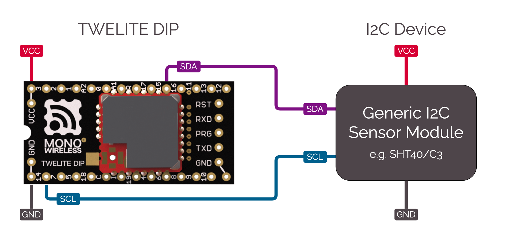

# BRD_I2C_TEMPHUMID

This is an Act sample using an I2C sensor device to measure temperature and humidity and send them periodically.

In this sample, using I2C sensors on our product ([AMBIENT SENSE PAL](https://mono-wireless.com/jp/products/twelite-pal/sense/amb-pal.html) or [TWELITE ARIA BLUE / RED](https://mono-wireless.com/jp/products/twelite-aria/index.html)). However you can also use generic I2C devices by editing receiving/sending procedures. Connect a generic I2C device according to the following diagram.




This Act includes following features:

* Sending / Receiving wireless packets
* Configuration with "interactive settings mode" - [\<STG\_STD>](../settings/stg\_std.md)
* Building a state machine with "SM_SIMPLE" - [\<SM\_SIMPLE>](../api-reference/classes/smsimple-suttomashin.md)


## Features

* Send / Receive I2C commands
* Sleep periodically for running with a button cell.

## Usage

### Required TWELITE modules

| Type | Example  |
| -- | ------------ |
| Parent | Run the Act <a href="parent_monostick.md">Parent_MONOSTICK</a> on the <a href="https://mono-wireless.com/jp/products/MoNoStick/">MONOSTICK BLUE or RED</a> |
| Children | - [BLUE PAL / RED PAL](https://mono-wireless.com/jp/products/twelite-pal/BnR/index.html) + [AMBIENT SENSE PAL](https://mono-wireless.com/jp/products/twelite-pal/sense/amb-pal.html)<br>- [TWELITE ARIA BLUE / RED](https://mono-wireless.com/jp/products/twelite-aria/index.html) |


## Act Explained

### Header files

```cpp
#include <TWELITE>
#include <NWK_SIMPLE>// Network support
#include <STG_STD>   // Interactive settings mode
#include <SM_SIMPLE> // Simple state machines
```

Header files are `<NWK_SIMPLE>` (Simple network support), `<STG_STD>` (Interactive settings mode) and `<SM_SIMPLE>` (Simple state machines).

### Sensor drivers

For your reference, this Act is using SHTC3 (TWELITE AMB PAL) or SHT40 (TWELITE ARIA). You can switch them by editing `#ifdef` and they have same function interfaces for code portability. Both codes are similar because they were designed by the same manufacturer. (Please `#define` either `USE_SHTC3` or `USE_SHT40`.)

```cpp
/*** sensor select, define either of USE_SHTC3 or USE_SHT40  */
// use SHTC3 (TWELITE PAL)
#define USE_SHTC3
// use SHT40 (TWELITE ARIA)
#undef USE_SHT40
```

Below using the SHTC3.

```cpp
#if defined(USE_SHTC3)
// for SHTC3
struct SHTC3 {
	uint8_t I2C_ADDR;
	uint8_t CONV_TIME;

    bool setup() { ... }
	bool begin() { ... }
	int get_convtime() { return CONV_TIME; }
	bool read(int16_t &i16Temp, int16_t &i16Humd) { ... }
} sensor_device;
```

The struct (class) `SHTC3` has I2C-sensor-realted procedures. The member variable `I2C_ADDR` is the I2C address and the `CONV_TIME` is the waiting time for getting values. The instance created from the `SHTC3` is `sensor_device`.

Methods

| Name | Description |
| ------ | ---- |
| `setup()` | Initialize the sensor instead of the constructor (uncalled due to the limitation of the MWX Library). |
| `begin()` | Begin getting values from the sensor. After starting, it is necessary to wait a certain amount of time until the appropriate sensor values are obtained. |
| `get_convtime()` | Get the waiting time to acquire the sensor value. |
| `read(int&, int&)` | Read the sensor value. |

Each procedures are shown below.

#### setup()
```cpp
bool setup() {
	// here, initialize some member vars instead of constructor.
	I2C_ADDR = 0x70;
	CONV_TIME = 10; // wait time [ms]
	return true;
}
```

Set the I2C address and the sensor value acquisition wait time (10 ms for the above) in the member variables.

In principle, these values are fixed values, so there is no need to set them. Valid examples of how to treat them as variables: Managing the conversion time required when operating a sensor with higher precision or selecting an I2C sub-address by setting them.

#### begin()
```cpp
bool begin() {
	// send start trigger command
	if (auto&& wrt = Wire.get_writer(I2C_ADDR)) {
		wrt << 0x60; // SHTC3_TRIG_H
		wrt << 0x9C; // SHTC3_TRIG_L
	} else {
		return false;
	}
	return true;
}
```

Write commands to operate the sensor.

In the MWX Libary, you can choose two different ways to control the I2C line from the [Wire class object](../api-reference/predefined_objs/wire/README.md). This act is using [Helper functions](../api-reference/predefined_objs/wire/wire-helperclass.md).

`Wire.get_writer(I2C_ADDR)` opens the I2C device and returns a object for reading / writing data. If the device is not available, the object `wrt` is evaluated as `false`.

The line `wrt << 0x60;` is writing a data to the device with the stream operator `<<`. The operator is often used for writing data in `uint8_t`.

#### get_convtime()
```cpp
int get_convtime() {
	return CONV_TIME;
}
```

Return the value of `CONV_TIME`.


#### read()
```cpp
bool read(int16_t &i16Temp, int16_t &i16Humd) {
	// read result
	uint16_t u16temp, u16humd;
	uint8_t u8temp_csum, u8humd_csum;
	if (auto&& rdr = Wire.get_reader(I2C_ADDR, 6)) {
		rdr >> u16temp;      // read two bytes (MSB first)
		rdr >> u8temp_csum;  // check sum (crc8)
		rdr >> u16humd;      // read two bytes (MSB first)
		rdr >> u8humd_csum;  // check sum (crc8)
	} else {
		return false;
	}

	// check CRC and save the values
	if (   (CRC8_u8CalcU16(u16temp, 0xff) == u8temp_csum)
		&& (CRC8_u8CalcU16(u16humd, 0xff) == u8humd_csum))
	{
		i16Temp = (int16_t)(-4500 + ((17500 * int32_t(u16temp)) >> 16));
		i16Humd = (int16_t)((int32_t(u16humd) * 10000) >> 16);
	} else {
		return false;
	}

	return true;
}
```
Get values from the sensor device.

SHTC3 reads the sensor value after waiting a few ms after starting the sensor readout by `begin()`.
The sequence of sensor values is as follows.

| Byte | Description |
| --- | ---- |
| 0   | Temperature Value (MSB side) |
| 1   | Temperature Value (LSB side) |
| 2   | CRC8 value of the byte 0 and 1 |
| 3   | Humidity Value (MSB side) |
| 4   | Humidity Value (LSB side) |
| 5   | CRC8 value of the byte 3 and 4 |

In SHTC3, the order of data also changes depending on the parameters given at the start of sensor acquisition, but if you start with the `0x609C` command written by the above `begin()`, temperature data comes first.

In `begin()`, the data was written out, but here the data is read in. To read the data, similarly, `Wire.get_reader()` creates a helper object `rdr`. If there are no errors, `rdr` returns *true* in the *if* clause. The second parameter `6` given to `get_reader(I2C_ADDR, 6)` is the number of bytes to read. When this number of bytes have been read, the procedure terminates reading the I2C bus. (Some devices may work even if these procedures are omitted, but usually you should give an appropriate value.)

Read is done with the stream operator `>>`. There are several other read methods. For details, see [Helper functions](../api-reference/predefined_objs/wire/wire-helperclass.md) for details. When using the stream operator, enter values into pre-declared variables of type `uint8_t`, `uint16_t`, or `uint32_t`. `rdr >> u16temp` reads from the 2-byte I2C bus for variables of type `uint16_t` and stores them in **big-endian format (first byte is upper byte)**.

Finally, 100 times the temperature [°C] and 100 times the humidity [%] are calculated and stored in `i16Temp` and `i16Humd`.Refer to the I2C device datasheet for the calculation formula.

### setup()

Called once when the TWELITE is started. This function performs various initializations.

```cpp
void setup() {
	/*** SETUP section */
	...
}
```


#### State machine with SM_SIMPLE
```cpp
// application state defs
enum class STATE : uint8_t {
	INTERACTIVE = 255,
	INIT = 0,
	SENSOR,
	TX,
	TX_WAIT_COMP,
	GO_SLEEP
};

// simple state machine.
SM_SIMPLE<STATE> step;

void setup() {
	...
	/// init vars or objects
	step.setup(); // initialize state machine
	...
}
```


The state machine (state transition machine) is used to simplify the description in the `loop()` statement that is called each time. Of course, you do not have to use `SM_SMPLE` in this example to describe your application.

[SM_SIMPLE](./smsimple-suttomashin.md) is implemented in a very short code that allows simple management of transitions to states, timeouts, and flags. The states are defined in advance as enumerations. In the above example, it is `enum class STATE`. The entity of the state machine is declared as `SM_SMPLE<STATE> step` with the predefined enum `STATE` as a parameter.

#### Set BEHAVIOR
```cpp
void setup() {
	...
	/// load board and settings objects
	auto&& set = the_twelite.settings.use<STG_STD>(); // load save/load settings(interactive settings mode) support
	auto&& nwk = the_twelite.network.use<NWK_SIMPLE>(); // load network support
	...
}
```

BEHAVIOR is a collection of functions used in a program. It describes how to behave when various events occur.

In this example, we use two kinds of BEHAVIOR: interactive settings mode screen `<STG_STD>` and simple relay network `<NWK_SMPLE>`.


#### Interactive settings mode STG_STD
```cpp
	...
	/// configure settings
	// configure settings
	set << SETTINGS::appname(FOURCHARS);
	set << SETTINGS::appid_default(DEFAULT_APP_ID); // set default appID
	set << SETTINGS::ch_default(DEFAULT_CHANNEL); // set default channel
	set.hide_items(E_STGSTD_SETID::OPT_DWORD2, E_STGSTD_SETID::OPT_DWORD3, E_STGSTD_SETID::OPT_DWORD4, 	E_STGSTD_SETID::ENC_KEY_STRING, E_STGSTD_SETID::ENC_MODE);
```

In order to make the interactive settings mode configuration items suitable for the application you are describing, initialize [STG_STG](...). /settings/stg_std.md) to set the initial settings.

* `SETTINGS::appname` : application name (string). It will be displayed on the first line on the interactive settings mode screen. Use a minimum string since there is not enough room for the number of characters on the screen.
* `SETTINGS::appid_default` : Default application ID. Execute this if you want your own application to have its own defined application ID.
* `SETTINGS::ch_default` : channel default. Execute if you want your own application to have its own default channel.

Then `set.hide_items()` removes unnecessary settings items on the screen in the default interactive settings mode. If you do not mind displaying them all, you do not need to make this call.

```cpp
	// if SET(DIO12)=LOW is detected, start with intaractive mode.
	if (digitalRead(PIN_DIGITAL::DIO12) == PIN_STATE::LOW) {
		set << SETTINGS::open_at_start();
		step.next(STATE::INTERACTIVE);
		return;
	}
```

This description starts in interactive settings mode when the DIO12 pin is LOW (GND level) and the device is powered up or reset. Read the pin status with `digitalRead()` and reflect `SETTINGS::open_at_start()`.

Set the state of the state machine to `STATE::INTERACTIVE`, since it would be inconvenient if normal application processing is performed during interactive settings mode. In this state, no input or other processing is performed and the application stays in the same state.

```cpp
	// load values
	set.reload(); // load from EEPROM.
	OPT_BITS = set.u32opt1(); // this value is not used in this example.

	// LID is configured DIP or settings.
	LID = set.u8devid(); // 2nd is setting.
	if (LID == 0) LID = 0xFE; // if still 0, set 0xFE (anonymous child)
```

Finally, load the data in interactive settings mode. By calling `set.reload()`, data written to the EEPROM is read. If no setting is made and there is no information in the EEPROM, it can be read as the specified value.

Here, option bits `set.u32opt1()` and 8-bit logical ID `set.u8devid()` are read. child machine).


```cpp
	/// configure system basics
	the_twelite << set; // apply settings (from interactive settings mode)
	nwk << set; // apply settings (from interactive settings mode)
	nwk << NWK_SIMPLE::logical_id(LID); // set LID again (LID can also be configured by DIP-SW.)
	...
```

Finally, `the_twelite` and `nwk` reflect (some of) the configuration information. This reflects information essential for wireless communication, such as application ID and channel. There is no explicit read code for these settings in the above, but `set.reload()` reads the settings to the specified values if they are not set, or to the set values if they are.

#### Initialize peripherals
```cpp
	/*** BEGIN section */
	Wire.begin(); // start two wire serial bus.
```

Initialization for the I2C device.

#### Start MWX
```cpp
	// let the TWELITE begin!
	the_twelite.begin();

	/*** INIT message */
	Serial << "--- TEMP&HUMID:" << FOURCHARS << " ---" << mwx::crlf;
	Serial	<< format("-- app:x%08x/ch:%d/lid:%d"
					, the_twelite.get_appid()
					, the_twelite.get_channel()
					, nwk.get_config().u8Lid
				)
			<< mwx::crlf;
	Serial 	<< format("-- pw:%d/retry:%d/opt:x%08x"
					, the_twelite.get_tx_power()
					, nwk.get_config().u8RetryDefault
					, OPT_BITS
			)
			<< mwx::crlf;
```

`the_twelite.begin()` is a procedure that declares the completion of the initialization of the MWX library. Without this procedure, the MWX library will not work properly.

Messages at startup, etc. are also displayed here.

### loop()

```cpp
void loop() {
	do {
		switch (step.state()) {
		 // states
		case STATE::INIT:
		...
		break;
		...
		}
	while(step.b_more_loop());
}
```

The `loop()` is controlled by the [SM_SIMPLE state machine](../api-reference/classes/smsimple-suttomashin.md)`step` for control. The purpose is to concisely express the sequence of steps from sleep recovery, sensor value acquisition, wireless packet transmission, waiting for transmission to complete, and sleep.

The control structure of the above *do while* statement is described below. The state is determined by `step.state()`. The conditional expression of *while* is `step.b_more_loop()`. This is because there are cases where you want to process continuously without leaving `loop()` when a state transitions from one state to another. In other words, if you transition to another state and leave the *switch* clause, the *case* clause of the next state will be called. Be careful with this behavior.

#### case STATE::INTERACTIVE:

It is not convenient for the main loop to operate during interactive settings mode, so it is fixed in this state.

#### case STATE::INIT:

```cpp
// start sensor capture
sensor_device.begin();
step.set_timeout(sensor_device.get_convtime()); // set timeout
step.next(STATE::SENSOR);
```

Starts acquiring sensor data. The `set_timeout()` statement waits for the sensor to acquire data.

For a sensor that waits for a very long time, it is possible to extend the battery life by writing a process to sleep once here, but this example is omitted because of the complexity of the structure. If necessary, you can use [Example of waiting for sleep](./pal_amb-usenap.md).

#### case STATE::SENSOR:

```cpp
if (step.is_timeout()) {
	// the sensor data should be ready (wait some)
	sensor_device.read(sensor.i16temp, sensor.i16humid);

	Serial << "..finish sensor capture." << mwx::crlf
		<< "     : temp=" << div100(sensor.i16temp) << 'C' << mwx::crlf
		<< "       humd=" << div100(sensor.i16humid) << '%' << mwx::crlf
		;
	Serial.flush();

	step.next(STATE::TX);
}
```

Get the sensor value by `sensor_device.read()` and store the value in the `sensor` structure.

First, a timeout check is performed by `step.is_timeout()`. The starting point of timeout is `step.set_timeout()`. If the timeout does not occur, the *if* clause is not executed and `loop()` is left as is. The next hardware event (often a system timer, [TickTimer](../api-reference/predefined_objs/ticktimer.md), which generates an interrupt every 1 ms. /api-reference/predefined_objs/ticktimer.md), which generates an interrupt every 1ms), the TWELITE microcontroller will be in DOZE mode, where the CPU is in low-power standby.

As a wireless sensor, there is no need to output the result to the serial port of TWELITE on the sensor side, but the acquired value is displayed on the serial port to facilitate operation check. Here, `Serial.flush()` is executed to wait for output, which is a description assuming that the serial port output does not finish before TWELITE goes to sleep. This process also causes battery drain, so either do not do `Serial.flush()` or do not output to the serial port.

The [div100()](../api-reference/funcs/utility/div100.md) is a low-cost function to divide by 100.

#### case STATE::TX:
```cpp
step.next(STATE::GO_SLEEP); // set default next state (for error handling.)

// get new packet instance.
if (auto&& pkt = the_twelite.network.use<NWK_SIMPLE>().prepare_tx_packet()) {
	...
}
```

Describes a communication procedure. In this state, there is no wait processing, etc., and the program transitions to the next state immediately after processing is executed. The reason why `step.next(STATE::GO_SLEEP)` is written in advance is to avoid writing the same description in all places, since errors are detected in multiple places.

In `if (auto&& pkt = the_twelite.network.use<NWK_SIMPLE>().prepare_tx_packet())`, the process is to create an object for the packet to be sent and execute the *if* clause if the object is successfully created.

```cpp
// set tx packet behavior
pkt << tx_addr(0x00)  // 0..0xFF (LID 0:parent, FE:child w/ no id, FF:LID broad cast), 0x8XXXXXXX (long address)
	<< tx_retry(0x1) // set retry (0x1 send two times in total)
	<< tx_packet_delay(0, 0, 2); // send packet w/ delay
```

First, configure the transmission settings. The destination `tx_addr(0x00)` is set to the parent machine `0x00`, the number of retransmissions `tx_retry(0x1)` is set to 1, and the packet delay setting `tx_packet_delay(0, 0, 2)` is set to 0 delay for the first transmission and 2 ms for the retransmission interval. The packet delay is set to 0 for the first transmission and 2ms for the retransmission interval.

```cpp
pack_bytes(pkt.get_payload()
	, make_pair(FOURCHARS, 4)
	, uint16_t(sensor.i16temp)
	, uint16_t(sensor.i16humid)
	);
```

The identifier `FOURCHARS` and the sensor data are stored in the payload part of the packet. Of the values obtained, the temperature value is `int16_t `, but is cast to `uint16_t` because the data structure of the outgoing packet is to be stored unsigned.

```cpp
// do transmit
MWX_APIRET ret = pkt.transmit();

if (ret) {
	step.clear_flag(); // waiting for flag is set.
	step.set_timeout(100); // set timeout
	step.next(STATE::TX_WAIT_COMP);
}
```

Call `pkt.transmit()` to request a transmission. The MWX library will process the request at the appropriate time.

If the send request is successful, `ret` will be *true*. Initialize the flags to determine completion `step.clear_flag()`, set a timeout `step.set_timeout(100)` to handle unexpected errors such as failed transmissions, and set the next state to `STATE::TX_WAIT_COMP` (see ` STATE::GO_SLEEP` is overridden).

#### case STATE::TX\_WAIT\_COMP:

Here, it waits for the completion of transmission. Judgment of timeout (in case of error) or transmission completion event is made.

```cpp
if (step.is_timeout()) { // maybe fatal error.
	the_twelite.reset_system();
}
if (step.is_flag_ready()) { // when tx is performed
	Serial << "..transmit complete." << mwx::crlf;
	Serial.flush();
	step.next(STATE::GO_SLEEP);
}
```


#### STATE::GO\_SLEEP:

Processes the `sleepNow()` function. By calling this function, the TWELITE wireless microcontroller goes to sleep.


### on\_tx\_comp()

```cpp
void on_tx_comp(mwx::packet_ev_tx& ev, bool_t &b_handled) {
	step.set_flag(ev.bStatus);
}
```

This is a system event called when transmission is completed. Here `.set_flag()` is called to set the flag of `step`.

### sleepNow()

Procedures for going to sleep.

```cpp
void sleepNow() {
	step.on_sleep(false); // reset state machine.

	// randomize sleep duration.
	uint32_t u32ct = 1750 + random(0,500);

	// output message
	Serial << "..sleeping " << int(u32ct) << "ms." << mwx::crlf;
	Serial.flush(); // wait until all message printed.

	// do sleep.
	the_twelite.sleep(u32ct);
}
```

Initialize the state of the state machine by `.on_sleep(false)` before sleep. The parameter `false' starts from `STATE::INIT(=0)` after returning from sleep.

Here, the time to wake up is set between 1750ms and 2250ms by a random number. This avoids continuous collisions with packets from other devices transmitting at a similar period.


If the cycles are exactly the same, packets from each other will collide and communication will be difficult. Usually, the timer cycles shift with each other over time, so that communication is restored after a short period of time, and then collisions occur again after another period of time.


Lines 8 and 9, this example goes to sleep waiting for output from the serial port. Usually, we want to minimize energy consumption, so we minimize (or eliminate) output from the serial port before sleep.

Line 12, to enter sleep, call `the_twelite.sleep()`. In this call, the pre-sleep procedures of the hardware on the board are performed.

The sleep time is specified in ms as a parameter.


TWELITE PAL must always wake up once within 60 seconds and reset the watchdog timer. The sleep time must be specified not to exceed `60000`.


### wakeup()

When the program wakes up from sleep, `wakeup()` is called. After that, `loop()` is called each time. Before `wakeup()`, each peripheral such as UART and devices on the board are woken up. For example, it restarts the LED lighting control.

```cpp
void wakeup() {
	Serial	<< mwx::crlf
			<< "--- PAL_AMB:" << FOURCHARS << " wake up ---"
			<< mwx::crlf
			<< "..start sensor capture again."
			<< mwx::crlf;
	...
}
```
