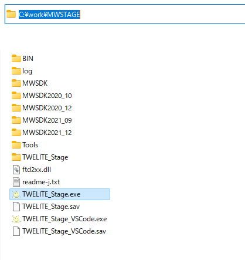

# Installing the TWELITE SDK

Download the TWELITE STAGE SDK distribution archive (e.g. ZIP) and extract it to an appropriate folder.


The folder names of each level of the destination folder must not contain anything other than one-byte numbers `0..9`, one-byte alphabets `a..zA..Z`, and some symbols `-_.`. In short, it must not contain spaces, Kanji characters, Hiragana characters, etc.


The following is an example folder after extracting the TWELITE STAGE SDK archive. (Windows, `c:\work\MWSTAGE...`)


**See [Installing the TWELITE STAGE SDK](https://stage.twelite.info/v/eng/install/) for more information.**



This is the end of the normal installation process. Refer to the following "Set Environmental variables" and below as necessary.



## Set Environmental variables

If you want to build with other than TWELITE STAGE application, please set the environment variables (e.g. `MWSDK_ROOT`).


If you are using the TWELITE STAGE application, you **do not need** to set these environment variables.
Inside the TWELITE STAGE application, those environment variables will be set appropriately.


`MWSDK_ROOT`, `MWSDK_ROOT_WINNAME`(for Windows10) need to be set.

#### Windows10,11
In this example, the name of the extracted folder is `C:\MWSTAGE`. If you have installed the software in a different folder, please change the name.

Run `C:\MWSTAGE\Tools\SET_ENV.CMD` to set the following environment variables:

* `MWSDK_ROOT`
* `MWSDK_ROOT_WINNAME`

For example, the following variables are set:

```
MWSDK_ROOT=C:/MWSTAGE/MWSDK/
MW_ROOT_WINNAME=C:\MWSTAGE\MWSDK\
```



To uninstall the TWELITE STAGE SDK from the installed PC, please do the following:

* Run `UNSET_ENV.cmd`. This will unset the environment variables.
* Delete the MWSTAGE folder.


#### Linux
Set the development environment and shell to reflect the MWX\_ROOT environment variable.

There are several ways to do this, but add the following setting to the `.profile` of your home folder (if the file does not exist, please create a new one). You can even build VSCode with this setting.

`MWSDK_ROOT=/foo/bar/MWSTAGE/MWSDK/`\
`export MWSDK_ROOT`


To add it without using the editor, enter the command as follows. The $ is a prompt and will be displayed differently depending on your environment. The `/foo/bar/MSWSDK` part should be rewritten according to the installed folder.

```bash
$ cd $HOME
$ echo MWSDK_ROOT=/foo/bar/MWSTAGE/MWSDK>>.profile
$ echo export MWSDK_ROOT>>.profile
```

#### macOS
Set the development environment and shell to reflect the `MWX_ROOT` environment variable.


There are several ways to do this, but add the following settings to `.profile` in your home folder (create a new file if you don't have one). You can even build VSCode with this setting.

`MWSDK_ROOT=/foo/bar/MWSTAGE/MWSDK/`\
`export MWSDK_ROOT`


To add it without using the editor, enter the command as follows. The $ is a prompt and will be displayed differently depending on your environment. The `/foo/bar/MSWSDK` part should be rewritten according to the installed folder.

```bash
$ cd $HOME
$ echo MWSDK_ROOT=/foo/bar/MWSTAGE/MWSDK>>.profile
$ echo export MWSDK_ROOT>>.profile
```



Use LaunchD to apply `MWSDK_ROOT` to the entire environment.

Some settings in VSCode refer to environment variables, but they are not required for the build.


