# Building ACT

The application program written in the MWX library is called ACT. The first step is to build and write it.

* About the build folder structure
* About the build script
* About building with Visual Studio Code (Described as VSCode)


This page describes several methods of building, all of which ultimately involve running the make command. Please refer to the [Makefile description](makefile.md) for details.



Depending on the OS environment, security warnings may appear when running each executable program (e.g. `make`, build toolchain like `gcc`). It is necessary to configure the settings to suppress the warning. (Please consult with yourself or your system administrator to determine if you wish to **run the program with the warning suppressed.**)


## About the build folder structure

Open the folder `MWSDK_ROOT` (e.g. `C:\MWSDK`) where you have installed the MWSDK. It has the following structure

```
MWSDK_ROOT
  |
  +-ChipLib      : Semiconductor library
  +-License      : Software License Agreement
  +-MkFiles      : makefile
  +-Tools        : A set of tools such as compilers
  +-TWENET       : TWENET/MWX library
  +-Act_samples  : Sample codes of ACT
  ...
```


Tool act files such as compilers are stored under `Act_samples`. (Some of them are omitted below)

```
Act_samples
  |
  +-BRD_APPTWELITE    : ACT for boards with the same configuration as App_TweLite
  +-PAL_AMB           : ACT for environmental sense PAL
  +-PAL_MAG           : ACT for open-close PAL
  +-PAL_MOT           : ACT for motion PAL
  ..
  +-Parent-MONOSTICK  : ACT for parent device (for MONOSTICK)
  +-PingPong          : ACT for transmit and receive like Ping Pong
  +-PulseCounter      : ACT using a pulse counter
  +-act0              : Scratching ACT
```

These acts are simple examples to help you write your own MWX library, but many of them have the following features

* Obtaining sensor values
* After obtaining the sensor value, send a wireless packet to the master
* Sleeps for a period of time (or waits for an interrupt) after transmission is complete

The Parent-MONOSTICK act is used to receive and display packets. This act for the parent is output in ASCII format. (`:00112233AABBCC.... .FF[CR][LF]`, and the middle part is a hexadecimal byte expressed by two ASCII characters. The trailing ? is also a two-character byte, but it becomes a checksum byte called LRC. Reference: ASCII format)

When trying to get it to work in practice, try the following combinations:

| Parents                                                  | Child                                                 | Remark                                                                                                                                 |
| -------------------------------------------------------- | ----------------------------------------------------- | -------------------------------------------------------------------------------------------------------------------------------------- |
| [BRD\_APPTWELITE](../act\_samples/brd\_apptwelite.md)    | [BRD\_APPTWELITE](../act\_samples/brd\_apptwelite.md) | The parent device is started with the M1 pin low (GND level). In normal mode (always running), you can see it works like App\_TweLite. |
| [PingPong](../act\_samples/pingpong.md)                  | [PingPong](../act\_samples/pingpong.md)               | The system works with two children. When one of them sends a ping packet, the other sends a pong packet back.                          |
| [Parent-MONOSTICK](../act\_samples/parent\_monostick.md) | Other                                                 | You can check the transmission of packets of the act for the child machine.                                                            |


Now let's take a look inside the PingPong folder from within ACT.


You can also build other acts in `Act_samples`. In this case, the folder and file names should be read differently.


```
Act_samples
  +-PingPong
    +-PingPong.cpp   : ACT code
    +-build          : build folder
    +-.vscode        : setting files for VSCode
```

You must have a `.cpp` file with the same name as the folder directly under the folder.


If it is a small act, you can write it in this `.cpp` file. If you have a larger act, you can build it in multiple files by referring to the [Makefile description](makefile.md).



The ACT file PingPong.cpp is located directly under the PingPong folder. If you change the name of the folder, make sure to rename the .cpp file to the same name as the folder.



Next, open the build folder.

```
Act_samples
  +-PingPong
    +-build
      +-Makefile        : makefile
      +-build-BLUE.cmd  : build script for TWELITE BLUE
      +-build-RED.cmd   : build script for TWELITE RED
      +-build-clean.cmd : clean up obj_* files
```

It contains the scripts and Makefiles needed for the build.

**Build by running `make TWELITE={BLUE or RED}` in the folder containing this `Makefile`. Building with VSCode is the same, calling make internally.**


## Building with TWELITE STAGE App. (Normal)

The TWELITE STAGE app can be used to build, write, and run. This section describes the TWELITE STAGE application from startup to build.


### 0. TWELITE Connection

Connect MONOSTICK or TWELITE R to your USB port.


TWELITE is a sensitive electronic component and should be handled with care. Typical precautions are listed below.

Especially when TWELITE R is used, the electronic board is often in direct contact with the outside without a case, which may cause unintended shorts, noise, or other problems that prevent the USB device from operating properly.

In this case, closing the application and unplugging and plugging in the USB device will usually restore it. In the worst case, the USB device may be damaged or the PC may be corrupted.

Also, handle electronic circuit boards with care.

* Circuit error.
  * Check the circuit **again** before turning on the power.
  * Be careful not to **reverse-insert batteries or over-voltage**.
* Static electricity
  * Even a voltage that is not human-sensitive can cause a semiconductor failure. Even simple measures such as touching metal parts before working, wristbands, and special mats can have a reasonable effect.
* Short-circuits caused by touching metal objects, etc.
  * Make sure that there are no metal objects near the electronic board. If clips or other objects are scattered around, this may cause a short circuit, or even a dangerous situation in which the battery heats up due to a large discharge.
    

### 1. Launch the TWELITE STAGE application

Launch the executable `TWELITE_Stage.{extension}` located in the {TWELITE SDK installation} folder. (reference:  [TWELITE STAGE Application Manual - Usage](https://stage.twelite.info/v/eng/usage/))。


Below is an example of the screen while the TWELITE STAGE application is running. The main screen on the left and the command prompt screen are shown, but the main screen is usually used. The command prompt screen is not normally used, but it displays various information and input data from the TWELITE microcontroller serial port.

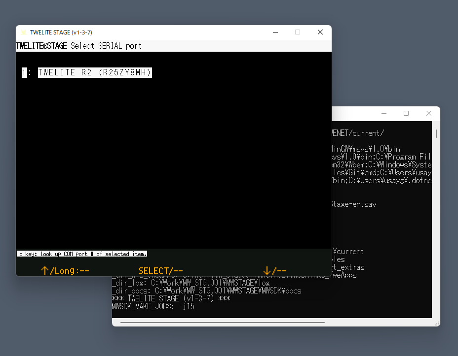


The main operations on the main screen are as follows

* Left mouse click (selection)
* Double right mouse click (return to previous screen)
* Quickly press `ESC` twice, or `ESC` once on some screens (return to previous screen)
* Hold down the Alt(Cmd) key (help screen)
* Normal keyboard input (follow the screen)

(Reference: [TWELITE STAGE App Manual - Key and Mouse Operations](https://stage.twelite.info/v/eng/usage/key_mouse))


### 2. Serial port selection

This is the first screen that appears when you start the TWELITE STAGE application. If TWELITE R or MONOSTICK is connected in advance, it will be listed on this screen. Select the TWELITE you wish to operate on this screen. It is also possible to select the TWELITE without selecting it on this screen.

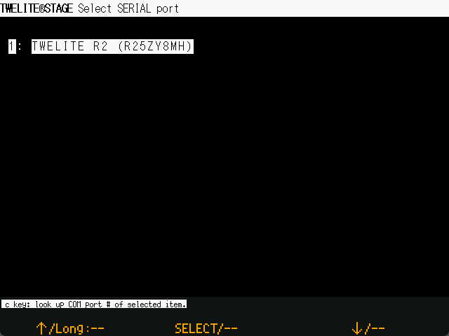

(Reference:  [TWELITE STAGE App Manual](https://stage.twelite.info/v/eng/usage/screens/serial_port_sel))


### 3. Main Menu

After exiting the serial port selection screen, the main menu appears. Select the "Application Rewrite" menu for build and write.

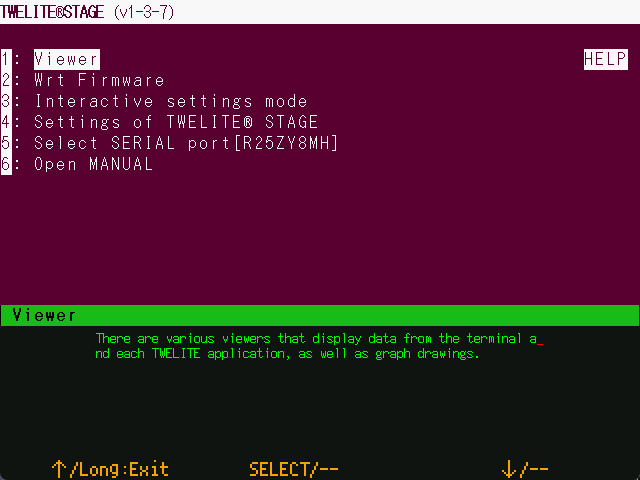

(Reference:  [TWELITE STAGE App Manual](https://stage.twelite.info/v/eng/usage/screens/main_menu/))


### 4. Wrt Firmware (Application programming) menu

Before selecting the application programming menu, please check the TWELITE connection and serial port selection. The serial port selection status can be checked on the help screen that appears by holding down the Alt(Cmd) key.

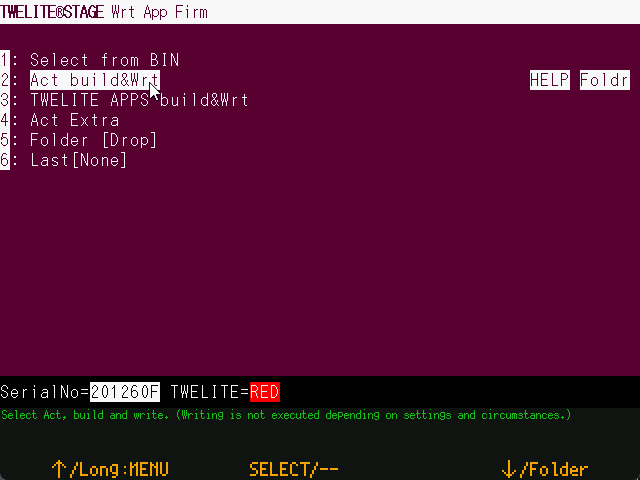

There are several categories of projects that can be referenced from the TWELITE STAGE application. `HELP` on the right side displays related information in a browser. `Foldr` displays the folder where the project is located.


If TWELITE is already connected, the TWELITE model is determined when the menu is selected. (Inside the TWELITE STAGE application, the build is performed according to the TWELITE model that has been determined.)



If an error occurs here, return to the main menu from this screen and reselect the menu. If necessary, deselect the serial port by pressing `Alt(Cmd)` + `0` on the TWELITE STAGE application and check the various connections, including the USB connection. Some USB connection errors may not be resolved until you reboot your computer.


(Reference:  [TWELITE STAGE App Manual](https://stage.twelite.info/v/eng/usage/screens/main_menu/firm_prog/))


### 4. Project Selection

Here, select "Act Build & Wrt" from the " Wrt Firmware" menu.

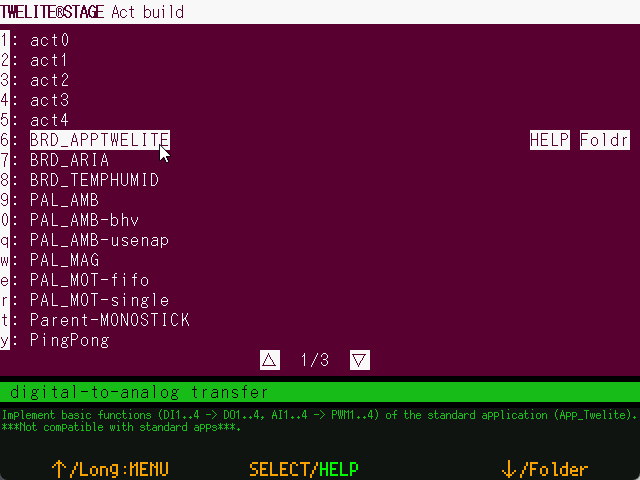

Project names, such as sample acts, are listed. The `HELP` on the right side displays the related information in a browser. The `foldr` displays the folder where the project is located.

Reference:  [TWELITE STAGE App Manual-Act Build & Wrt](https://stage.twelite.info/v/eng/usage/screens/main_menu/firm_prog/act_build))


### 5. Build & Wrt(Programming)

Here, select `BRD_APPTWELITE` in the project selection screen shown earlier.

Once selected, writing will be performed as shown in the following screen example. If an error is displayed, follow the on-screen instructions or return to the previous screen and try again.

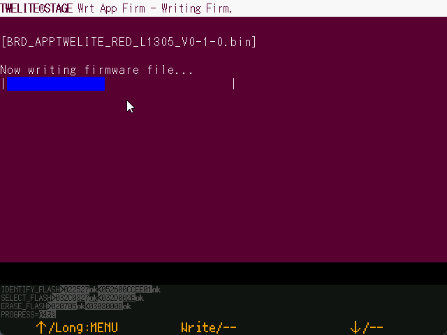

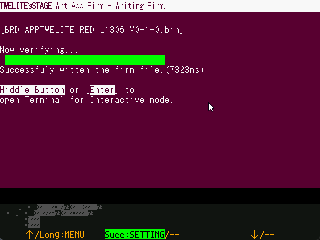

(Reference:  [TWELITE STAGE App Manual-build screen](https://stage.twelite.info/v/eng/usage/screens/main_menu/firm_prog/build_screen))


### 6. Go to Interactive settings mode

When the programming is successfully completed, it will continue to [Interactive settings mode](https://mono-wireless.com/jp/products/TWE-APPS/interactive.html) (settings screen). However, the screen will not be displayed unless the firmware supports Interactive settings mode.

In Interactive settings mode, you can configure various settings, including TWELITE's wireless CHANNEL.

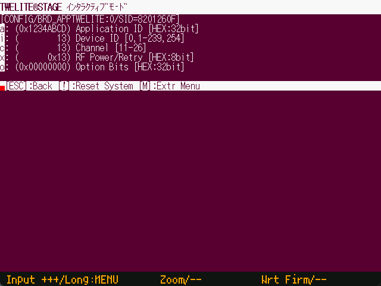


(Reference:  [TWELITE STAGE App Manual-Interactive settings mode](https://stage.twelite.info/v/eng/usage/screens/main_menu/interactive))


### 7. Terminal screen

Return to the root menu and select `Viewer` > `Terminal`.

This is a very simple terminal where you can check messages from TWELITE and input data into TWELITE.

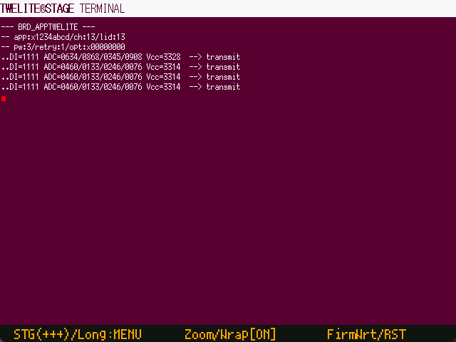

The screen displays a message when a wireless transmission is made approximately every second. You can also transition to the Interactive settings mode screen by typing `+ + +`.


(Reference:  [TWELITE STAGE App Manual-Terminal](https://stage.twelite.info/v/eng/usage/screens/main_menu/viewer/terminal))


## About building with VSCode (Optional)

VSCode is a powerful editor for source editing, but it is also possible to build firmware for TWELITE microcontrollers on VSCode.


VSCode is started from the TWELITE STAGE application from the project listing in Build&Write menu. (Note: The settings is required at TWELITE STAGE App `[Setting Menu] > Wrt Firmware > Open a folder with VSCode`. For simplicity of configuration, the executable `TWELITE_Stage_VSCode.{extension}` is available for Windows, Linux, and macOS.)


Set "Open folder with code (VSCode)" to `1` in STAGE settings.

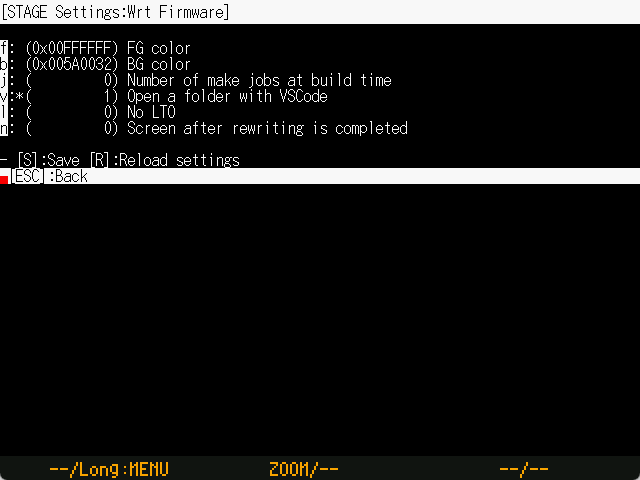


Press `[VSCode]` on the right end of the list of builds.

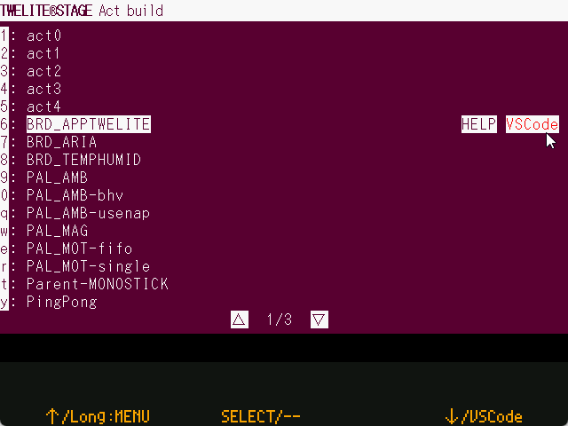



If VSCode is already launched, the necessary settings by setting the system environment variables may not be reflected. In this case, exit VSCode and start VSCode again from the TWELITE STAGE application.

Because of the use of system environment variables to reflect information, in principle, simultaneous operation of multiple TWELITE STAGES that reference different library folders may cause problems. If you open Terminal on VSCode and the environment variable `MWSDK_ROOT` is properly set, you can expect the build to be successful.


### Build with VSCode
Firstly, open a workspace from TWELITE STAGE app that you want build. The attached workspace in TWELITE STAGE SDK has build task definitions for TWELITE microcontroller.


In the example below, a workspace is opened with an example screen of the English interface.


Open a workspace and select `[Terminal>Run Task...]`.


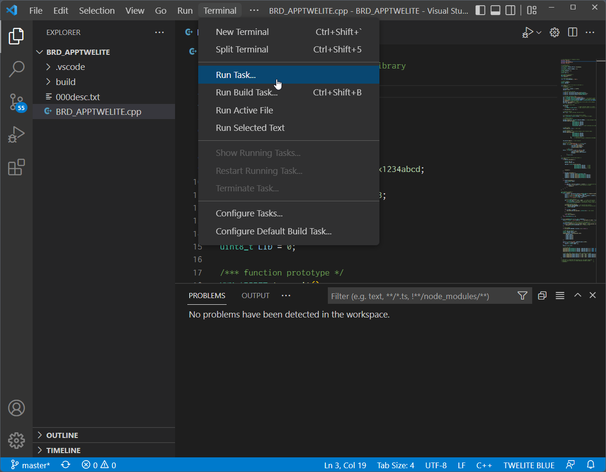

Select the type of TWELITE radio module (BLUE/RED) and the act name to build. In the example below we have selected Build for TWELITE BLUE PingPong (for TWELITE BLUE/PingPong act). The build will start immediately after selection.


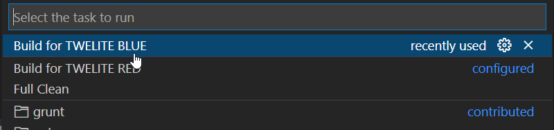


The progress of the build is shown in the TERMINAL section at the bottom of the screen.

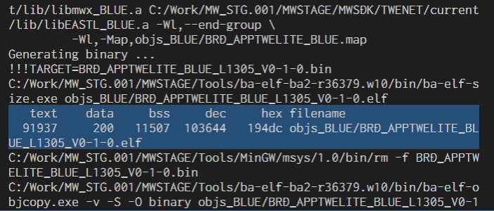



If the build is successful, you will see a message about the creation of the `.elf` file, along with its size information (`text data bss dec hex filename`), as shown in the highlighted part of the screenshot above.

Also, a BIN file (in the above example, `PingPong_BLUE_???.bin`) file should be created under the `build` folder. Please check it.



The build definition adds a definition to convert folder names (e.g. `/c/User/...`) that do not conform to the Windows 10 file system (e.g. `C:/User/...`).

The conversion is not complete, but you can extract the filename and line number of the error from the compilation message.

The execution command in `.vscode/tasks.json` is `sh -c "make ... | sed -E -e s#..."` to rewrite the string of the drive name equivalent in the output message.

```
...
"windows": {
    "command": "sh",
    "args": [
        "-c", "make TWELITE=BLUE 2>&1 | sed -E -e s#\\(/mnt\\)?/\\([a-zA-Z]\\)/#\\\\\\2:/#g"
    ],
```



If the build does not work, **check the error messages first**; it is often easy to identify the cause of an error from a message on a line containing the string error.。

To be sure, clean (remove intermediate files in the `objs_???` folder) and rerun the build to be sure. (All operations, including `make clean`, will fail if there are intermediate files left over from builds in other environments).



## Build on command line (Linux/macOS)

Additional information about building in the command line environment.


A working knowledge of the command line (e.g. bash) is required.



Depending on the OS environment, security warnings may appear when running each executable program. It is necessary to configure the settings to suppress the warning. (**Please consult with yourself or your system administrator to determine if you wish to run the program with the warning suppressed.**)



### Linux, macOS
To build by command line, run `make` in a window where `bash` (or some other shell) is running. Make sure that the environment variable `MWSDK_ROOT` is set correctly beforehand. For example, if you install to `/work/MWSTAGE/MWSDK`, set `~/.profile` as follows.

```bash
MWSDK_ROOT=/work/MWSTAGE/MWSDK
export MWSDK_ROOT
```


Run `make` from the command line (bash). If `make` is not available, you need to install a package. (The following is an example for Ubuntu Linux)

```bash
$ make

Command 'make' not found, but can be installed with:

sudo apt install make
sudo apt install make-guile

$ sudo apt install make
...
```


* On Linux environments, install the `make` or `build-essential` package.
* In the macOS environment, install Command Line Tools in Xcode.


### Windows

On Windows, run `{MWSTAGE SDK install}/MWSDK/WIN_BASH.cmd`.
Environment variables and make utility are already set.

### Building

A build should look like this:

```
$ cd $MWSDK_ROOT
$ cd Act_samples/PingPong/build
$ pwd
/mnt/c/MWSDK/Act_samples/PingPong/build

$ ls
... View file list

$ rm -rfv objs_*
... Delete intermediate files just in case

$ make TWELITE=BLUE
... Normal build for BLUE

$ make -j8 TWELITE=BLUE
... Parallel build for BLUE (8 processes simultaneously)
```


### Example commands

See the [Makefile description](makefile.md) for more details.

| Example             | Remark                    |
| ------------------- | ------------------------- |
| `make TWELITE=BLUE` | build for TWELITE BLUE    |
| `make TWELITE=RED`  | build for TWELITE RED     |
| `make cleanall`     | Delete intermediate files |


## About intermediate files

When the build is done, the `objs_???` folder is created and an intermediate file is created in it. This file is dependent on the environment in which it was compiled, so if any files from other environments are left, make will fail.


**Deleting the `objs_???` folder**'' may resolve the `make` error.


