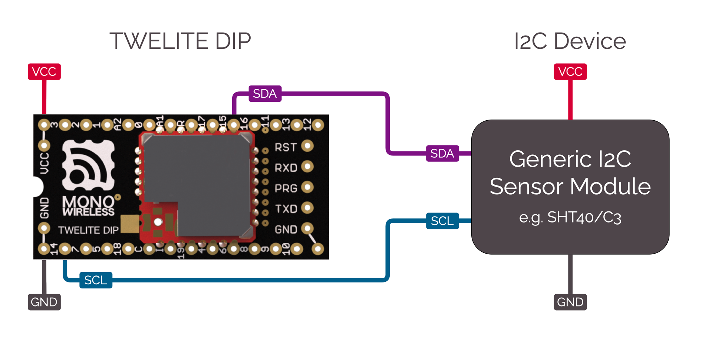

# BRD_I2C_TEMPHUMID

I2C センサーデバイスを用いて、定期起床からの計測および送信を行うサンプルです。

このサンプルでは、当社の [環境センサーパル AMBIENT SENSE PAL](https://mono-wireless.com/jp/products/twelite-pal/sense/amb-pal.html) あるいは [TWELITE ARIA BLUE / RED](https://mono-wireless.com/jp/products/twelite-aria/index.html) に搭載の I2C センサーデバイスを利用しています。しかし、I2Cコマンド送受信部分を書き換えることで、その他の一般的な I2C センサーデバイス(図中 Generic I2C Sensor Module) を利用することもできます。その場合には、以下のように配線してください。




このアクトには以下が含まれます。

* 無線パケットの送受信
* インタラクティブモードによる設定 - [\<STG\_STD>](../settings/stg\_std.md)
* ステートマシンによる状態遷移制御 - [\<SM\_SIMPLE>](../api-reference/classes/smsimple-suttomashin.md)



## アクトの機能

* I2C デバイスのコマンド送受信を行います。
* コイン電池で動作させるための、スリープ機能を利用します。

## アクトの使い方

### 必要なTWELITE

| 役割 | 例  |
| -- | ------------ |
| 親機 | <a href="https://mono-wireless.com/jp/products/MoNoStick/">MONOSTICK BLUEまたはRED</a>アクト<a href="parent_monostick.md">Parent_MONOSTICK</a>を動作させる。                                |
| 子機 | - [BLUE PAL または RED PAL](https://mono-wireless.com/jp/products/twelite-pal/BnR/index.html) + [環境センサーパル AMBIENT SENSE PAL](https://mono-wireless.com/jp/products/twelite-pal/sense/amb-pal.html)<br>- [TWELITE ARIA BLUE または RED](https://mono-wireless.com/jp/products/twelite-aria/index.html) |


## アクトの解説

### インクルード

```cpp
#include <TWELITE>
#include <NWK_SIMPLE>// ネットワークサポート
#include <STG_STD>   // インタラクティブモード
#include <SM_SIMPLE> // 簡易ステートマシン
```

無線送受信に必要な `<NWK_SIMPLE>`、インタラクティブモードを追加するための `<STG_STD>`、アプリケーションループの記述を簡素化するための `<SM_SIMPLE>` をインクルードしています。

### センサードライバ

この例では SHTC3 (TWELITE AMB PAL) と、SHT40 (TWELITE ARIA) の２種類のコードがあり `#ifdef` により切り替えています(`USE_SHTC3`または`USE_SHT40`のどちらかを `#define` してください)。コードの移植性のため２種類は同じ関数インタフェースとして定義しています。２種類のコードは同メーカ、同系列のセンサーであるため似通っています。

```cpp
/*** sensor select, define either of USE_SHTC3 or USE_SHT40  */
// use SHTC3 (TWELITE PAL)
#define USE_SHTC3
// use SHT40 (TWELITE ARIA)
#undef USE_SHT40
```

以下では SHTC3 の例を示します。
```cpp
#if defined(USE_SHTC3)
// for SHTC3
struct SHTC3 {
	uint8_t I2C_ADDR;
	uint8_t CONV_TIME;

    bool setup() { ... }
	bool begin() { ... }
	int get_convtime() { return CONV_TIME; }
	bool read(int16_t &i16Temp, int16_t &i16Humd) { ... }
} sensor_device;
```
ここではソースコードを整理するため I2C センサー関連の手続きを構造体(クラス) STHC3 にまとめています。この構造体には I2C アドレス `I2C_ADDR` と、値取得のための待ち時間 `CONV_TIME` をメンバー変数として持っており、`sensor_device` という実体名で宣言しています。

この構造体（クラス）は以下のメンバー関数を持っています。
| 関数名 | 解説 |
| ------ | ---- |
| `setup()` | 構造体の初期化を行う。（コンパイラの制約でグローバル宣言した場合コンストラクタが呼び出されないため）コンストラクタの代わりに呼び出す。 |
| `begin()` | センサー値の取得を開始する。開始後、適切なセンサー値が得られるまで一定時間待つ必要がある。 |
| `get_convtime()` | センサー値の取得待ち時間を返す。 |
| `read(int&, int&)` | センサー値を取得する。 |

処理を一つ一つ見ていきます。


#### setup()
```cpp
bool setup() {
	// here, initialize some member vars instead of constructor.
	I2C_ADDR = 0x70;
	CONV_TIME = 10; // wait time [ms]
	return true;
}
```
メンバー変数に I2C アドレスと、センサー値取得待ち時間(上記は10ms)を設定します。

これらの値は原則として固定値ですので変数設定する必要はありません。変数として扱う有効な例として、設定によってより高精度なセンサー稼働をさせるような場合に必要な変換時間を管理する、設定によって I2C の副アドレスを選択するような場合などが考えられます。

#### begin()
```cpp
bool begin() {
	// send start trigger command
	if (auto&& wrt = Wire.get_writer(I2C_ADDR)) {
		wrt << 0x60; // SHTC3_TRIG_H
		wrt << 0x9C; // SHTC3_TRIG_L
	} else {
		return false;
	}
	return true;
}
```
センサーを動作させるために指令を書き込みます。

MWXライブラリでは、[Wireクラスオブジェクト](../api-reference/predefined_objs/wire/README.md)を用いたI2Cバスへの読み書きに２種類の異なった記述方法がありますが、こちらは[ヘルパー関数](../api-reference/predefined_objs/wire/wire-helperclass.md)を用いる方法です。

*if* 文中で `Wire.get_writer(I2C_ADDR)` は、アドレス`I2C_ADDR`に対応するI2Cデバイスを開き、その読み書き用のオブジェクトを生成します。読み書きオブジェクト `wrt` は *if* 節の `(bool)` 評価により、デバイスのオープンに失敗したときなどには *false* を返します。*true*が戻った時は無事にオープンできたことになり *if*節内の処理を行います。

ここでは `wrt << 0x60;` のように、ストリーム演算子 `<<` を用いて１バイト I2C デバイスに書き込んでいます。このストリーム演算子は原則 `uint8_t` 型の１バイトを書き込むためのものです。

#### get_convtime()
```cpp
int get_convtime() {
	return CONV_TIME;
}
```

`CONV_TIME`の値を返すための関数です。

#### read()
```cpp
bool read(int16_t &i16Temp, int16_t &i16Humd) {
	// read result
	uint16_t u16temp, u16humd;
	uint8_t u8temp_csum, u8humd_csum;
	if (auto&& rdr = Wire.get_reader(I2C_ADDR, 6)) {
		rdr >> u16temp;      // read two bytes (MSB first)
		rdr >> u8temp_csum;  // check sum (crc8)
		rdr >> u16humd;      // read two bytes (MSB first)
		rdr >> u8humd_csum;  // check sum (crc8)
	} else {
		return false;
	}

	// check CRC and save the values
	if (   (CRC8_u8CalcU16(u16temp, 0xff) == u8temp_csum)
		&& (CRC8_u8CalcU16(u16humd, 0xff) == u8humd_csum))
	{
		i16Temp = (int16_t)(-4500 + ((17500 * int32_t(u16temp)) >> 16));
		i16Humd = (int16_t)((int32_t(u16humd) * 10000) >> 16);
	} else {
		return false;
	}

	return true;
}
```
センサーデータを読み出します。

SHTC3では、`begin()`によりセンサー読み出しを開始してから、数ms待ち時間をおいてセンサー値を読み出します。
センサー値の並びは以下のようになっています。

| バイト | 解説 |
| --- | ---- |
| 0   | 温度センサー値(上位バイト) |
| 1   | 温度センサー値(下位バイト) |
| 2   | バイト0,1のCRC8値         |
| 3   | 湿度センサー値(上位バイト) |
| 4   | 湿度センサー値(下位バイト) |
| 5   | バイト3,4のCRC8値         |
※ SHTC3では、センサー取得開始時に与えるパラメータによって、データの並び順も変化しますが上記`begin()`で書き込んだ`0x609C` コマンドで開始した場合は、温度データが先に来ます。

`begin()`ではデータを書き出していましたが、ここではデータを読み込みます。データを読み込むには同様に `Wire.get_reader()` により、ヘルパーオブジェクト `rdr` を生成します。エラーがなければ `rdr` は *if* 節中で *true* を返します。ここで `get_reader(I2C_ADDR, 6)` の２番目に与えたパラメータ `6` は、読み出しバイト数です。このバイト数を読みだした時点で I2C バスの読出しを終了する手続きを行います。（デバイスによっては、こういった手続きを省略しても動作するものもありますが、通常は適切な値を与えるようにしてください）

読み出しはストリーム演算子 `>>` により行っています。読み出し方法にはほかにもいくつかあります。詳しくは[ヘルパー関数](../api-reference/predefined_objs/wire/wire-helperclass.md) を参照してください。ストリーム演算子を用いる場合は、事前に宣言した `uint8_t`, `uint16_t`, `uint32_t` 型の変数に値を入力します。`rdr >> u16temp` は、`uint16_t`型の変数に対して２バイトI2Cバスから読み出し**ビッグエンディアン形式(１バイト目は上位バイト)**で格納します。

最終的に `i16Temp` ・ `i16Humd` に温度[℃]の１００倍値、および湿度[%]の100倍値を計算して格納しています。計算式について I2C デバイスのデータシートを参照してください。

### setup()

`setup()`関数は TWELITE 無線マイコンが始動したときに１度だけ呼び出される関数です。この関数では、各種初期化を行います。

```cpp
void setup() {
	/*** SETUP section */
	...
}
```


#### ステートマシン SM_SIMPLE
```cpp
// application state defs
enum class STATE : uint8_t {
	INTERACTIVE = 255,
	INIT = 0,
	SENSOR,
	TX,
	TX_WAIT_COMP,
	GO_SLEEP
};

// simple state machine.
SM_SIMPLE<STATE> step;

void setup() {
	...
	/// init vars or objects
	step.setup(); // initialize state machine
	...
}
```

ステートマシン（状態遷移マシン）は、都度呼び出される `loop()` 文中の記述を簡素化するために用います。もちろん、アプリケーションの記述を行うのに、この例で使用する `SM_SMPLE` を使用しなくても構いません。

[SM_SIMPLE](./smsimple-suttomashin.md)は、ごく短いコードで実装されており、状態への遷移と、タイムアウトの管理、フラグの管理を簡易的に行えます。状態はあらかじめ列挙体で定義しておきます。上記の例では `enum class STATE` です。ステートマシンの実体は定義済みの列挙体 `STATE` をパラメータとして `SM_SMPLE<STATE> step` のように宣言します。

#### ビヘイビアの登録
```cpp
void setup() {
	...
	/// load board and settings objects
	auto&& set = the_twelite.settings.use<STG_STD>(); // load save/load settings(interactive mode) support
	auto&& nwk = the_twelite.network.use<NWK_SIMPLE>(); // load network support
	...
}
```
ビヘイビアは、プログラム中で利用する機能のまとまりです。各種イベントが発生したときの振る舞いが記述されています。

ここでは、インタラクティブモード画面 `<STG_STD>` と、シンプル中継ネットワーク `<NWK_SMPLE>` の２種類のビヘイビアを利用します。


#### インタラクティブモードの設定 STG_STD
```cpp
	...
	/// configure settings
	// configure settings
	set << SETTINGS::appname(FOURCHARS);
	set << SETTINGS::appid_default(DEFAULT_APP_ID); // set default appID
	set << SETTINGS::ch_default(DEFAULT_CHANNEL); // set default channel
	set.hide_items(E_STGSTD_SETID::OPT_DWORD2, E_STGSTD_SETID::OPT_DWORD3, E_STGSTD_SETID::OPT_DWORD4, 	E_STGSTD_SETID::ENC_KEY_STRING, E_STGSTD_SETID::ENC_MODE);
```
記述するアプリケーションに合わせたインタラクティブモードの設定項目にするため、 [STG_STG](../settings/stg_std.md) に対して初期設定を行います。

* `SETTINGS::appname` : アプリケーション名（文字列）を指定します。インタラクティブモード画面上で先頭行に表示されます。画面上の文字数には余裕がないので最小限の文字列にします。
* `SETTINGS::appid_default` : アプリケーションIDの規定値です。独自のアプリケーションで独自の規定アプリケーションIDを持たせたい場合に実行します。
* `SETTINGS::ch_default` : チャネルの規定値です。独自のアプリケーションで既定のチャネルを持たせたい場合に実行します。

続いて `set.hide_items()` では、既定のインタラクティブモードの画面上で不要な設定項目を削除しています。すべて表示しても構わない場合は、この呼び出しを行う必要はありません。


```cpp
	// if SET(DIO12)=LOW is detected, start with intaractive mode.
	if (digitalRead(PIN_DIGITAL::DIO12) == PIN_STATE::LOW) {
		set << SETTINGS::open_at_start();
		step.next(STATE::INTERACTIVE);
		return;
	}
```
DIO12 のピンが LOW (GNDレベル) で、電源投入またはリセットされた場合は、インタラクティブモードで起動する記述です。`digitalRead()`でピンの状態を読み取り、`SETTINGS::open_at_start()`を反映させます。

インタラクティブモード中に通常のアプリケーション処理が行われてしまうと不都合であるため、ステートマシンの状態を `STATE::INTERACTIVE` に設定します。この状態では、一切の入力等の処理を行わず同じ状態にとどまります。


```cpp
	// load values
	set.reload(); // load from EEPROM.
	OPT_BITS = set.u32opt1(); // this value is not used in this example.

	// LID is configured DIP or settings.
	LID = set.u8devid(); // 2nd is setting.
	if (LID == 0) LID = 0xFE; // if still 0, set 0xFE (anonymous child)
```
最後にインタラクティブモードのデータを読み込みます。`set.reload()` を呼び出すことで、EEPROM に書き込まれたデータを読み込みます。設定が行われず EEPROM に何も情報がない場合は、規定値として読みだせます。

ここではオプションビット `set.u32opt1()` と、８ビットの論理ID `set.u8devid()` を読み出します。LID が `0` の場合は、通常親機として運用されるため、この値が記録されている場合は `0xFE` (IDを割り振らない子機) としています。


```cpp
	/// configure system basics
	the_twelite << set; // apply settings (from interactive mode)
	nwk << set; // apply settings (from interactive mode)
	nwk << NWK_SIMPLE::logical_id(LID); // set LID again (LID can also be configured by DIP-SW.)
	...
```
最後に `the_twelite`　と `nwk` に設定情報（の一部）を反映させています。アプリケーションIDやチャネルといった無線通信に必須の情報が反映されます。上記ではこれらの設定に対する明示的な読み出しコードは存在しませんが `set.reload()` で、設定がなければ規定値に、あれば設定値が読み出されます。

#### ペリフェラルの初期化
```cpp
	/*** BEGIN section */
	Wire.begin(); // start two wire serial bus.
```
I2C センサーの初期化設定を行っています。

#### MWX の開始
```cpp
	// let the TWELITE begin!
	the_twelite.begin();

	/*** INIT message */
	Serial << "--- TEMP&HUMID:" << FOURCHARS << " ---" << mwx::crlf;
	Serial	<< format("-- app:x%08x/ch:%d/lid:%d"
					, the_twelite.get_appid()
					, the_twelite.get_channel()
					, nwk.get_config().u8Lid
				)
			<< mwx::crlf;
	Serial 	<< format("-- pw:%d/retry:%d/opt:x%08x"
					, the_twelite.get_tx_power()
					, nwk.get_config().u8RetryDefault
					, OPT_BITS
			)
			<< mwx::crlf;
```
`the_twelite.begin()` は MWX ライブラリの初期化完了を宣言する手続きです。この処理を行わないと、MWX ライブラリは適切に動作しません。

起動時のメッセージなどもここで表示します。

### loop()

```cpp
void loop() {
	do {
		switch (step.state()) {
		 // 各状態の振る舞い
		case STATE::INIT:
		...
		break;
		...
		}
	while(step.b_more_loop());
}
```

`loop()`は、[SM\_SIMPLEステートマシン](../api-reference/classes/smsimple-suttomashin.md)`step`を用いた制御を行っています。スリープ復帰からセンサー値取得、無線パケット送信、送信完了待ち、スリープといった一連の流れを簡潔に表現するためです。

上記の *do while* 文の制御構造を記述しておきます。ステート（状態）は `step.state()` で判定します。*while* の条件式は `step.b_more_loop()` となっています。これは、ある状態からさらに別の状態に遷移したときに、`loop()` を抜けずに連続的に処理したい場合があるためです。つまり、別の状態に遷移して *switch* 節を抜けた場合、次の状態の *case* 節が呼び出されます。この動作には注意してください。

#### case STATE::INTERACTIVE:

インタラクティブモード中にメインループが動作するのは都合が悪いため、この状態に固定します。


#### case STATE::INIT:

```cpp
// start sensor capture
sensor_device.begin();
step.set_timeout(sensor_device.get_convtime()); // set timeout
step.next(STATE::SENSOR);
```

センサーのデータ取得を開始します。`set_timeout()` で、センサー取得の時間待ちを行います。

時間待ちの非常に長いセンサーなどは、ここでいったんスリープを行うといった処理を記述すると電池寿命を延ばすことができますが、構造が複雑になるためこの例では割愛します。必要な場合は[スリープ待ちの例](./pal_amb-usenap.md)を参照してください。

#### case STATE::SENSOR:

```cpp
if (step.is_timeout()) {
	// the sensor data should be ready (wait some)
	sensor_device.read(sensor.i16temp, sensor.i16humid);

	Serial << "..finish sensor capture." << mwx::crlf
		<< "     : temp=" << div100(sensor.i16temp) << 'C' << mwx::crlf
		<< "       humd=" << div100(sensor.i16humid) << '%' << mwx::crlf
		;
	Serial.flush();

	step.next(STATE::TX);
}
```
センサーの値を `sensor_device.read()` により取得して `sensor` 構造体に値を格納します。

最初に `step.is_timeout()` によるタイムアウトチェックを行います。タイムアウトの起点は先ほどの `step.set_timeout()` です。タイムアウトしない場合は、*if* 節は実行されず、そのまま `loop()` を抜けます。次のハードウェアイベント（多くの場合はシステムタイマーである1ms ごとに割り込みを発生する[TickTimer](../api-reference/predefined_objs/ticktimer.md)の割り込み）が来るまではTWELITE マイコンは低電力でCPUが待機するDOZE(ドーズ)モードになります。

無線センサーとしてセンサー側の TWELITE のシリアルポートに結果を出力する必要はありませんが、動作確認を容易にするためシリアルポートに取得値を表示しています。ここで `Serial.flush()` を行い出力待ちを行っていますが、これは TWELITE がスリープするまでにシリアルポート出力が終わらないことを想定した記述です。この処理も、電池消耗の原因になるため`Serial.flush()`を行わないようにするか、シリアルポートへの出力をしないようにします。

ここで使用する [`div100()`](../api-reference/funcs/utility/div100.md) は、低コストで100の除算を行う関数です。TWELITE 無線マイコンには除算回路がありませんので、除算処理は極力行わないことを推奨します。

#### case STATE::TX:
```cpp
step.next(STATE::GO_SLEEP); // set default next state (for error handling.)

// get new packet instance.
if (auto&& pkt = the_twelite.network.use<NWK_SIMPLE>().prepare_tx_packet()) {
	...
}
```

通信手続きを記述します。この状態で待ち処理などを行うことはなく、処理を実行したら速やかに次の状態に遷移します。あらかじめ `step.next(STATE::GO_SLEEP)` と記述しているのは、エラーなどの検出は複数個所で行われるため、すべての場所で同じ記述を行うことを避けるためです。

`if (auto&& pkt = the_twelite.network.use<NWK_SIMPLE>().prepare_tx_packet())` では、送信パケットのオブジェクトを生成し、オブジェクトの生成に成功したら *if* 節を実行するという処理です。

```cpp
// set tx packet behavior
pkt << tx_addr(0x00)  // 0..0xFF (LID 0:parent, FE:child w/ no id, FF:LID broad cast), 0x8XXXXXXX (long address)
	<< tx_retry(0x1) // set retry (0x1 send two times in total)
	<< tx_packet_delay(0, 0, 2); // send packet w/ delay
```
最初に送信の設定を行います。宛先 `tx_addr(0x00)` を親機 `0x00` に設定し、再送回数 `tx_retry(0x1)` を１回にし、パケットの遅延の設定 `tx_packet_delay(0, 0, 2)` を初回送信までの遅延は 0、再送間隔を 2ms と設定しています。

```cpp
pack_bytes(pkt.get_payload()
	, make_pair(FOURCHARS, 4)
	, uint16_t(sensor.i16temp)
	, uint16_t(sensor.i16humid)
	);
```
パケットのペイロード部に識別子の`FOURCHARS`とセンサーデータを格納します。得られた値のうち温度値は `int16_t `ですが、送信パケットのデータ構造は符号なしで格納するため、`uint16_t`にキャストしています。

```cpp
// do transmit
MWX_APIRET ret = pkt.transmit();

if (ret) {
	step.clear_flag(); // waiting for flag is set.
	step.set_timeout(100); // set timeout
	step.next(STATE::TX_WAIT_COMP);
}
```

`pkt.transmit()` を呼び送信要求を行います。この時点ではまだ送信処理は始らず、送信要求を内部のキューに設定しただけです。MWXライブラリ内で適切なタイミングで送信要求が処理されます。

送信要求に成功した場合 `ret` は *true* になります。完了を判定するためのフラグの初期化 `step.clear_flag()`、送信失敗時など予期しないエラーを処理するためのタイムアウト `step.set_timeout(100)` を設定し、次の状態を `STATE::TX_WAIT_COMP` にします（`STATE::GO_SLEEP` の指定は上書きされます)。

#### case STATE::TX\_WAIT\_COMP:

ここでは送信の完了待ちを行います。タイムアウトの判定（エラー時）または送信完了イベントの判定を行います。

```cpp
if (step.is_timeout()) { // maybe fatal error.
	the_twelite.reset_system();
}
if (step.is_flag_ready()) { // when tx is performed
	Serial << "..transmit complete." << mwx::crlf;
	Serial.flush();
	step.next(STATE::GO_SLEEP);
}
```


#### STATE::GO\_SLEEP:

`sleepNow()`の処理を行います。この関数を呼び出すことで TWELITE 無線マイコンはスリープ状態になります。


### on\_tx\_comp()

```cpp
void on_tx_comp(mwx::packet_ev_tx& ev, bool_t &b_handled) {
	step.set_flag(ev.bStatus);
}
```

送信完了時に呼び出されるシステムイベントです。ここでは`.set_flag()`を呼び出し`step`のフラグをセットします。


### sleepNow()

スリープに入る手続きをまとめています。

```cpp
void sleepNow() {
	step.on_sleep(false); // reset state machine.

	// randomize sleep duration.
	uint32_t u32ct = 1750 + random(0,500);

	// output message
	Serial << "..sleeping " << int(u32ct) << "ms." << mwx::crlf;
	Serial.flush(); // wait until all message printed.

	// do sleep.
	the_twelite.sleep(u32ct);
}
```

スリープ前に`.on_sleep(false)`によりステートマシンの状態を初期化します。パラメータのfalseはスリープ復帰後`STATE::INIT(=0)`から始めます。

ここでは、起床までの時間を乱数により 1750ms から 2250ms の間に設定しています。これにより他の同じような周期で送信するデバイスのパケットとの連続的な衝突を避けます。


周期が完全に一致すると、互いのパケットで衝突が起き通信が困難になります。通常は時間の経過とともにタイマー周期が互いにずれるため、しばらくすると通信が回復し、また時間がたつと衝突が起きるという繰り返しになります。


8,9行目、この例ではシリアルポートからの出力を待ってスリープに入ります。通常は消費エネルギーを最小化したいため、スリープ前のシリアルポートの出力は最小限（または無し）にします。

12行目、スリープに入るには `the_twelite.sleep()` を呼びます。この呼び出しの中で、ボード上のハードウェアのスリープ前の手続きなどが行われます。

パラメータとしてスリープ時間をmsで指定しています。


TWELITE PAL では、必ず60秒以内に一度起床し、ウォッチドッグタイマーをリセットしなければなりません。スリープ時間は`60000`を超えないように指定してください。



### wakeup()

スリープから復帰し起床すると `wakeup()` が呼び出されます。そのあと`loop()` が都度呼び出されます。`wakeup()`の前に、UARTなどの各ペリフェラルやボード上のデバイスのウェイクアップ処理が行われます。例えばLEDの点灯制御を再始動します。

```cpp
void wakeup() {
	Serial	<< mwx::crlf
			<< "--- PAL_AMB:" << FOURCHARS << " wake up ---"
			<< mwx::crlf
			<< "..start sensor capture again."
			<< mwx::crlf;
	...
}
```
