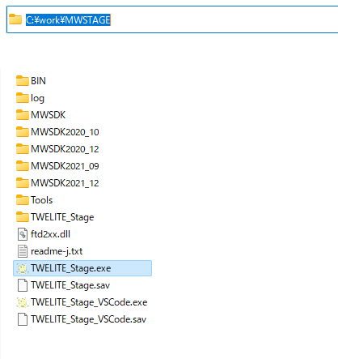

# TWELITE STAGE SDK のインストール

TWELITE STAGE SDK 配布アーカイブ(ZIPなど)をダウンロードし、適切なフォルダに展開します。


展開先の各階層のフォルダ名には、半角数字 `0..9`, 半角アルファベット`a..zA..Z`,一部の記号 `-_.` 以外は含まれないようにしてください。空白や漢字・ひらがななどが含まれてはいけません


TWELITE STAGE SDK アーカイブ展開後のフォルダ例です (windows, `c:\work\MWSTAGE\...`)


**詳しくは[TWELITE STAGE SDKのインストール](https://stage.twelite.info/install/)を参照してください。**



通常のインストール作業はここまでです。続く「環境変数の設定」以下は必要に応じて参照してください。



## 環境変数の設定


TWELITE STAGE アプリを用いる場合は、**環境変数の設定は不要**です。コマンドラインでビルドを行う場合は設定してください。


`MWSDK_ROOT`, `MWSDK_ROOT_WINNAME`(Windows10のみ) の設定が必要です。


#### Windows
ここでは展開後のフォルダ名を `C:\MWSTAGE `とします。別のフォルダにインストールした場合は、読み替えてください。

`C:\MWSTAGE\Tools\SET_ENV.CMD` を実行してください。以下の環境変数を設定します。

* `MWSDK_ROOT`
* `MWSDK_ROOT_WINNAME`

例えば以下のような設定になります。

```
MWSDK_ROOT=C:/MWSTAGE/MWSDK/
MW_ROOT_WINNAME=C:\MWSTAGE\MWSDK\
```


インストールしたPC上からTWELITE STAGE SDKをアンインストールするには以下を行ってください。

* `UNSET_ENV.cmd`を実行してください。環境変数の設定を解除します。
* MWSTAGEフォルダを削除してください。


#### Linux
開発環境やシェルに `MWX_ROOT`環境変数を反映されるように設定してください。

方法はいくつかありますが、ホームフォルダの`.profile`（ファイルがなければ新しく作成してください）に以下の設定を追加します。この設定でVSCodeのビルドまで可能です。

`MWSDK_ROOT=/foo/bar/MWSTAGE/MWSDK/`\
`export MWSDK_ROOT`


エディタを使用せずに追加するには以下のようにコマンド入力します。`$`はプロンプトで環境によって表示が違います。`/foo/bar/MSWSDK`の部分はインストールしたフォルダに応じて書き換えてください。

```bash
$ cd $HOME
$ echo MWSDK_ROOT=/foo/bar/MWSTAGE/MWSDK>>.profile
$ echo export MWSDK_ROOT>>.profile
```

#### macOS
開発環境やシェルに `MWX_ROOT`環境変数を反映されるように設定してください。


方法はいくつかありますが、ホームフォルダの`.profile`（ファイルがなければ新しく作成してください）に以下の設定を追加します。この設定でVSCodeのビルドまで可能です。

`MWSDK_ROOT=/foo/bar/MWSTAGE/MWSDK/`\
`export MWSDK_ROOT`


エディタを使用せずに追加するには以下のようにコマンド入力します。`$`はプロンプトで環境によって表示が違います。`/foo/bar/MSWSDK`の部分はインストールしたフォルダに応じて書き換えてください。

```bash
$ cd $HOME
$ echo MWSDK_ROOT=/foo/bar/MWSTAGE/MWSDK>>.profile
$ echo export MWSDK_ROOT>>.profile
```


環境全体に`MWSDK_ROOT`を適用にするにはLaunchDを用います。

VSCodeの一部の設定で環境変数を参照していますが、ビルドには必須ではありません。


