# アクトのビルド

MWXライブラリで記述したアプリケーションプログラムをアクト(Act)と呼びます。まずは、これをビルドして書き込みます。

* ビルドフォルダ構成について
* Visual Studio Code (VSCodeと記載) でのビルドについて


本ページでは、いくつかのビルド方法を記載していますが、いずれの方法も最終的にはmakeコマンドを実行しています。詳細は[Makefileの解説](makefile.md)を参照ください。




OS環境によっては各実行プログラム(`make` や`gcc`などビルドツールチェイン)の動作時にセキュリティ警告が出る場合があります。警告を抑制する設定が必要になります。（**警告を抑制してプログラムを動作する運用を行うか**は、お客自身またはシステム管理者に相談の上、ご判断ください）



## ビルドフォルダ構成について

MWSDKをインストールしたフォルダ`MWSDK_ROOT (例 C:\MWSDK)`を開きます。以下のような構成になっています。

```
MWSDK_ROOT
  |
  +-ChipLib      : 半導体ライブラリ
  +-License      : ソフトウェア使用許諾契約書
  +-MkFiles      : makefile
  +-Tools        : コンパイラ等のツール一式
  +-TWENET       : TWENET/MWXライブラリ
  +-Act_samples  : アクトサンプル
  ...
```


アクトファイルは`Act_samples` 以下に格納しています。（以下は一部割愛しています）

```
Act_samples
  |
  +-CoreAppTwelite    : App_TweLiteと同じ構成のボード用のアクト
  +-PAL_AMB           : 環境センス PAL 用のアクト
  +-PAL_MAG           : 開閉センス PAL 用のアクト
  +-PAL_MOT           : 動作センス PAL 用のアクト
  ..
  +-Parent-MONOSTICK  : 親機アクト、MONOSTICK用
  +-PingPong          : PingPong アクト
  +-PulseCounter      : パルスカウンタを利用したアクト
  +-act0              : スクラッチ（とりあえず書いてみる）用アクト
```

これらのアクトは、MWXライブラリの記述の参考となるシンプルな例ですが、多くのアクトは以下の機能を有しています。

* センサー値を取得する
* センサー値取得後、無線パケットを親機宛に送信する
* 送信完了後、一定時間スリープする（または割り込みを待つ）

`Parent-MONOSTICK`のアクトによりパケットの受信と表示を行っています。この親機用のアクトは、アスキー形式で出力しています。 (`:00112233AABBCC...FF[CR][LF]` のような : で始まり、途中は１６進数のバイトをアスキー文字2字で表現する形式です。末尾の??は同様に2字のバイトとなりますがLRCというチェックサムバイトになります。参考：[アスキー形式](https://mono-wireless.com/jp/products/TWE-APPS/App\_Uart/mode\_format\_ascii.html))

実際に動作させてみるときは、以下の組み合わせを試してみてください。

| 親                                                        | 子                                                     | 解説                                                                  |
| -------------------------------------------------------- | ----------------------------------------------------- | ------------------------------------------------------------------- |
| [BRD\_APPTWELITE](../act\_samples/brd\_apptwelite.md)    | [BRD\_APPTWELITE](../act\_samples/brd\_apptwelite.md) | 親機はM1ピンをLOW(GNDレベル)にして起動する。通常モード（常時稼働）にて、App\_TweLiteのような動作を確認できます。 |
| [PingPong](../act\_samples/pingpong.md)                  | [PingPong](../act\_samples/pingpong.md)               | 子機同士2台使って動作します。片方から Ping パケットを送ると、相手方から Pong パケットが戻ってきます。           |
| [Parent-MONOSTICK](../act\_samples/parent\_monostick.md) | その他                                                   | 子機用のアクトのパケット送信を確認できます。                                              |


では、アクトの中から PingPong のフォルダの中を見てみましょう。


`Act_samples` にある他のアクトもビルドできます。その場合、フォルダ名・ファイル名は読み替えるようにしてください。


```
Act_samples
  +-PingPong
    +-PingPong.cpp   : アクトファイル
    +-build          : ビルドフォルダ
    +-.vscode        : VSCode 用の設定ファイル
```

必ずフォルダ直下にフォルダと同名の `.cpp` ファイルが必要です。


小規模なアクトならこの`.cpp`ファイル内に記述します。規模が大きくなってきたときは[Makefileの解説](makefile.md)を参考にして複数のファイルに分割してビルドすることが出来ます。



`PingPong` フォルダ直下にアクトファイル `PingPong.cpp` があります。フォルダ名を変更した場合は、必ず `.cpp` ファイルの名前もフォルダ名と同名にします。



次にビルドフォルダを開きます。

```
Act_samples
  +-PingPong
    +-build
      +-Makefile        : makefile
      +-build-BLUE.cmd  : TWELITE BLUE 用ビルドスクリプト(Windows用)
      +-build-RED.cmd   : TWELITE RED 用ビルドスクリプト(Windows用)
      +-build-clean.cmd : obj_* ファイル削除
```

ビルドに必要なスクリプトと`Makefile`が格納されています。


**この`Makefile` のあるフォルダで make TWELITE={BLUEまたはRED} を実行することで、ビルドが行われます。VSCode でのビルドも同様で内部的に make を呼び出します。**


## TWELITE STAGE アプリでのビルド

TWETLITE STAGE アプリを用いて、ビルドから書き込み、実行までを行えます。ここでは、TWELITE STAGE アプリの起動からビルドまでを解説します。


### 0. TWELITE の接続

MONOSTICKまたはTWELITE Rをお使いのUSBポートに接続します。


TWELITE は繊細な電子部品ですので、取り扱いには十分注意してください。以下に代表的な注意事項を記載します。

特にTWELITE Rを用いている場合は、多くの場合電子基板がケースなどを介さず直接外部に触れる状態で使用するため、意図しないショートやノイズなどUSBデバイスが正常に動作しない状態になる場合があります。

この場合は、アプリケーションを終了させUSBデバイスを抜き差しすることで通常は回復します。最悪、USBデバイスの破損やPCの破損も考えられます。

電子基板の取り扱いには十分注意してください。

* 回路の間違い
  * 電源を入れる前には**もう一度**回路を確認してください。
  * 電池の**逆差しや過大電圧**には注意してください。
* 静電気
  * 人感がない電圧であっても半導体の故障になりえます。大掛かりな対応をしなくとも、金属部に触れてから作業する・リストバンド・専用マットなど簡易にできる対応でも相応の効果はあります。
* 金属物などが触れることでのショート
  * 電子基板の近くには金属物がないようにしてください。クリップなどが散らかっているとこれが原因でショートすることもありますし、電池が大放電して加熱する危険な状況も考えられます。
    

### 1. TWELITE STAGE アプリの起動

{TWELITE SDK インストール} フォルダにある実行形式 `TWELITE_Stage.{拡張子}` を起動します(参考:  [TWELITE STAGE アプリマニュアル-使用法](https://stage.twelite.info/usage/))。


以下は、TWELITE STAGE アプリ動作中の画面例です。左側の主画面とコマンドプロンプト画面がありますが、主画面を操作します。コマンドプロンプト画面は通常使用しませんが、諸情報及びTWELITEマイコンシリアルポートからの入力データが表示されます。


主画面での主な操作は以下です。

* マウス左クリック （選択）
* マウス右ダブルクリック（前の画面に戻る）
* 素早く `ESC` を２回, 一部画面では `ESC` １回 （前の画面に戻る）
* Alt(Cmd) キーを押し続ける（ヘルプ画面）
* 通常キーボード入力（画面に従う）

(参考:  [TWELITE STAGE アプリマニュアル-キー操作・マウス操作](https://stage.twelite.info/usage/key_mouse))。


### 2. シリアルポートの選択

TWELITE STAGE アプリを起動すると最初に表示される画面です。事前に TWELITE R や MONOSTICK を接続しておけば、この画面に列挙されます。この画面で操作したい TWELITE を選択します。この画面で選択せずに、別の操作で選択することも可能です。


(参考:  [TWELITE STAGE アプリマニュアル](https://stage.twelite.info/usage/screens/serial_port_sel))


### 3. メインメニュー

シリアルポート選択画面を抜けると、メインメニューが表示されます。ビルドや書込は「アプリ書換」メニューを選択します。

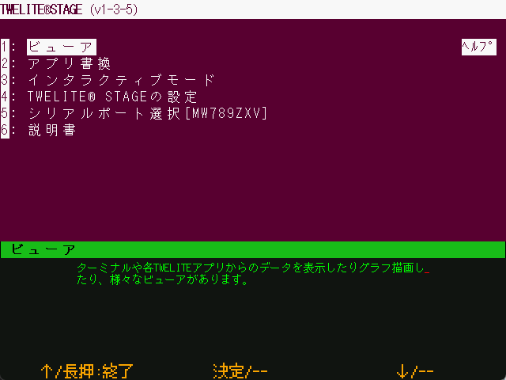

(参考:  [TWELITE STAGE アプリマニュアル](https://stage.twelite.info/usage/screens/main_menu/))


### 4. アプリ書換メニュー

アプリ書換メニューを選択する前に、TWELITE の接続とシリアルポートの選択を確認しておいてください。シリアルポートの選択状況は Alt(Cmd) キーを押し続けると出現するヘルプ画面上で確認できます。

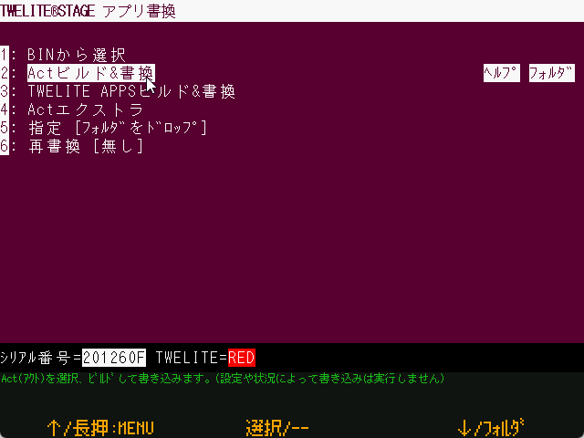

TWELITE STAGE アプリから参照できるプロジェクトはいくつかに分類されています。右側の`ﾍﾙﾌﾟ`は関連情報をブラウザで表示します。`ﾌｫﾙﾀﾞ`はプロジェクトのあるフォルダを表示します。


TWELITE が接続済みであれば、メニューを選択したときに、TWELITE のモデルが判定されます。（TWELITE STAGE アプリ内部では、この判定したTWELITEモデルに応じたビルドを行うようになっています）。



ここでエラーが出た場合は、この画面からメインメニューに戻って、メニューを再選択します。解決しない場合は、必要に応じてTWELITE STAGE アプリ上で `Alt(Cmd)` + `0` を入力してシリアルポート選択を解除を行ったうえで USB 接続を含む各種接続を確認するなどします。USB接続のエラーによっては、お使いのコンピュータを再起動しないと解決しない場合もあります。


(参考:  [TWELITE STAGE アプリマニュアル](https://stage.twelite.info/usage/screens/main_menu/firm_prog/))


### 4. プロジェクトの選択

ここでは「アプリ書換メニュー」から「Actビルド&書換」を選択します。

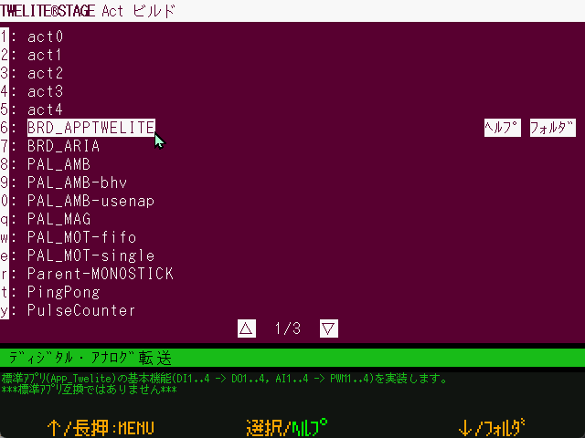

サンプルアクトなどのプロジェクト名が列挙されます。右側の`ﾍﾙﾌﾟ`は関連情報をブラウザで表示します。`ﾌｫﾙﾀﾞ`はプロジェクトのあるフォルダを表示します。

(参考:  [TWELITE STAGE アプリマニュアル-Actビルド&書換](https://stage.twelite.info/usage/screens/main_menu/firm_prog/act_build))


### 5. ビルド&書換
ここでは、先ほどのプロジェクト選択画面中で `BRD_APPTWELITE` を選択します。

選択すると、以下の画面例のように書き込みが行われます。エラーが表示された場合は、画面の指示に従うか、前の画面戻ってやり直してください。


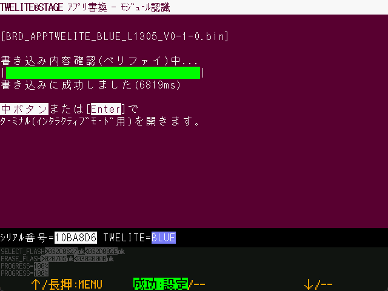

(参考:  [TWELITE STAGE アプリマニュアル-ビルド画面](https://stage.twelite.info/usage/screens/main_menu/firm_prog/build_screen))


### 6. インタラクティブモードに移動

書換が正常に終了すると、続けて[インタラクティブモード](https://mono-wireless.com/jp/products/TWE-APPS/interactive.html)（設定画面）に移行します。ただし、インタラクティブモードに対応するファームウェアでないと画面は表示されません。

インタラクティブモードでは、TWELITE の無線チャネルなど、各種設定を行えます。

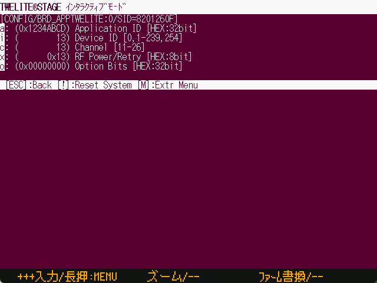


(参考:  [TWELITE STAGE アプリマニュアル-インタラクティブモード](https://stage.twelite.info/usage/screens/main_menu/interactive))


### 7. ターミナル画面

ルートメニューに戻って「ビューア」→「ターミナル」を選択します。

ごく簡易的なターミナルです。TWELITE からのメッセージを確認と、TWELITE への入力を行えます。

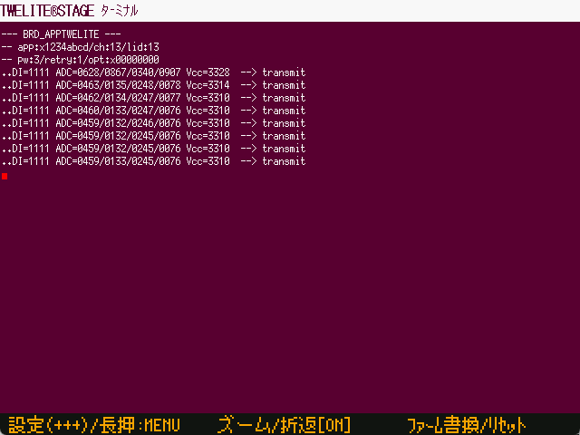

画面では、約１秒おきに無線送信したときのメッセージが表示されます。`+ + +` 入力によるインタラクティブモード画面への遷移も行えます。


(参考:  [TWELITE STAGE アプリマニュアル-ターミナル](https://stage.twelite.info/usage/screens/main_menu/viewer/terminal))


## VSCode でのビルドについて

VSCode はソース編集の強力なエディタですが、VSCode上で TWELITE マイコン用のファームウェアをビルドすることも可能です。


VSCode の起動は TWELITE STAGE アプリの「ビルド＆書換」メニュー以下のプロジェクト一覧より行います。（この動作を行うために TWELITE STAGE アプリの設定が必要です。設定の簡便のため Windows, Linux, macOS では `TWELITE_Stage_VSCode.{拡張子}` の実行形式を用意しています。）


STAGE設定で 「code でフォルダを開く(VSCode)」を `1` にする。

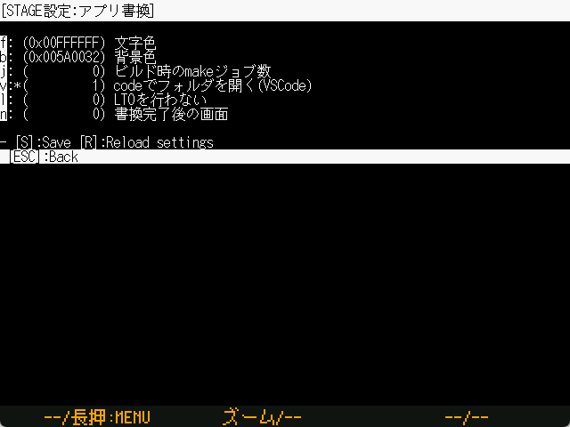


ビルドのリスト中の右端 `[VSCode]` を押します。

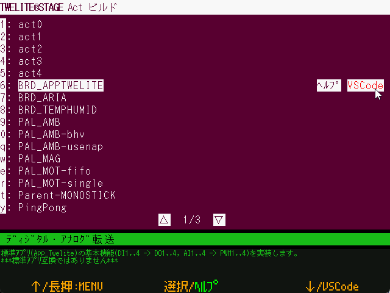



すでに VSCode が立ち上がった状態では必要な設定が反映されない場合があります。その場合は、一旦 VSCode を終了して、改めて TWELITE STAGE アプリから VSCode を起動します。

情報の反映のためにシステム環境変数を用いてるため、原理的に、別々のライブラリフォルダを参照する複数の TWELITE STAGE の同時運用では問題が出る場合があります。VSCode 上で Terminal を開き、環境変数 `MWSDK_ROOT` が適切に設定されている場合はビルドは正常に行われることが期待できます。



### VSCode のビルドタスク

最初にビルドしたいワークスペースを開いておきます。TWELITE STAGE SDK添付のワークスペースにはビルドタスクの定義が追加されています。


以下の例では英語インタフェースの画面例で、ワークスペースを開いています。


ワークスペースを開き `[Terminal>Run Task...]` を選択します。

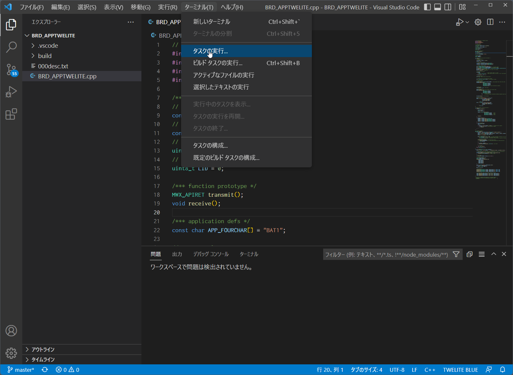


ビルドするTWELITE無線モジュールの種別(BLUE/RED)とアクト名を選択します。以下の例では `Build for TWELITE BLUE` を選択しています。選択後すぐにビルドが始まります。

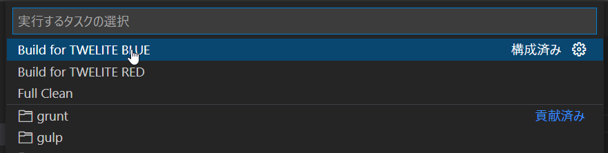


ビルド中の経過は画面下部のターミナル部分に出力されます。

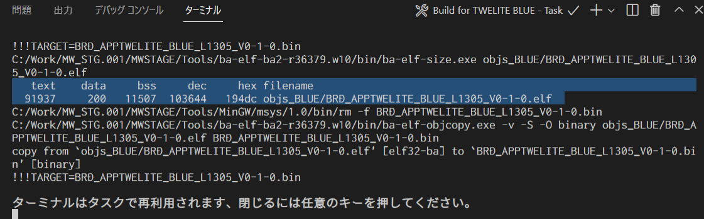


正しくビルドできた場合、上記画面例の反転表示部のように `.elf` ファイルが生成されるメッセージがサイズ情報(`text data bss dec hex filename`と記載がある部分)とともに出力されます。

またBINファイル（上記では `BRD_APPTWELITE_BLUE_???.bin`）ファイルがbuildフォルダ下に出来上がっているはずです。確認してみてください。



VSCodeのタスク定義には Windowsのファイルシステムに適合しないフォルダ名 (例：`/c/User/...`)を変換する(例：`C:/User/...`) 定義を追加しています。

下記`.vscode/tasks.json` 中の変換ルールは完全ではありませんが、出力メッセージ中のドライブ名相当部分の文字列をVSCodeが識別できる形式に書き換えています。この書換によりコンパイルメッセージからエラーが発生しているファイル名と行番号をVSCode中で表示できます。

```
...
"windows": {
    "command": "sh",
    "args": [
        "-c", "make TWELITE=BLUE 2>&1 | sed -E -e s#\\(/mnt\\)?/\\([a-zA-Z]\\)/#\\\\\\2:/#g"
    ],
```




ビルドがうまくいかない場合は、まず**エラーメッセージを確認**して下さい。**errorという文字列が含まれる行**中のメッセージから、エラー原因が容易に特定できる場合も少なくありません。

また、クリーン(`objs_???` フォルダにある中間ファイルの削除)を行い、ビルドを再実行してみてください。（他の環境でビルドした中間ファイルが残っていると`make clean`を含めすべての操作が失敗します)



## コマンドラインでのビルド
コマンドライン環境でのビルドについて補足します。



コマンドライン(bash)についての利用の知識が必要です。



OS環境によっては各実行プログラムの動作時にセキュリティ警告が出る場合があります。警告を抑制する設定が必要になります。（**警告を抑制してプログラムを動作する運用を行うか**は、お客自身またはシステム管理者に相談の上、ご判断ください）


### Linux, macOS 環境
コマンドラインでのビルドは、`bash` (または他のシェル)が動作するウインドウで`make`を実行します。事前に環境変数`MWSDK_ROOT`が正しく設定されていることを確認してください。例えば`/work/MWSDK`にインストールした場合は `~/.profile` に以下のような設定を行います。


```bash
MWSDK_ROOT=/work/MWSDK
export MWSDK_ROOT
```


コマンドライン(bash)よりmakeを実行します。`make`がない場合はパッケージをインストールする必要があります。

```bash
$ make

Command 'make' not found, but can be installed with:

sudo apt install make
sudo apt install make-guile

$ sudo apt install make
...
```


* Linux環境では`make`または`build-essential`パッケージをインストールします。
* macOS環境ではXcodeでCommand Line Toolsをインストールします。



### Windows 環境

Windowsでは `{MWSTAGE SDK インストール}/MWSDK/WIN_BASH.cmd` を実行します。
環境変数や make ユーティリティが設定済みです。


### ビルド

ビルドは以下のようになります。

```
$ cd $MWSDK_ROOT
$ cd Act_samples/PingPong/build
$ pwd
/mnt/c/MWSDK/Act_samples/PingPong/build

$ ls
... ファイル一覧の表示

$ rm -rfv objs_*
... 念のため中間ファイルを削除

$ make TWELITE=BLUE
... BLUE用に通常ビルド

$ make -j8 TWELITE=BLUE
... BLUE用にパラレルビルド(同時に8プロセス)
```


### コマンド例

詳細は[Makefileの解説](makefile.md)をご覧ください。

| コマンド例               | 解説                |
| ------------------- | ----------------- |
| `make TWELITE=BLUE` | TWELITE BLUE用にビルド |
| `make TWELITE=RED`  | TWELITE RED用にビルド  |
| `make cleanall`     | 中間ファイルの削除         |


## 中間ファイルについて

ビルドが行われると `objs_???` フォルダが作成され、その中に中間ファイルが生成されます。このファイルはコンパイルした環境に依存しているため、他の環境のファイルが残っているとmakeがエラーとなりビルドが失敗します。


**直接`objs_???`フォルダ**を削除すると`make`のエラーが解消する場合があります。


