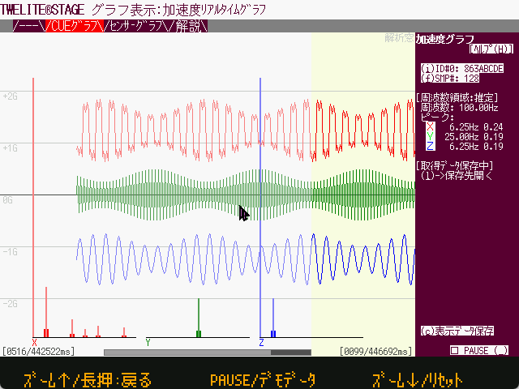

# TWELITE STAGE App.


Please refer to [handling of materials](https://twelite.gitbook.io/general/about_documents).  If you have any questions or concerns, we would appreciate it if you would contact our support office.



The image files (screen captures), may differ from the version used, and there may be differences in the strings displayed in the images, menu order, etc.


TWELITE STAGE APP is a tool to build/program TWELITE wireless microcontroller series apps and view the execution results.


On Windows/macOS/Linux, the MWSDK, which contains compiler sample code, etc., is included. For more details, please refer to the following.

* MWSDK in general - [https://sdk.twelite.info/](https://sdk.twelite.info/)
* MWX Library - [https://mwx.twelite.info/](https://mwx.twelite.info/)


Designed to work on a variety of platforms.

* Windows 10
* macOS \(High Sierra and later)》(High Sierra and later)
* Linux \(Ubuntu18.04\)
* Raspberry Pi \(Raspberry Pi 3 Model B, Lcd Touch Screen, Raspberry Pi OS August-2020\)
* (M5stack : supported up to version 1.0, v1.3 and later are not supported at source level)

Operating conditions, distribution format, and implemented functions differ depending on the platform.

## About this document.

* [https://twelite.gitbook.io/general/about\_documents](https://twelite.gitbook.io/general/about_documents).
* The following pages are listed to indicate supported platforms.
  * `Windows` -- Windows 10
  * `macOS` -- Mac OS X, macOS
  * `Linux` -- Linux \(Ubuntu etc.})
  * `RasPi` -- RaspberryPi

