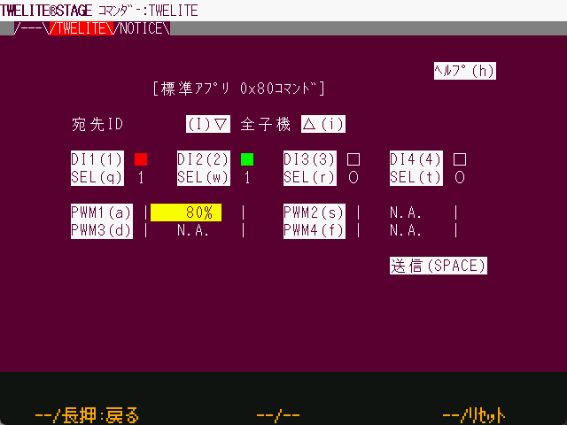

# Key and Mouse Operation

`Windows` `macOS` `Linux` `RasPi`

This section describes the operation through the TWELITE STAGE application.

## Key Operations.
`Windows` `macOS` `Linux` `RasPi`

Keystrokes while pressing `ALt(Cmd)` are operations such as changing the settings of the TWELITE STAGE app.
Other keystrokes are usually on-screen inputs.

### Common keys
`Windows` `macOS` `Linux` `RasPi`

| Key | Meaning |
| ------ | ------------ |
| `ESC` `ESC` | Press ESC twice quickly. Cancel, return to previous screen. Depending on the screen, one `ESC` will return you to the previous screen. | `Enter` | Enter, press `Enter`.
| `Enter` | Input, select |
| Cursor↑↓ | Select item |

### help screen
`Windows` `macOS` `Linux` `RasPi`. 

In Windows/macOS/Linux, you can press and hold Alt\(Cmd\) to display the help screen. The help screen will display a description of the keys that can be operated together with Alt\(Cmd\) and some operational status.


The help screen is also displayed by **moving the mouse pointer to the upper left part of the screen**.


! [help screen](... /.gitbook/assets/img_help_ovrly.png)

### Alt(Cmd)+Operation.

`Windows` `macOS` `Linux` `RasPi`.

The following table describes the operations while holding down Alt(Cmd) on Windows/macOS/Linux. In the table, Alt(Cmd)+ is omitted; pressing Alt(Cmd) will bring up a help screen to check the available keys, which are supplemented in the table below.

| `Alt(Cmd)`+ key | Meaning |
|--------|--------|
| `I` |  Enter + + + key sequence to enter Interactive settings mode.  * Interactive settings mode is not entered with + + + for applications that perform intermittent operation due to sleep.                                                                   |
| `R` | Resets the module, using the TWELITE R or MONOSTICK function to control the reset pin.                                                                                                         |
| `A`, `S`, `D` | Press the A, B, or C button.                                                                                                                                                 | `A`, B, C button.
| Press and hold `Shift` + `A`, `S`, `D` | A, B, C button.                                                                                                                                               | `C` | Press and hold the A, B, or C button.
| `C` | Copy the string of the displayed screen to the clipboard. (The range varies depending on the screen.) |
| `V` | Paste from the clipboard as keyboard input.                                                                                                                                       |
| `F` | Go to full screen; Shift+F will zoom in more if possible.                                                                                                                            | `G`
| `G` | Change the way the screen is drawn. 640x480 LCD screen is emulated, but you can select one of four drawing methods (1. LCD monitor-like drawing / 2. CRT-like drawing / 3. enlarged with prominent dots / 4. enlarged with blurred dots) when zoomed in. The setting can be changed to the startup setting in the setting menu. The setting can be made at startup in the settings menu. 
| `J` | Select the screen size. The available screen sizes are {640,480}, {1280, 720}, {1280,960}, {1920,1440}, {2560,1440}, and {320,240}.  * You can set the startup settings in the settings menu.                                           | `Q` | TWELVE
| `Q` | Exit TWELITE STAGE.                                                                                                                                             |
| `0` | Disconnect the serial port and list the serial ports again.                                                                                                                                   |
| `1`,`2`,...          | Select a serial port.                                                                                                                                                    | `0`, `0`, `0`, `0`...
| `L`, `Shift`+`L` | Start logging serial port input/output. When finished, the log file will be opened in Notepad on Windows or in Log Viewer on macOS. If you want to open the log folder, press `Shift`+`L` to open the folder containing the log.                                                                 | ...

#### Other operations
| key | meaning |
|--------|--------|
| `Alt(Cmd)`+`Shift`+`Ctrl`+`m` | Open MWX library code folder |
| `Alt(Cmd)`+`Shift`+`Ctrl`+`m` | Open the log folder

## Mouse Operation
`Windows` `macOS` `Linux` `RasPi`.

Mouse is mostly left click, but right click, right double click, and wheel may be used.

| Mouse Operation | Meaning |
| ------ | ------------ |
| Left Click | Select |
| Drag while left-clicking | Used depending on the screen (dragging on a graph screen) |
| left double-click | not used | right-click | used depending on screen (dragging on graph screen)
right-click | use by screen | right double-click | escape from screen
| right double-click | escape from screen (same as `ESC` `ESC`)
| wheel | use depending on screen (zoom in/out on graph screen) |

### A,B,C buttons with mouse
`Windows` `macOS` `Linux` `RasPi`.

The TWELITE STAGE application has a menu that resembles a row of three hardware buttons to which functions are assigned for each screen.
When you move the mouse pointer over the menu display at the bottom of the screen, buttons labeled `[ A ]`, `[ B ]`, and `[ C ]` will appear. Left-click or long-press left-click on this button to select a function. (You can also use `Alt(Cmd)`+`a`,`s`,`d` or `Alt(Cmd)`+`Shift`+`a`,`s`,`d` to select)

![Example of the virtual \[ B \] button at the bottom of the screen](../.gitbook/assets/img_vbtn_b.png)

### In-screen operations with the mouse
`Windows` `macOS` `Linux` `RasPi`

On Windows/macOS/Linux, the TWELITE STAGE screen structure consists only of text strings in principle, but menus, buttons, and tabs can be operated with the mouse.

Although it consists only of text, tabs at the top of the screen and highlighted text can be selected with a left mouse click.
