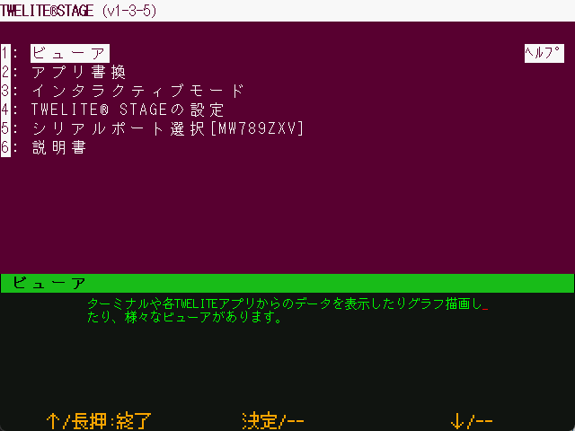

# Main Menu

`Windows` `macOS` `Linux` `RasPi`

This is the top level of the hierarchical menu.

On this screen, you can make various menu selections. When the menu is inverted, a simple explanation is displayed in the green text area at the bottom.

* [viewer](viewer/README.md) : A viewer that interprets and displays messages from the TWELITE radio module. In most cases, App_Wings is used for the receiving side.
* [app_rewrite](firm_prog/README.md) : builds and writes firmware to the connected TWELITE radio module.
* Interactive settings mode (interactive.md): to set the connected TWELITE radio module to interactive settings mode.
* [TWELITE STAGE settings](settings.md) : Configure various settings for the TWELITE STAGE application.
* [Serial port selection](select_serial_port.md) : Displays a menu to select a serial port.
* Description : Menu to display the description. Open the following instructions in your browser.
    * TWELITE STAGE application (this document)
    * MWX library
    * TWENET_C library
