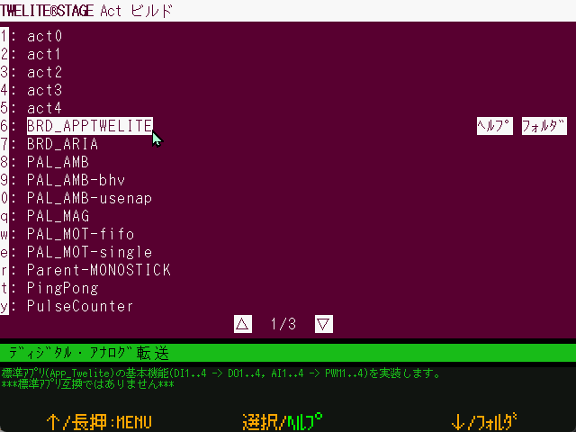

# Act build&Wrt

`Windows` `macOS` `Linux` `RasPi`

Build and rewrite Act. (Windows/Mac/Linux)


Focus on small-scale source code that can be used as a reference for writing Act (Act).




When this screen is opened, a list of projects is displayed. Select the project you wish to write, and the build - write will be performed. After writing is complete, press `Enter` or `[ B ]` button to reset the TWELITE radio module and go to the Interactive settings mode screen (or Terminal screen, configuration required).

[Build - Write screen](build\_screen.md)

If the configuration is set to use VSCode (open a folder with application rewrite>code), do not build, but open the [Build to write BIN file screen](bin.md) under `build/`.


### Folder

The projects to be built are as follows

```
{MWSTAGE installation folder}/MWSTAGE/Act_samples
```


### Operation

| Operation                             | Desc.                                                          |
| ------------------------------ | ---------------------------------------------------------- |
| `[ A ]`                         | Menu selection ↑                                                   |
| `[ A ]` long press                     | Exit this screen and return to the previous menu.                                           |
| `[ B ]`                         | Selection                                                         |
| `[ B ]` long press                      | Open the relevant website (if registered in `000desc.txt` in the project folder) with a standard OS browser. |
| `[ C ]`                         | Menu selection ↓                                                   |
| `[ C ]` long press                      | Open a folder (project, related folders). You can set it to open in VS Code in the settings menu.       |
| ESC                            | Exit this screen and return to the rewriting menu.                                      |
| mouse click `[ﾍﾙﾌﾟ]`                | Open the relevant website.                                             |
| mouse click `[ﾌｫﾙﾀﾞ]` \(or `[VSCode]`\) | Open the relevant folder \(with VSCode\).                                               |
| mouse click `[▽]` or `[△]`          | Go to the next or previous page.      |


