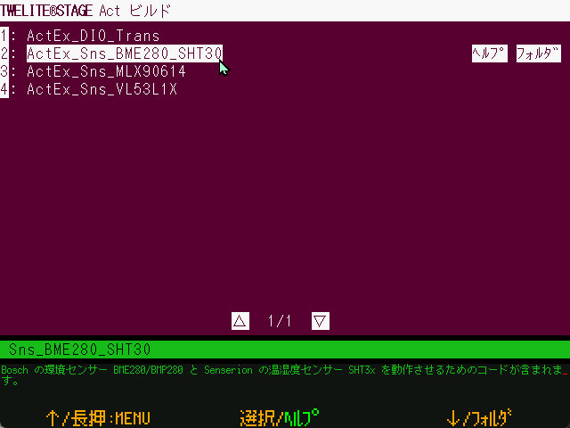

# Act extras

`Windows` `macOS` `Linux` `RasPi`

Build and rewrite Act.


Act Extras include those that use external open source libraries and other resources, and those that perform relatively complex processing.




When this screen is opened, a list of projects is displayed. Select the project you wish to write, and the build - write will be performed. After the writing is finished, press `Enter` or `[ B ]` button to reset the TWELITE radio module and go to the Interactive settings mode screen (or Terminal screen, configuration required).

[Build to Write Screen](build\_screen.md)

If you have set up to use VSCode at the TWELITE STAGE settings, do not build, but open [screen to write BIN file](bin.md) under `build/`.


### Folder

The projects to be built are located as follows

```
{MWSTAGE installation folder}
    MWSTAGE/Act_extras
```

### Operation

| Operation                      |  Desc.                                                          |
| ------------------------------ | ---------------------------------------------------------- |
| `[ A ]` | Select menu ↑ |
| `[ A ]` long press | Exit this screen and return to the previous menu. |
| `[ B ]` | Selecting a menu item. |
| `[ B ]` long press | Open the related website (if it is registered in `000desc.txt` in the project folder) with a standard OS browser. |
| `[ C ]` | Menu selection ↓ |
| `[ C ]` long press | Open a folder (project or related folder). You can set it to open with VS Code in the settings menu. |
| `ESC` | Exit this screen and return to the rewriting menu. |
| Mouse click `[HELP]` | Opens the related website. |
| Mouse click `[Foldr]`  \(or `[VSCode]`\) | Open a related folder \(with VSCode\).  | 
| Mouse click `[▽]` or `[△]` | Go to the next or previous page.  | 