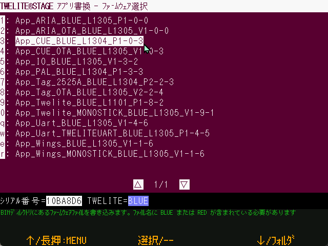

# Select from BIN

`Windows` `macOS` `Linux` `RasPi`

Writes a pre-built application (.BIN file).



Selecting the menu will display a list of files. Select the firmware you wish to write.

Before selecting the menu, store the BIN file you want to write in the following.

| Platform | Location
| ------------------- | --------------------------- |
| Windows, Mac, Linux | {MWSTAGE folder}/BIN |

In the BIN folder, store the .BIN file (stored under the build folder of each project) built with TWELITE STAGE, without changing the file name.

```
../BIN/App_Wings_MONOSTICK_BLUE_L1304_V1-1-3.bin
       App_Wings_MONOSTICK_RED_L1304_V1-1-3.bin
       App_Twelite_BLUE_L1304_V1-9-1.bin
       App_Twelite_RED_L1304_V1-9-1.bin
       ...
```


The file name is used to identify BLUE/RED.

