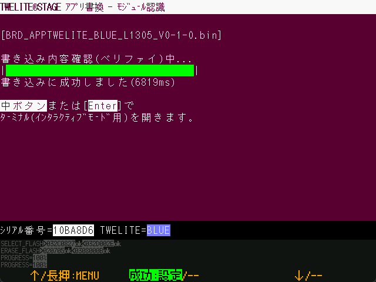

# Build and Programming Screen

`Windows` `macOS` `Linux` `RasPi`

### During Build

This is the screen during the build process. The contents of the build commands are output to the console screen. ..." in the screen shows the number of files being built. is the number of files being built, and the darker color at the bottom is the name of the file being built.

### Build error

If the build fails, the screen will look like the above. You can execute a rebuild or view the error log. It will also return to the straight line menu as time expires after a certain period of time.

Only typical error messages are displayed on the screen. When a build fails, error messages may not be displayed.

| Operation          | Desc.                                                             |
| ------------- | ------------------------------------------------------------ |
| `[ A ]` long press | Exit this screen and return to the previous menu.                             |
| `[ B ]`        | Rebuild on error                                       |
| `[ C ]`        | Show error log (Windows/Mac) The error log is `{project folder}/build/builderr.log`. |
| `[ C ]` long press | Open a folder (project, related folders). You can set it to open in VS Code in the settings menu. |
| ESC           | Exit this screen and return to the rewriting menu.                   |

### Programming (Writing firmware)

If the build is successful, the screen for writing firmware is displayed.

After v1.0.2 or later, after the firmware is rewritten, a verification process is performed to read and check the rewritten contents.

### Failure while programming

If the programming is in error, the screen will look like the above

| Operation     |   Desc.                                                                           |
| ---------- | ---------------------------------------------------------------------------- |
| `[ A ]` long press | Exit this screen and return to the previous menu.                                                             |
| `[ B ]`     | Perform programming again (returns to the previous programming menu. Since the menu item for programming is still selected, press `[ B ]` again to perform the programming again). |
| ESC       | Exit this screen and return to the programming menu.                                                        |

### Completion of programming

If the programming is successfully completed, the above message is displayed.

From v1.0.2 onward, after the firmware is rewritten, a verification process is performed to read and check the rewritten contents.

| Operation     |   Desc.  |
| :--- | :--- |
| `[ A ]` long press | Exit this screen and return to the previous menu. |
| `[ B ]` | Reset the TWELITE radio module and go to the Interactive settings mode screen (or terminal, depending on your settings) screen. |
| ESC | Exit this screen and return to the programming menu. |

| 操作         |                                                             |
| ---------- | ----------------------------------------------------------- |
| `[ A ]` long press | Exit this screen and return to the previous menu.                                            |
| `[ B ]`    | Reset the TWELITE wireless module and go to the Interactive settings mode screen (or terminal, depending on your settings) screen. |
| ESC   | Exit this screen and return to the programming menu.                                       |

