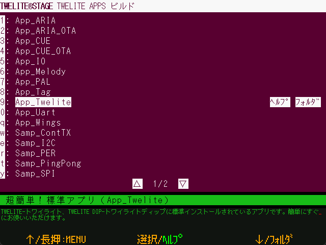

# TWELITE APPS build&Wrt


`Windows` `macOS` `Linux` `RasPi`

Build and rewrite TWELITE APPS. (Windows/Mac/Linux)


The source code is mainly written in C language by TWENET C API and is relatively large in scale to be used as is.




When this screen is opened, a list of projects is displayed. Select the project you wish to write, and the build - write will be performed. After the writing is finished, press `Enter` or `[ B ]` button to reset the TWELITE wireless module and go to the Interactive settings mode screen (or Terminal screen, configuration required).

[Build to Programming\(Wrt\) Screen](build\_screen.md)

If you are set to use VSCode (perform programming > open a folder with code), do not build, but open the [BIN file writing screen](bin.md) under `build/`.


### Folder

The projects to be built are as follows

```
{MWSTAGE installation folder}/MWSTAGE/Wks_TweApps
```


### Operation

| Operation                      | Desc.                                                      |
| ------------------------------ | ---------------------------------------------------------- |
| `[ A ]`                        | menu selection ↑                                          |
| `[ A ]` long press             | Exit this screen and return to the previous menu.          |
| `[ B ]`                        | Selection                                                  |
| `[ B ]` long press             | Open the relevant website (if registered in `000desc.txt` in the project folder) with a standard OS browser. |
| `[ C ]`                        | menu selection ↓                                                   |
| `[ C ]` long press             | Open a folder (project, related folders). You can set it to open in VS Code in the settings menu.   |
| ESC                            | Exit this screen and return to the programming menu.       |
| mouse click `[HELP]`           | Open the relevant website.             |
| mouse click `[Foldr]` or `[VSCode]` | Open the relevant floder \(with VSCode\). |
| mouse click `[▽]` or `[△]`          | Go to the next or previous page.                                           |
