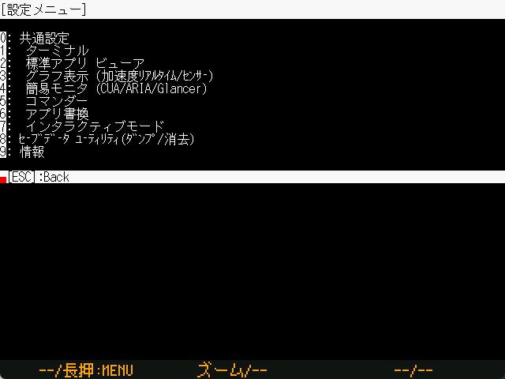

# Setting up a TWELITE STAGE

`Windows` `macOS` `Linux` `RasPi`

Configure various settings.




* Menus on this screen cannot be operated with the mouse.
* It may be difficult to see if you change the color of the screen.



In the menus in the following explanations, there are items that do not exist on some platforms, but all are enumerated and explained.

Color settings other than those in the common menu are omitted.

### root menu

```text
Common settings
 Terminal
 Std App Viewer
 Graph Viewer(Accl, Sensors)
 Simple monitor (CUA/ARIA/Glancer)
 Simple monitor (CUA/ARIA/Glancer)
 Commander
 Wrt Firmware
 Interactive settings mode
Save Data Utility ( Dump/Erase)
Information
````


### common setting

```text
a: (      0x00) Startup App.
G: (      0x00) Screen size and drawing method
F: (          ) Serial Device ID
f: (0x00FFFFFF) FG color
b: (0x005A0032) BG color
B: (    115200) Baud Rate
```

| Settings | Content |
| :----------------------- | :----------------------------------------------------------- |
| Startup App.               | This is the setting for moving to the viewer application when TWELITE STAGE is started. The value is 1... {numbers listed in the viewer app menu}. If the serial device ID is not set, it will wait for input on the serial device selection screen when starting. |
| Screen size and drawing method     | `Windows` `macOS` `Linux` `RasPi` Specify by 2-digit XY character (X:Screen size Y:Drawing method)X 0:640x480 1:1280x720 2:1280x960 3:1920x1440 4:2560x1440 5:320x240, Y 0:LCD-like 1:CRT-like 2:Blurred 3:Block |
| Serial Device ID      | The `Windows` `macOS` `Linux` `RasPi` setting is a serial device name or a numeric value of 1...9. For numerical values, the order of device enumeration is used. |
| FG, BG color     | Specify the text color and background color. The color setting values of the common settings are inherited by the settings of other screens. If other screens have not yet been set, the color settings in the common settings will be used. Colors are specified as 24-bit RGB hexadecimal numbers, but the values are internally rounded to 16-bit 565 format. |
| Baud Rate        | TWELITE Set the baud rate on the radio module side so that the terminal and other displays will not be corrupted if the baud rate on the radio module side is not 115200. |


### Wrt Firmware

```text
f: (0x00FFFFFF) FG color
b: (0x005A0032) BG color
j: (         0) Number of make jobs at build time
v: (         0) Open a folder with VSCode
l: (         0) LNo LTO
n: (         0) Screen after rewriting is completed
```

| 設定                          | 内容                                                         |
| :---------------------------- | :----------------------------------------------------------- |
| Number of make jobs at build time       | `Windows` `macOS` `Linux` `RasPi` This is the number of parallel jobs for builds. Setting an appropriate number can be expected to reduce build time. The default value of 0 is calculated by (number of physical processors - 1). As a rough guide, the number of logical processors should be used as the upper limit. |
| Open a folder with VSCode | `Windows` `macOS` `Linux` Setting 1 opens the folder with the code command (VS Code) instead of the standard OS folder window. |
| Screen after rewriting is completed              | Set `Windows` `macOS` `Linux` `RasPi` 1 to open the terminal instead of the Interactive settings mode screen. 2 to return to the rewrite menu. |
| LNo LTO               | The `Windows` Window compiler can generate slightly smaller binaries through the LTO mechanism, but linking takes time. This procedure can be eliminated, allowing for faster linking. |


### Saved Data Utility

```text
r: Read sector.
R: Read ALL sectors.
e: Erase sector.
E: Erase ALL sectors.
```

This screen is a utility that performs maintenance of the data save area, emulating an EEPROM\(64 bytes as one sector, up to 60 sectors, 3840 bytes\).

| Settings | Contents |
| :--- | :--- |
| r | Reads a sector. 0..59 is entered, the contents of the sector with the entered sector number are displayed. | 
| R | (Entering YES reads all sectors, but only the last one is displayed. |
| e | Erase Sector (0xFFFF) (Entering 0...59 will erase the sector with the entered sector number. |
| E | Entering YES erases all sectors. |


On `Windows` `macOS` `Linux` it is stored in the file `{executable name}.sav`, i.e. `TWELITE_Stage.sav`.  


