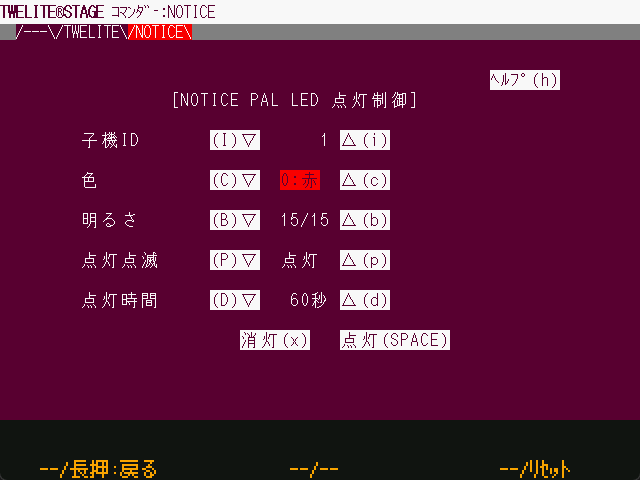

# Commander

`Windows` `macOS` `Linux` `RasPi`

The Commander sends serial messages to the TWELITE radio microcontroller. The first screen of the Commander describes the notes.

At the top of the screen are tabs represented by text, which can be clicked on with the mouse to move to the screen in the tab.

| Operation  | Desc.                                    |
| ---------- | ----------------------------------- |
| `[ A ]` | Move tab (left) |
| `[ A ]` long press | Exit this screen and return to the selection screen.                    |
| `[ B ]` | No assignment |
| `[ B ]` long press | No assignment
| `[ C ]` | Move tabs (right) |
| `[ C ]` long press | TWELITE Controls the wireless module's reset pin and resets it. |
| ESC | Exit this screen and return to the selection screen.                    |

#### Tab: TWELITE

This screen generates and sends the [0x80 command](https://mono-wireless.com/jp/products/TWE-APPS/App\_Twelite/step3-80.html) for [App_Twelite \(standard application\)](https://mono-wireless.com/jp/products/TWE-APPS/App\_Twelite/), writes App_Twelite or App_Wings to the TWELITE radio microcontroller, sets the Application ID CHANNEL, and confirms that the message is received from the communication partner Confirm that the message has been received from the communicating party.

| Item | Content |
| -------- | ------------------------------------------------------------------------------------------------------------------------------------------------------- |
| Destination   | The Destination. If you are a Child Node, specify "Parent Node:0". If you are the Parent Node, specify "All Child Nodes = 0x78" or a specific Child Node ID (up to 1..8 can be specified).  |
| DI1..DI4 | This is the setting status from DI1 to DI4. `■` means selection (LOW=GND level) and `□` means (HIGH=VCC level). Specify SEL for the item below.   |
| SEL      | Selection bits for each DI (0 to ignore the DI designation, 1 to enable the designation)     |
| PWM1..4  | Set the duty ratio of PWM. 0 is equivalent to GND level, 1024 (100%) is equivalent to VCC level, and the PWM port set to N.A. is not changed. The LED of PWM1 on the TWESTAGE board is sucked in from VCC, so it lights up brightest at 0 and turns off at 100%. |

A command is generated each time each item is changed. Pressing the Send button will re-send the command for the current setting.

#### Tab:NOTICE

This screen generates [NOTICE PAL](https://mono-wireless.com/jp/products/twelite-pal/sense/notice-pal.html)'s [Commands for LED control](https://wings.twelite.info/how-to-use/parent-mode/transemit-command/0x90-command), which writes App_Wings to the TWELITE radio microcontroller, sets the Application ID CHANNEL, and verifies that the message is received from the communication partner.

| Item | Content                                                  |
| ----- | --------------------------------------------------- |
| Child Node ID | Destination. 1..8. Assign the same ID to the Child Node.                | The ID of the child unit. |
| Color | Specify the lighting color from 7 colors. There are two types of white, one is a mixture of RGB colors and one is white LED lighting alone. |
| brightness | 0..15 where 0 is off.       |
| Light blinking | Select light-on or blinking pattern.                                  |
| Lighting time  | This function automatically turns off the light after a certain period of time after issuing a command.                      |
| Off button | Generates a lights-off message.                                      |
| On button | Transmits the current settings.                                        |

A command is generated each time each item is changed. Pressing the lit button will re-send the command for the current setting.

#### Display at the bottom of the screen

The bottom of the screen displays the timestamp at which the command was generated and the command beginning with `:`. The clipboard will copy the contents of this screen.
