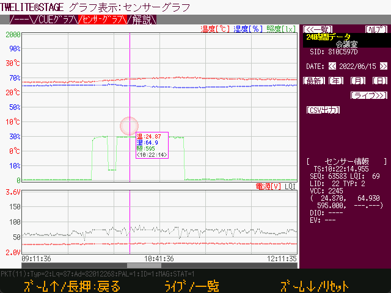
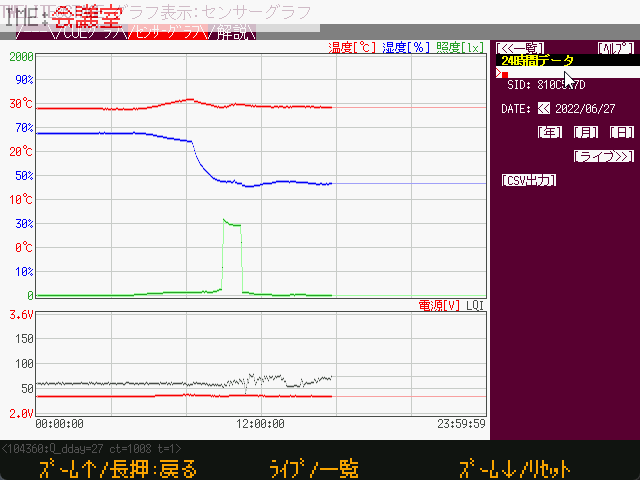

# Sensor Graph

`Windows` `macOS` `Linux`  `RasPi`

Various sensor data are recorded in a database file. There is also a function to simply refer to the measured values on the TWELITE Stage screen.






It is not possible to start multiple TWELITE STAGE with the same executable name and use the sensor graph at the same time.

The database file is stored in the `{MWSTAGE installation}/log` folder and the file name is determined by the TWELITE_Stage executable name.This is because the same executable file name refers to the same database file. The TWELITE STAGE app implementation does not expect multiple application instances to be adding data to the database at the same time. In some situations, this may result in a database file access error, which may cause the TWELITE STAGE app to crash.

For example, if you want to connect two MONOSTICKs and run multiple "sensor graphs" at the same time, run the TWELITE STAGE application with different executable names (`stage_a.exe`, `stage_b.exe`) for each. The database file names are `log/stage_a_WSns.sqlite` and `log/stage_b_WSns.sqlite`.


* Data is stored in a file named `{MW_STAGE Install}/log/{MW_STAGE file name}_WSns.sqlite` using sqlite3.

* The screen transition is [List (with graph preview)]>[24-hour data]>[Live View].

    * From [24-hour data], you can move to [Year], [Month], [Day (with graph preview)] selection screen.

* About the [Live] display screen

    * Select a specific node from the list.
    * Display real-time data every second, up to 450 seconds in the past.

* About [24-hour data] display screen

    * Display data for a specific day.
    * Data is acquired every second, and if there are multiple data, they will be thinned out.
    * Except for the maximum magnification (1 second per pixel), the data is displayed by averaging the acquired values in each pixel range.
    * If the value extends beyond the screen, the measurement points are displayed at the top and bottom edges.
    * If the current time is included, the display is updated when new data arrives.
    * Wheel, cursor up/down: zoom in/out of time axis
    * Mouse move: Simplified display of the acquired data in the time axis corresponding to the mouse pointer.
        * Cursor→, ←: Move to the next acquisition data.
    * Click and drag: Scroll (only when zoomed in)
    * When zoomed in, operation by scroll bar is also available.
    * The [CSV Output] function displays all acquired values contained in the database.

* Use the tools at https://sqlitebrowser.org/ to extract data.

### Operation

|  Operation                                 |  Desc                                                        |
| ------------------------------------ | ------------------------------------------------------------ |
| Mouse drag (graph area) | Move the display position when zooming in
Mouse drag (bottom scroll bar) | Move the display position when zooming in | Move cursor →, ← | Move sample display
| Cursor →, ← | Move the sample display | Cursor up, down, wheel
| Cursor up, down, wheel | Zoom in/out on sample horizontal axis
| `[LIVE>>]`                           | Go to the one-second increment view that displays the latest arrival data |
| `[24Hr Data]`                        | Go to daily graph |
| `[<Nodes]`                           | Go to the nodes selection screen |
| `[Yr]`　`[Mo]` `[Dy]`                | Select a specific date by year, month, and day. |
| `[ltst]`                             | Go to today's data |
| `[CSV exprot]`                       | Output one day's data to CSV file |
| `[DISP]` at Nodes screen             | Change the display method of the list |
| `[SORT]` at Nodes screen             | Change the order of the list |
| `[↑]` at Nodes screen               | Reverses the order of the listings |


#### Edit Sensor Node Description

`v1.3.9`or later


On the "24-hour data screen," left-clicking on the memo portion of the sensor node in the upper right corner of the screen will prompt you to edit the memo.





| Key     | Description                                             |
| ------------ | ------------------------------------------------------------ |
| ASCII charavcters     | If you enter a normal alphanumeric string directly, it will be switched accordingly on the screen. |
| `BS`         | Delete the trailing characters displayed.                       |
| `ENTER`      | The entered string is reflected in the database.                   |

* IME input operations (e.g. Japanese) may depend on the system you are using.
* Unexpected character strings may be input depending on the operation at the time of IME input. When an unnecessary string is displayed in the input area, delete the unnecessary part by pressing the `BS` key.


### Screen Transitions

There are three basic types of screens: list, 24-hour, and live.

```
[List] <--> [24 hours] <--> [Live]
              ↓↑
          [Select Year, Month, Date]
```


### Open at startup of sensor graph mode.

Specify `32` in [STAGE Common Settings -> Startup Application Designation].


### About DB table

#### sensor_data

| Column Name | Type | Description                                                         |
| ------------- | ---------------------- | ------------------------------------------------------------ |
| `_uqid`       | INTEGER                | continuation number used in the database |
| `sid`         | INTEGER<br />`int32_t` | serial number stored in `int32_t` type." In the case of the serial number "8123abcd", the integer value of -2,128,368,691 is stored. |
| `ts`          | INTEGER               | The time the system received the packet, a timestamp value stored of type `int64_t` UNIX epoch (seconds elapsed since 1970). |
| `ts_msec`     | INTEGER               | The milliseconds portion of the timestamp.                             |
| `year`        | INTEGER               | The year portion of the local time from the timestamp.  |
| `month`       | INTEGER               | The month portion of the local time from the timestamp. |
| `day`         | INTEGER               | The day portion of the local time relative to the timestamp. |
| `hour`        | INTEGER               | The hour portion of local time from the time stamp. |
| `lid`         | INTEGER               | The identification value, e.g., LID, assigned by the user. |
| `lqi` | INTEGER | Approximate value of the reception strength (Link Quality Indicator).             
| `pkt_seq`     | INTEGER               | The sequential number of the packet. The possible values depend on the firmware. |
| `pkt_type`    | INTEGER               | The type of wireless packet. <br />`2 PAL AMB, 6 ARIA` <br />`1 PAL MAG` <br />`*3 PAL MOT,5 CUE` <br />`0x101 App_Twelite, *0x103 App_IO` <br />*Not supported at this time |
| `value`       | REAL                  | measured value (definition depends on packet type)<br />`pkt_type->`<br />` 2,6: temperature`<br />` 1: presence of magnet 00->no magnet, 01->N-pole, 02->S-pole`<br />` 3,5: X axis acceleration (average if packet includes multiple 0x101,103: bitmap of input IO (same value as the last 8 bits of val_dio)` |
| `value1`      | REAL                  | measured value (definition depends on packet type)<br />`pkt_type->`<br />` 2,6: Humidity[%]`<br />` 1: not used`<br />` 3,5: Y axis acceleration (average value if packet contains multiple samples)[G]`<br />` 0x101: ADC1[V] ,103: Not used` |
| `value2`      | REAL                  | measured value (definition depends on packet type)<br />`pkt_type->`<br />` 2: illuminance[lx], 6: not used`<br />` 1: not used`<br />` 3,5: Z axis acceleration (average value if packet contains multiple samples)`[G ]<br />` 0x101: ADC2[V], 103: unused` |
| `value3`      | REAL                  | measurement value (definition depends on packet type)<br />`pkt_type->`<br />` 2: not used, 6: not used`<br />` 1: not used`<br />` 3,5: not used`<br />` 0x101: ADC3[V], 103: not used` |
| `val_vcc_mv`  | INTEGER               | voltage[mV] |
| `val_dio`     | INTEGER<br />`int32_t` | b0..b7: DI1..DI8 values (1 is LO, 0 is HIGH level)<br />b24..b25: magnet value (if b28 is 1), 00->no magnet, 01->N pole, 10->S pole<br />b28: if 1 Magnet data is stored in b24..b25<br />b31: Regular transmission bit (magnet only) |
| `val_adc1_mv` | INTEGER               | `pkt_type`->1,2,3,0x101: Measured value of ADC1
| `val_adc2_mv` | INTEGER               | `pkt_type`->0x101: Measured value of ADC4 |
| `val_adc2_mv` | INTEGER               | Other data storage purpose | `ev_src` | INTEGER
| `ev_src`      | INTEGER               | Source of the event | `ev_id` | INTEGER | Purpose of storing other data
| `ev_id`       | INTEGER               | Event ID<br />`pal_type`->5: 1.... .6 -> dice 16 -> MOVE ... etc. (see documentation for TWELITE CUE) |
| `ev_param`    | INTEGER               | Event Parameter |

#### sensor_node

Used to store additional information (text) in sensor nodes.

| Column Name | Type | Description                                                         |
| ---------- | ------- | ------------------------------------------------------------ |
| `sid`      | INTEGER | SID above                                                    |
| `sid_text` | TEXT    | SID converted to hexadecimal string (for readability)            |
| `desc`     | TEXT    | Auxiliary information corresponding to the SID, to be displayed together in a list, etc. |

#### sensor_last

Used for the purpose of maintaining the last received timestamp.

| Column Name | Type | Description                             |
| ------------ | ------- | -------------------------------- |
| `sid`        | INTEGER | SID above.                       |
| `ts`         | INTEGER | Timestamp of last receipt     |
| `lid`        |         | Here are some excerpts from the last data received |
| `lqi`        |         |                                  |
| `pkt_type`   |         |                                  |
| `value`      |         |                                  |
| `value1`     |         |                                  |
| `value2`     |         |                                  |
| `value3`     |         |                                  |
| `val_vcc_mw` |         |                                  |
| `val_dio`    |         |                                  |
| `ev_id`      |         |                                  |

