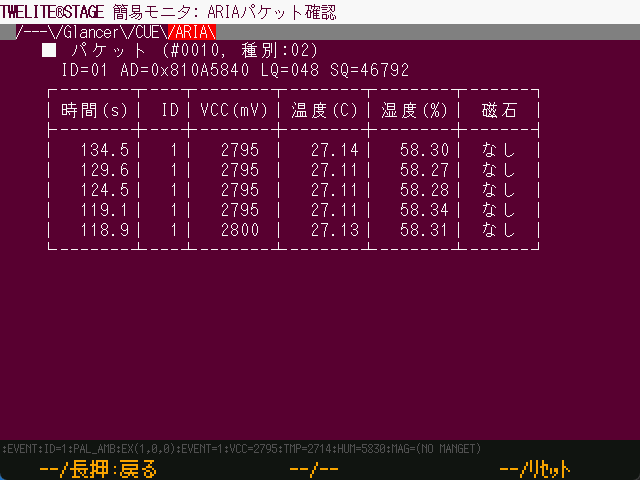

# ARIA Viewer

`Windows` `macOS` `Linux` `RasPi`

Interpret messages from [TWELITE ARIA](https://mono-wireless.com/jp/products/twelite-aria/index.html).


During this commentary, the cupcake image of the previous version is shown.


## TWELITE ARIA

The default setting (ARIA mode) of TWELITE ARIA wakes up due to several factors and transmits various information after waking up while driving intermittently using sleep, which can be operated even with coin cell batteries.

#### Wake-up factors

* Wake-up by timer (periodic wake-up by set value)
* Wake-up by magnetic sensor (when a magnet is detected approaching)

#### Transmitted data

* Module power supply voltage
* Magnetic sensor detection value
* Temperature and humidity data

### Packet

Displays basic packet information.

| Item | Desc.                                                                                                                        |
| ----- | ------------------------------------------------------------------------------------------------------------------------- |
| #???? | The number of packets received so far.                                                                                                         |
| Type    | The value of [`E_PKT`](https://mwm5.twelite.info/references/parser/twefmt/twepacket/e\_pkt), which is the packet type; packets from CUE usually have PKT_PAL=02. |
| ID    | Logical ID of the sender. Normally the value is 0..100.                                                                                              |
| AD    | The serial number of the sender.                                                                                                             |
| LQ    | LQI, the value corresponding to the radio wave strength.                                                                                                         |
| SQ    | Packet sequence number.                                                                                                              |

### Data Table

Displays the history of the last 9 data received from TWELITE ARIA. The higher the number, the more recent the data.

#### Time\(s\)

The time in seconds from the start of the TWELITE STAGE APP until the data is received.

#### ID

Logical device ID of the module.

#### VCC\(mV\)

Supply voltage of the module\[mV].

#### Temperature\(C\)

The temperature measured by the module \(°C\).

#### Humidity\(%\)

The humidity \(%\) measured by the module.

#### Magnet

Displays detected or undetected magnet poles.


No indication of whether the magnetic sensor is awake or not due to detection.

