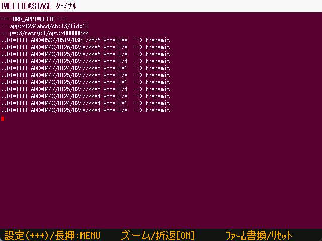

# Terminal

`Windows` `macOS` `Linux` `RasPi`

This is a simple terminal that supports ANSI escape sequences (partial) and performs I/O directly with the TWELITE radio microcontroller.

| Operation  | |
| ---------- | ---------------------------------------------------------------------------------------------------------------------------------- |
| `[ A ]`  | input + + + sequence (Interactive settings mode) |
| `[ A ]` long press | Exit this screen and return to the previous menu.  |
| `[ B ]`  | Display in large font. Display a partial area of the first screen. Select the area so that the cursor is displayed in the screen, but`, depending on the screen output, the part you want to see may not be visible. |
| `[ B ]` long press | Turn-on/off of the wrapping control, which by default is turned on, but can also be turned off. Text after the right edge of the screen is not displayed. |
| `[ C ]`  | Go to the firmware programming screen. Shortcuts are provided for frequent source code modifications, operation checks, and build & write operations during firmware development.  |
| `[ C ]` long press | Controls and resets the reset pin of the TWELITE wireless module. |
| ESC ESC | Exit this screen by quickly entering the ESC key twice. In most screens, pressing the ESC key once is the operation for exiting the screen, but since the terminal may use the ESC key alone, it is assigned to two consecutive entries. |
