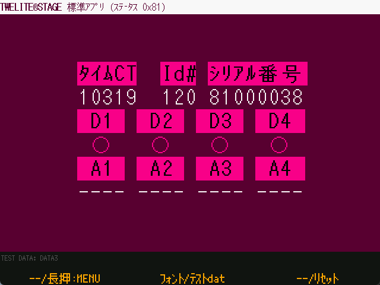

# Std App Viewer

`Windows` `macOS` `Linux` `RasPi`

Interprets [0x81 command](https://mono-wireless.com/jp/products/TWE-APPS/App\_Twelite/step3-81.html) of [App_Twelite \(standard app\)](https://mono-wireless.com/jp/products/TWE-APPS/App\_Twelite/).

The TWELITE wireless microcontroller is written with App\_Twelite (standard app) or App\_Wings, and the serial message from the communication partner is displayed before it is used.

The communication partner is App\_Twelite (standard app), and when it receives a standard app button or analog input status message (0x81 message), its contents are interpreted and displayed by mwm5's parser library.

| Operation  | Desc.                                    |
| ---------- | ----------------------------------- |
| `[ A ]`     | No assignment.                                |
| `[ A ]` long press | Exit this screen and return to the previous menu.                    |
| `[ B ]`     | Change the font.                         |
| `[ B ]` long press | Screen display with dummy data for testing.            |
| `[ C ]`     | No assignment.                                 |
| `[ C ]` long press | Controls and resets the reset pin of the TWELITE wireless module. |
| ESC ESC       | Exit this screen by entering double ESC keys.            |
