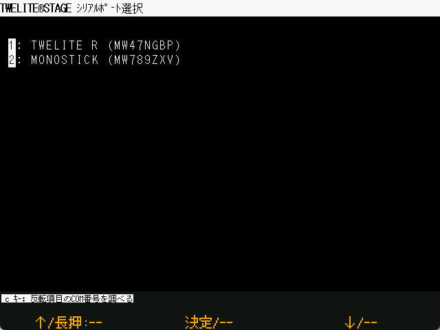

# Serial Port Selection

`Windows` `macOS` `Linux` `RasPi` 

On Windows/macOS/Linux, a screen will appear at startup to select the serial port to which the TWELITE wireless microcontroller is connected.
The serial port can be connected later without selecting it on this screen.


In the TWELITE STAGE application, the serial port selection is not linked to the processing of each screen.
For example, if you start the viewer without selecting a serial port, the display will not be updated. If the serial port is selected in this state, the display will be updated.
The serial port can be selected by `Alt(Cmdr)'.

The serial port can be switched at any time by pressing `Alt(Cmd)+0,1,2,.... ` key operation.


#### Windows

Pressing the `c` key displays the COM port name of the serial port currently inverted in the list.

#### RasPi

On the Raspberry Pi, `serial0` and `serial1` will be displayed if there is a `/dev/serial0` `/dev/serial1` in addition to the USB device. Usually `serial0` is used.

