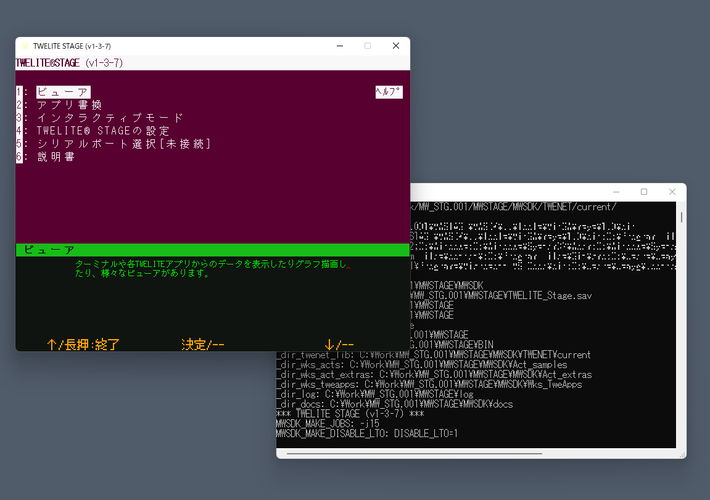

# 使用方法

TWELITE STAGE アプリ の画面・操作方法を解説します。

## アプリの起動方法

TWELITE STAGE アプリを起動するには、 `{MWSTAGE インストール}` にある実行形式を実行します。


アップデートなどでTWELITE STAGE アプリの実行形式を差し替える場合には、必ず、指定フォルダ `{MWSTAGE インストール}` にコピーしてください。
それ以外のパスに実行形式を配置した場合の動作は未定義です。


実行はプラットフォーム(Windows, macOS, Linux)によって方法が違います。

| システム | ファイル拡張子 | 備考 |
| -------- | ------     | ---- |
| Windows  | `.exe`     | エクスプローラで実行形式をダブルクリック。 |
| macOS    | `.command` | ファインダーから実行形式をダブルクリック。 |
| Linux, RaspberryPi | `.run`     | ディストリビューションやインストール環境に依存します。Xウインドウシステム上のターミナル画面(xtermなど)から、コマンドとして実行します |

## アプリの実行形式

２種類の実行形式があります。

* TWELITE_Stage.{拡張子} - 標準設定で起動します。
* TWELITE_Stage_VSCode.{拡張子} - 「VSCode を使う」設定済みです(設定は`TWELITE_Stage_VSCode.ini`に保存されている)。VSCodeを使う設定を有効にすると、VSCodeを用いた開発作業に適した動作を行うようになります。



TWELITE STAGE APP は複数起動してもエラーになりませんが、複数起動すると不都合のある機能（センサーグラフ機能など）が存在します。

したがって、複数のアプリを同時に起動する際には、実行形式を複製して、別々のファイルを立ち上げる必要があります。
各種設定ファイルや入出力ファイルが分離されるため、互いの干渉を避けることができます。


## アプリの実行画面

アプリを起動すると、以下の２種類のウィンドウが表示されます。

- メイン画面
  - TWELITE STAGEのユーザインタフェースを表示します。
    - TWELITE STAGEの操作はこの中で行います。
- コマンド画面
  - 通常は使用しませんが、補助情報を表示します。
    - シリアル通信の内容が表示されるため、ログを確認する用途に最適です。
    - コマンドラインから実行した場合には、実行元のターミナルがコマンド画面となります。

## アプリの終了

いずれかの方法で終了してください。
* 実行画面上の右上にマウスポインタを移動し、画面内に表示された終了ボタンを押します。
* 実行画面のウインドウを閉じます（macOSの場合は`⌘Q`も使用できます）。


ごくまれに、終了操作をしても実行画面が残る場合があります。その場合には、以下をお試しください。
* TWELTIE STAGE APPのコマンドライン画面を閉じる。
* 強制終了を行う（強制終了の操作方法はお使いのシステムの解説を参照してください）。

