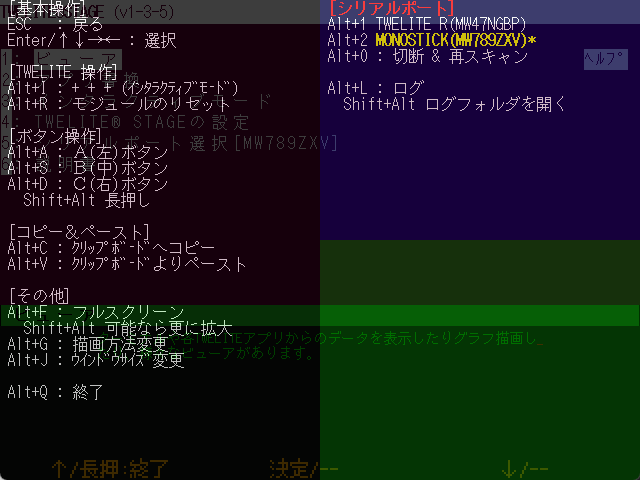

# キー操作・マウス操作

`Windows` `macOS` `Linux` `RasPi`

TWELITE STAGE APP の操作について解説します。

## キー操作
`Windows` `macOS` `Linux` `RasPi`

`Alt(⌘)`を押しながら行うキー入力は、 TWELITE STAGE APPの設定を変える操作等に割り当てられています。
その他のキー操作は、通常は文字入力として機能します。

### 共通のキー
`Windows` `macOS` `Linux` `RasPi`

| キー     | 意味           |
| ------ | ------------ |
| `ESC` `ESC`    | 素早く2回ESCを押す。キャンセル、または前画面に戻る。画面によっては1回の`ESC`で前画面に戻ります。 |
| `Enter`  | 入力、選択        |
| カーソル↑↓ | 項目の選択        |

### ヘルプ画面
`Windows` `macOS` `Linux` `RasPi`

Windows/macOS/Linux/Raspberry Piでは、**Alt\(⌘\)を押し続ける**ことでヘルプ画面を表示します。ヘルプ画面ではAlt\(⌘\)と一緒に操作できるキーの説明や一部動作状況を表示します。


ヘルプ画面は**画面の左上部分にマウスポインタを移動**することでも表示できます。


### Alt(⌘)+操作

`Windows` `macOS` `Linux` `RasPi`

Windows/macOS/LinuxでのAlt(⌘)を押しながら行う操作について解説します。

表中ではAlt(⌘)+の表記は省略しています。上記のヘルプ画面から使用可能なキーを確認できますが、下表に補足説明を示します。

| `Alt(⌘)`+キー              | 意味          |
|--------|--------|
| `I`            | + + + を入力します。インタラクティブモードに入るキーシーケンスです。 ※ スリープによる間欠動作を行うアプリは非対応。                                                                   |
| `R`               | モジュールをリセットします。TWELITE R や MONOSTICK の機能を用いてリセットピンの制御を行います。                                                                                                         |
| `A`, `S`, `D`         | A, B, C ボタンを押します。                                                                                                                                                 |
| `Shift` + `A`, `S`, `D` | A, B, C ボタンを長押しします。                                                                                                                                               |
| `C`               | 表示されている画面の文字列をクリップボードにコピーします。（画面によって範囲は異なります）                                                                                                                     |
| `V`               | クリップボードからキーボード入力としてペーストします。                                                                                                                                       |
| `F`               | フルスクリーン表示に遷移します。Shift+Fの場合、可能であればより拡大します。                                                                                                                            |
| `G`               | 画面の描画方法を変更します。640x480の液晶画面をエミュレートしていますが、拡大時の描画方式として（1. 液晶モニタ風の描画 / 2. ブラウン管風の描画  / 3. ドットを目立たせた拡大 / 4. ドットをぼやかせた拡大）の４種類が選択できます。※ 設定メニューで起動時の設定を変更できます。 |
| `J`               | 画面サイズを選択します。選択可能な画面サイズは {640,480}, {1280, 720}, {1280,960}, {1920,1440}, {2560,1440}, {320,240} です。 ※ 設定メニューで起動時設定にできます。                                           |
| `Q`               | TWELITE STAGE APPを終了します。                                                                                                                                             |
| `0`               | シリアルポートを切断し、再度シリアルポートの一覧を表示します。                                                                                                                                   |
| `1`,`2`,..          | シリアルポートを選択します。                                                                                                                                                    |
| `L`, `Shift`+`L`            | シリアルポートの入出力のログを開始します。終了時にはログファイルが Windows であればメモ帳、macOS であれば ログビューア で開かれます。`Shift`+`L` でログ格納フォルダを開きます。                                                                 |

#### その他の操作
| キー              | 意味          |
|--------|--------|
| `Alt(⌘)`+`Shift`+`Ctrl`+`m` | MWX ライブラリコードのフォルダを開きます。 |
| `Alt(⌘)`+`Shift`+`l` | log フォルダを開きます。 |

## マウス操作
`Windows` `macOS` `Linux` `RasPi`

マウス操作は左クリックが中心ですが、右クリック、右ダブルクリック、ホイールを使う場合があります。

| マウス操作     | 意味           |
| ------ | ------------ |
| 左クリック    | 選択 |
| 左クリックしながらドラッグ    | 画面によって利用（グラフ画面でのドラッグ） |
| 左ダブルクリック    | 使用しない |
| 右クリック    | 画面によって利用する        |
| 右ダブルクリック    | 画面から脱出する(`ESC` `ESC`と同様)      |
| ホイール | 画面によって利用する（グラフ画面で拡大縮小）        |

### マウスによるA,B,Cボタン
`Windows` `macOS` `Linux` `RasPi`

画面下部のメニュー表示にマウスポインタを移動すると、`[ A ]`, `[ B ]`, `[ C ]` という表記のボタンが表示されます。
TWELITE STAGE APPは、この3つ並びのハードウェアボタンを模したメニューに画面ごとの機能を割り当てています。
このボタンを左クリックまたは左長押しクリックすることで、機能を呼び出しできます。（`Alt(⌘)`+`a`,`s`,`d` または　`Alt(⌘)`+`Shift`+`a`,`s`,`d`でも選択可能）

![画面下部の仮想\[ B \]ボタンの表示例](../.gitbook/assets/img_vbtn_b.png)

### マウスによる画面操作
`Windows` `macOS` `Linux` `RasPi`

Windows/macOS/Linuxでは、TWELITE STAGE APP の画面を原則文字列のみで構成しますが、メニューやボタン、タブについてはマウスによる操作が可能です。

テキストのみの構成ですが、画面上部のタブや、反転表示の文字はマウスの左クリックで選択可能です。
