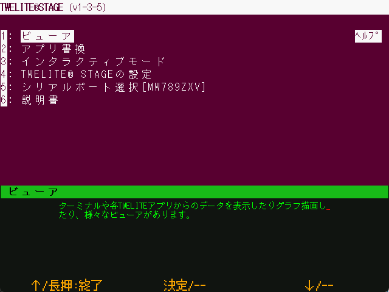

# 画面

`Windows` `macOS` `Linux` `RasPi`

### Windows / macOS / Linux / Raspberry Pi

TWELITE STAGE APPはコンソール画面（コマンドライン）から起動するアプリケーションです。コンソール画面とウインドウ画面の両方に情報が出力されます。

コンソール画面には、ターミナルと同様にUART出力を表示します。


一部の環境でコンソール画面の入力を受け付ることがありますが、確認済みの正式機能という位置づけではありません。


### Raspberry Pi (nox)

X11を使わず、フレームバッファに表示します。

通常（フレームバッファ上のシェル画面から起動した場合）はコンソール画面は表示されません。
