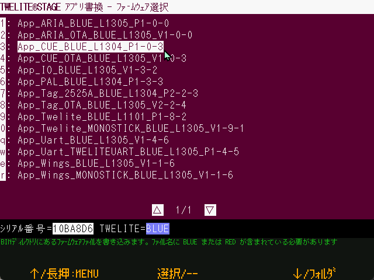

# BINから選択

`Windows` `macOS` `Linux` `RasPi`

ビルド済みのアプリ(.BINファイル)を書き込みます。



メニューを選択すると、ファイル一覧が表示されます。書き込みたいファームウェアを選択してください。

メニュー選択前に、書き込みむBINファイルを以下に格納しておきます。

| プラットフォーム            | 場所                          |
| ------------------- | --------------------------- |
| Windows, macOS, Linux, Raspberry Pi | {MWSTAGEフォルダ}/BIN           |

BINフォルダにはTWELITE STAGEでビルドした .BIN ファイル（各プロジェクトのbuildフォルダ以下に格納）を、ファイル名を変更せず格納しておきます。

```
../BIN/App_Wings_MONOSTICK_BLUE_L1304_V1-1-3.bin
       App_Wings_MONOSTICK_RED_L1304_V1-1-3.bin
       App_Twelite_BLUE_L1304_V1-9-1.bin
       App_Twelite_RED_L1304_V1-9-1.bin
       ...
```


ファイル名によりBLUE/REDの識別を行っています。

