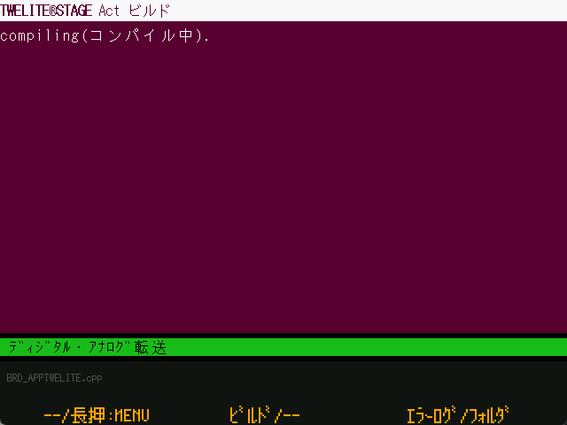
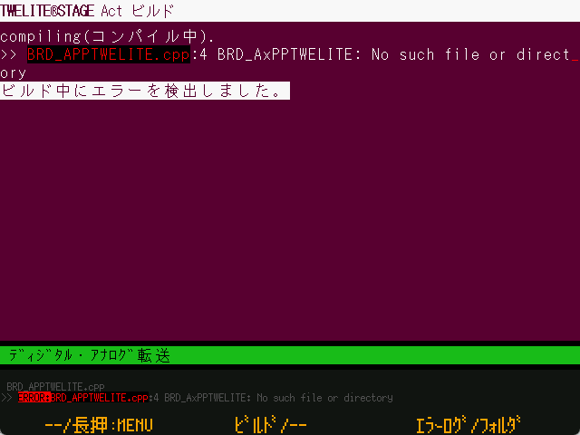
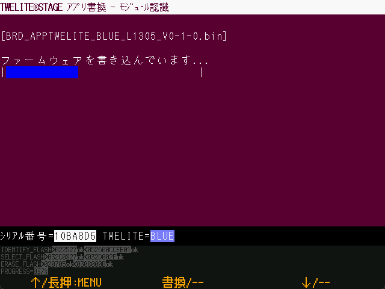
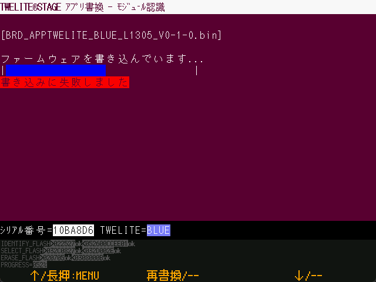
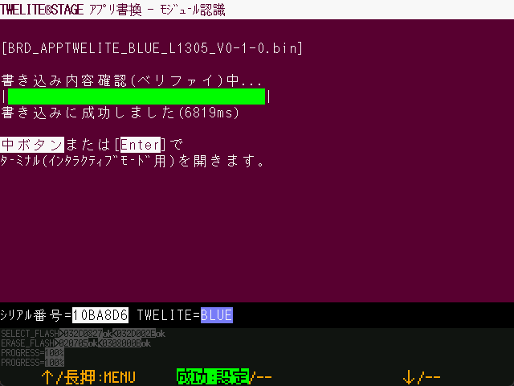

# ビルド・書換画面

`Windows` `macOS` `Linux` `RasPi`&#x20;

### ビルド中

ビルド（コンパイル）中の画面です。ビルドコマンドの内容は、コンソール画面に出力されます。画面中の ... はビルドしたファイル数、下部の暗い色の表示はビルドしているファイル名です。

####

### ビルドエラー

ビルドエラーが発生した場合は、上記のような画面を表示します。再ビルドの実行やエラーログの表示を行うことができます。また、一定時間でタイムアウトして直前のメニューに戻ります。

画面上のエラーメッセージは、代表的なものだけが表示されます。ビルドが失敗したとき、エラー内容のメッセージが表示されないこともあります。

| 操作          |                                                              |
| ------------- | ------------------------------------------------------------ |
| \[ A ] 長押し | この画面を抜けて、前のメニューに戻ります                             |
| \[ B ]        | エラー時に再ビルドする                                       |
| \[ C ]        | エラーログを表示する (Windows/macOS) エラーログは`{プロジェクトフォルダ}/build/builderr.log`です。 |
| \[ C ] 長押し | フォルダ（プロジェクト、関連フォルダ）を開きます。設定メニューでVS Codeで開くように設定できます。 |
| ESC           | この画面を終了し、書換メニューに戻ります。                   |

### 書換中

ビルドが成功すると、ファームウェアを書き込む画面を表示します。

### 書換失敗

書換がエラーの場合は、上記のような画面を表示します。

| 操作         |                                                                              |
| ---------- | ---------------------------------------------------------------------------- |
| \[ A ] 長押し | この画面を抜けて、前のメニューに戻ります                                                             |
| \[ B ]     | 再度書換を行う（直前の書き換えメニューに戻ります。再書換のメニュー項目が選択されている状態なので、もう一度\[ B ]を押すことで再書換操作になります） |
| ESC        | この画面を終了して、書換メニューに戻ります。                                                        |

### 書換完了

書換が無事に成功すると、上記のような画面を表示します。

v1.0.2以降では、ファームウェア書き換え後に、書き換え内容を読み出して確認するベリファイ処理を行います。

| 操作 |  |
| :--- | :--- |
| \[ A \] 長押し | この画面を抜けて、前のメニューに戻ります。 |
| \[ B \] | TWELITE をリセットして、インタラクティブモード画面（または設定によりターミナル）画面に移動します。 |
| ESC | この画面を終了し、書換メニューに戻ります。 |
