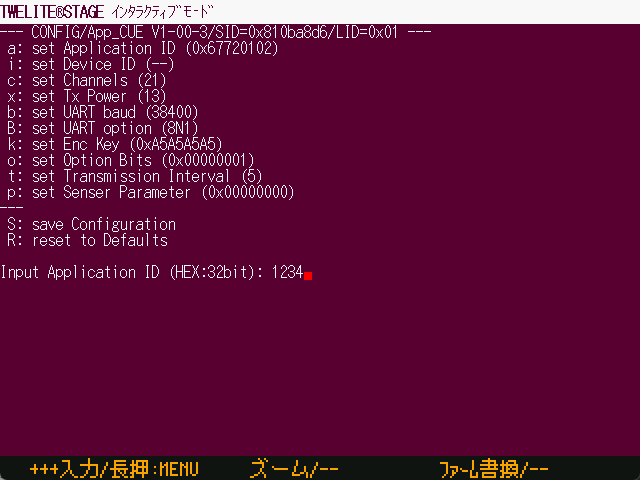

# インタラクティブモード

`Windows` `macOS` `Linux` `RasPi`

接続した TWELITE のインタラクティブモードを利用します。



この画面はターミナルとほぼ同じ振る舞いをしますが、インタラクティブモードに遷移するための操作と離脱の検出を行うなど、インタラクティブモードに固有の機能を追加しています。

* 接続する TWELITE には、インタラクティブモードに対応したファームウェアをあらかじめ書き込んでおく必要があります。
* TWELITE の入出力を使用するため、シリアル通信に文字化けなどが発生した場合など、期待通りにインタラクティブモードへの遷移や離脱ができない場合もあります。
* マウス操作には対応しておりません。キーボード（カーソル↑↓での操作は可能）操作を行ってください。


[ターミナル](viewer/terminal.md)によるインタラクティブモードへの遷移と操作もできます。

* ターミナルでは、自動的にSETピンの操作を行いません。手動でSETピンをLOに設定する必要があります。
* \+ + + 入力`Alt(Cmd)+I`やモジュールリセット`Alt(Cmd)+R`を行う操作については定義されています。



### インタラクティブモード画面の動作フロー

大まかな処理の流れを記載します。

```
[画面黒背景にする]
  ↓
[TWELITEのリセット (制御可能ならSET=LO)]
  ↓
<間欠動作アプリのインタラクティブモードメッセージを検出？> --YES--> [操作画面]へ
  ↓タイムアウト
['+' を３回入力]
  ↓
<通常アプリのインタラクティブモードメッセージを検出？> --YES--> [操作画面]へ
  ↓タイムアウト
[操作画面へ] ※ この状態はインタラクティブモードではない

[操作画面]
  ↓
<インタラクティブモード脱出メッセージ?> --> [終了]
  ↓
<画面離脱操作 [ A ] 長押しなど> --> [終了]
  ↓
<ESC ?> -> <入力中判定> --NO-> [終了]
  ↓            ↓
[入力文字列をTWELITEへ送信]
  ↓
[操作画面]へ戻る

[終了]
  ↓
[TWELITEのリセット]
  ↓
[画面離脱] インタラクティブモード画面を終了し前の画面へ戻る
```
