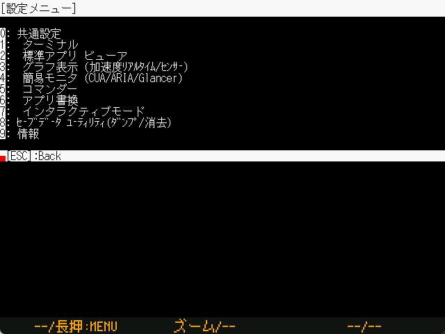

# TWELITE STAGEの設定

`Windows` `macOS` `Linux` `RasPi`

各種設定を行います。




* この画面のメニューはマウス操作できません。
* 画面の色を変更した場合に見づらくなる場合があります。



以下の解説のメニュー中には、プラットフォームによっては存在しない項目がありますが、全てを列挙して解説します。

共通メニュー以外の色設定については、解説を省略します。

### ルートメニュー

```text
共通設定
 ターミナル
 標準アプリ ビューア
 グラフ表示 (加速度ﾘｱﾙﾀｲﾑ/ｾﾝｻｰ)
 簡易モニター (CUA/ARIA/Glancer)
 グランサー(簡易モニタ)
 コマンダー
 アプリ書換
 インタラクティブモード
ｾｰﾌﾞﾃﾞｰﾀ ﾕｰﾃｨﾘﾃｨ(ﾀﾞﾝﾌﾟ/消去)
情報
```


### 共通設定

```text
a: (      0x00) 起動アプリ指定
G: (      0x00) 画面サイズ・描画方法
F: (          ) シリアルデバイスID
f: (0x00FFFFFF) 文字色
b: (0x005A0032) 背景色
B: (    115200) ボーレート
```

| 設定                     | 内容                                                         |
| :----------------------- | :----------------------------------------------------------- |
| 起動アプリ               | TWELITE STAGE始動時にビューアアプリに移動する設定です。設定値は1..{ビューアアプリメニューで列挙されている数}です。 ※ シリアルデバイスIDを設定しておかないと、始動時に接続するシリアルデバイス選択画面で入力待ちになります。 |
| 画面サイズ・描画方法     | `Windows` `macOS` `Linux` `RasPi` XYの２桁の文字で指定します(X:画面サイズ Y:描画方法)X 0:640x480 1:1280x720 2:1280x960 3:1920x1440 4:2560x1440 5:320x240, Y 0:LCD風 1:CRT風 2:ぼやけ 3:ブロック |
| シリアルデバイスID       | `Windows` `macOS` `Linux` `RasPi` 設定はシリアルデバイス名または数値の1..9 を指定します。 ※ 数値の場合はデバイス列挙順になります。 |
| 文字色・背景色           | 文字色、背景色を指定します。共通設定の色設定値は他の画面の設定にも継承されます。他の画面で未設定の場合は共通設定の色設定が採用されます。色はRGB 24bitを１６進数で指定しますが、内部的には16bit 565 形式に値が丸められます。 |
| ボーレート           | TWELITE 側のボーレートが 115200 でない場合に、ターミナルなどの表示が化けないように設定します。 |


### アプリ書換

```text
f: (0x00FFFFFF) 文字色
b: (0x005A0032) 背景色
j: (         0) ビルド時のmakeジョブ数
v: (         0) codeでフォルダを開く(VSCode)
l: (         0) LTOを行わない
n: (         0) 書換完了後の画面
```

| 設定                          | 内容                                                         |
| :---------------------------- | :----------------------------------------------------------- |
| ビルド時のmakeジョブ数        | `Windows` `macOS` `Linux` `RasPi` ビルドを行う際の並列ジョブ数です。適切な数を設定することでビルド時間の短縮を期待できます。 規定値0は(物理プロセッサ数-1)でジョブ数を計算しています。目安としては論理プロセッサ数を上限とすると良いでしょう。 |
| codeでフォルダを開く (VSCode) | `Windows` `macOS` `Linux` 1を設定することでOS標準のフォルダウインドウの替わりにcodeコマンド（VS Code）でフォルダを開きます。`TWELITE_Stage_VSCode`では有効になっています。 |
| 書換完了後の画面              | `Windows` `macOS` `Linux` `RasPi` 1を設定することでインタラクティブモード画面の替わりに、ターミナルを開きます。2を設定することで、書換メニューに戻ります。`TWELITE_Stage_VSCode`では2に設定されています。 |
| LTOを行わない                 | `Windows` WindowのコンパイラはLTOの仕組みにより少しだけ小さいバイナリを生成することが可能ですがリンクに時間がかかります。この手順を省略しより高速なリンクを可能とします。 |


### セーブデータユーティリティ

```text
r: Read sector.
R: Read ALL sectors.
e: Erase sector.
E: Erase ALL sectors.
```

この画面は、データセーブ領域のメンテナンスを行うユーティリティです。EEPROM\(64バイトを１セクタとして最大60セクタ、3840バイト\)をエミュレートしています。

| 設定 | 内容 |
| :--- | :--- |
| r | セクタを読み出します。0..59を入力すると、入力したセクタ番号のセクタの内容を表示します。 |
| R | （YESを入力すると全セクタの読み出しを行いますが、一番最後の部分しか表示されません） |
| e | セクタを消去\(0xFF\)します。0..59を入力すると、入力したセクタ番号のセクタが消去されます。 |
| E | YESを入力すると全セクタを消去します。 |


`Windows` `macOS` `Linux` `Raspberry Pi` では、 `{実行形式名}.sav` すなわち `TWELITE_Stage.sav` ファイルに保存されます。

