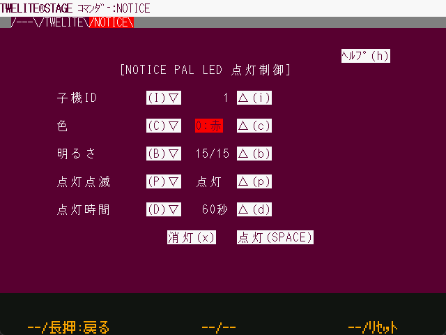

# コマンダー

`Windows` `macOS` `Linux` `RasPi`

コマンダーは、TWELITE にシリアルメッセージを送付するものです。コマンダーの最初の画面は留意事項について記載しています。

画面上部にはテキストで表現されたタブがあり、これをマウスでクリックすることでタブ中の画面に移動します。

| 操作         |                                     |
| ---------- | ----------------------------------- |
| \[ A ]     | タブの移動（左）                            |
| \[ A ] 長押し | この画面を抜けて、選択画面に戻ります。                    |
| \[ B ]     | 割当なし                                |
| \[ B ] 長押し | 割当なし                                |
| \[ C ]     | タブの移動（右）                            |
| \[ C ] 長押し | TWELITE のリセットピンを制御し、リセットします。 |
| ESC        | この画面を抜けて、選択画面に戻ります。                    |

#### タブ：TWELITE

この画面では、 [App\_Twelite(標準アプリ)](https://mono-wireless.com/jp/products/TWE-APPS/App\_Twelite/) の [0x80 コマンド](https://mono-wireless.com/jp/products/TWE-APPS/App\_Twelite/step3-80.html)を生成し、送信します。接続する TWELITE には App\_Twelite または App\_Wings を書き込んでおき、アプリケーションID・チャネルを設定した上で、通信相手からメッセージが受信されていることを確認します。

| 項目       | 内容                                                                                                                                                      |
| -------- | ------------------------------------------------------------------------------------------------------------------------------------------------------- |
| 宛先       | 送信先の TWELITE を指定します。自身が子機の場合は「親機:0」宛を指定してください。自身が親機の場合は「全子機＝0x78」または特定の子機ID(1..8まで指定可能)を指定します。                                                                        |
| DI1..DI4 | DI1からDI4までの設定状態です。■は選択（LOW=GNDレベル）、□は(HIGH=VCCレベル)を意味します。下項目のSELを指定してください。                                                                              |
| SEL      | 各DIの選択ビット（0ならDIの指定を無視し、1なら指定を有効化）                                                                                                                     |
| PWM1..4  | PWMのデューティ比を設定します。0はGNDレベル相当、1024(100%)はVCCレベル相当です。N.A.にしたPWMポートは変更しません。※ TWESTAGE基板のPWM1のLEDはVCCからの吸い込みとなっているため、0で最も明るく点灯し、100%では消灯となります。 |

各項目を変更するたびにコマンドが生成されます。送信ボタンを押すと、現在の設定のコマンドを再度送信します。

#### タブ:NOTICE

この画面では、[通知PAL(NOTICE PAL)](https://mono-wireless.com/jp/products/twelite-pal/sense/notice-pal.html) の [LED制御用のコマンド](https://wings.twelite.info/how-to-use/parent-mode/transemit-command/0x90-command) を生成します。接続する TWELITE には App\_Wings を書き込んでおき、アプリケーションID・チャネルを設定した上で、通信相手からメッセージが受信されていることを確認します。

| 項目    | 内容                                                  |
| ----- | --------------------------------------------------- |
| 子機ID  | 送信先の TWELITE PAL のIDを指定します。値の範囲は 1..8 です。
| 色     | 点灯色を７色から指定します。白は２種類ありますが、１つはRGBの混色で１つは白色LED単体の点灯です。 |
| 明るさ   | 0..15で指定します。0は消灯です。                                 |
| 点灯点滅  | 点灯または点滅パターンを選択します。                                  |
| 点灯時間  | コマンド発行後、一定時間経過すると自動的に消灯する機能です。                      |
| 消灯ボタン | 消灯メッセージを生成します。                                      |
| 点灯ボタン | 現在の設定を送信します。                                        |

各項目を変更するたびにコマンドが生成されます。点灯ボタンを押すと、現在の設定のコマンドを再度送信します。

#### 画面下部の表示

画面下部には、コマンドが生成されたタイムスタンプと `:`で始まるコマンドが表示されます。クリップボードにはこの画面の内容がコピーされます。
