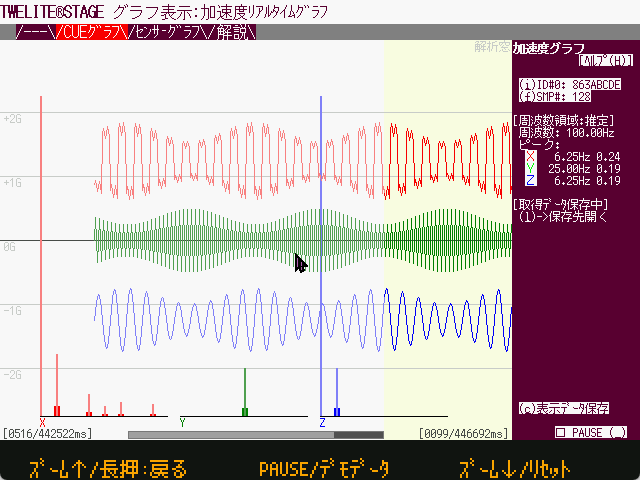

# 加速度リアルタイムグラフ

`Windows` `macOS` `Linux`  `RasPi`

[TWELITE CUE](https://mono-wireless.com/cue)や[TWELITE 動作センサーPAL](https://mono-wireless.com/jp/products/twelite-pal/sense/motion-pal.html)から受信したデータを参照する目的で使用します。


注：センサーグラフ機能では、１パケットに複数サンプルが含まれるような連続計測を行う場合であっても、１パケット１サンプルとして記録します。


CUE モード、MOTモード、2525 FIFO モードの３種類に対応します。

連続したサンプルが一定数(解析窓)以上になると、XYZ軸を周波数解析した表示を行います。ただし 2525 FIFO モードでは常に連続していると仮定します。

パケットの区切りが明示的な場合（直前のパケットから３秒以上経過したとき、CUEモードは１パケットごと、MOTモードはパケットのシーケンス番号が不連続になったとき）には、４サンプル分のダミーデータを挿入しピンク色の背景色で表示します。

先着順に最大４ノードまでのデータを格納します。


複数ノード運用時には、互いのパケット衝突により通信の失敗が多くなります。特に FIFO モードでは、送信周期がほぼ一定で互いにほぼ同時期にパケット送信を試み、干渉により送信が失敗するといったことが長時間続く場合があります。原則として無線チャネル１つにつき、１ノードという運用を行います。


### 代表的なCUEのインタラクティブモードの設定

* 連続的に約 25Hz で計測したい (Transmit Interval: `0`, Sensor Parameter: `03000000`)
* 連続的に約 50Hz で計測したい (Transmit Interval: `0`, Sensor Parameter: `03000100`)
* 連続的に約 100Hz で計測したい (Transmit Interval: `0`, Sensor Parameter: `03000200`)
* 約10秒おきに 約 100Hz で128サンプル分計測したい (Transmit Interval: `10`, Sensor Parameter: `03000208`)
* 約10秒おきに 約 100Hz で256サンプル分計測したい (Transmit Interval: `10`, Sensor Parameter: `03000210`)
* 約10秒おきに 約 50Hz で64サンプル分計測したい (Transmit Interval: `10`, Sensor Parameter: `03000104`)
* 約10秒おきに 約 200Hz で128サンプル分計測したい (Transmit Interval: `10`, Sensor Parameter: `03000308`)

### 操作

|  操作                                 |  内容                                                        |
| ------------------------------------ | ------------------------------------------------------------ |
| 右部 `[(I)ID#]`ボタン部              | クリックするごとにIDの切り替えを行う。（注：FIFOモードによる連続サンプルデータの場合は、複数IDによる運用は現実的ではありません） |
| 右部`[(f)SMP#]`ボタン部              | クリックするごとに解析窓サイズを 64,128,256 と変更する   |
| 右部 `[PAUSE( )]` ボタン            | 表示更新を中断する（サンプルの取得は内部の一時サンプルバッファが一杯になるまでは実行） |
| 右部 `[(c)表示データ保存]`  ボタン   | CSV形式のデータ出力を行う (log フォルダ)。画面中の一番右に表示されているサンプルからバッファにある一番古いサンプルまでを出力する。出力数は常に 5120 となり、画面一番右に表示されているサンプルが一番最後のデータになる。 |
| マウスドラッグ（グラフ部分）         | 表示サンプルの位置を移動                                     |
| マウスドラッグ（下部スクロールバー） | 表示サンプルの位置を移動（より大きなステップで）             |
| カーソル→, ←                         | サンプル表示の移動                                           |
| カーソル↑, ↓                         | サンプル横軸の拡大・縮小（等倍, 2倍, 3倍, 4倍。解析サンプル数256の場合は 2倍まで） |
|                                      |                                                              |

### サンプルレートの推定

サンプリングレートは、パケットの受信時間から計算しています。過去複数サンプルの受信時間を平均して１サンプル分としているため、パケットの飛びなどがある場合は誤差が大きくなります。

サンプルレートの推定が終わると、グラフ表示のスクロールをスムーズにします。

また、関連するログ記録のタイムスタンプ(T_SMPL)も同様に推測値、かつ、パケット取得時よりあとのタイムスタンプになっています。

### CUEグラフモードの起動時に開く

[STAGE 共通設定→起動アプリ指定]にて`31`を指定する。

### ログ出力 (表示データ保存)

[表示データ保存]ボタンを押すことで、画面上の表示位置（右端サンプル）を起点として、最大512サンプル分のデータを出力します。最新のサンプルが末尾に記録されるため、冒頭には何もデータが無い場合がある点に注意してください。

* データは、右端の一番新しいサンプルが 512 番目（ファイルの末尾）です。
* 周波数解析実行時は、最後のサンプルから 周波数解析サンプル数分が対象です。
* 周波数解析対象サンプルが記録されている行に周波数解析結果を追加しています(64サンプルの場合は 449番目から 32 行が結果で DC 成分から高周波成分までが並びます)。

| ラベル     | 項目名                           | 解説                                                         |
| ---------- | -------------------------------- | ------------------------------------------------------------ |
| #          | サンプル番号                     |                                                              |
| T_PKT[ms]  | パケット受信時刻                 | １パケットに複数サンプル含まれるため、同じタイムスタンプのサンプルが並びます。 |
| SEQ        | パケット続き番号                 | パケットの付与されており、連続していればパケットの欠落がないと考えられます。 |
| T_SMPL[ms] | サンプル時刻（仮想・推定）       | パケットの受信時刻から生成した各サンプルのタイムスタンプです。実際にサンプルが行われた時刻とは一致しません。（サンプルレートが受信パケット間隔より推定している点で誤差が大きくなる点と、受信サンプルにサンプル周期を加算している計算をしているため実際のサンプル時刻より１パケット周期分あとのタイムスタンプです） |
| X[G]       | X軸のサンプル値                  | センサーからの値にもとづき、単位は[G]です。                  |
| Y[G]       | Y軸のサンプル値                  | センサーからの値にもとづき、単位は[G]です。                  |
| Z[G]       | Z軸のサンプル値                  | センサーからの値にもとづき、単位は[G]です。                  |
| FD#        | 周波数解析計算値の番号           | 周波数解析サンプル数が 64の場合は `DC,1,2,...,31` の順で並びます。 |
| Hz         | 周波数解析計算結果の周波数軸の値 | およその周波数です。`(FD# / FD_Len) * FD_Freq` で計算しています。 |
| X          | X軸の周波数解析計算値            |                                                              |
| Y          | Y軸の周波数解析計算値            |                                                              |
| Z          | Z軸の周波数解析計算値            |                                                              |
| Label      | 追加情報名                       | 下表参照                                                     |
| Info       | 追加情報                         | 下表参照                                                     |
|            |                                  |                                                              |

#### 追加情報

| 情報名         | 解説                                                         |                              |
| -------------- | ------------------------------------------------------------ | ---------------------------- |
| ModuleSID      | 送信側のシリアル番号                                         |                              |
| Tick[ms]       | ログファイルオープン時のTWELITE STAGEアプリ側のシステム [ms] |                              |
| Date           | ログファイルオープン時の日付                                 |                              |
| Time           | ログファイルオープン時の時刻                                 |                              |
| Time_Msec_part | ログファイルオープン時の秒未満部分 [ms]                      |                              |
| Samples        | 有効サンプルデータ                                           |                              |
| FD_Len         | 周波数解析サンプル数                                         |                              |
| FD_Start#      | 周波数解析開始サンプル番号                                   |                              |
| FD_Freq        | 周波数解析範囲の周波数推定値[Hz]                             | サンプル受信間隔からの推定値 |
|                |                                                              |                              |

### ログ出力 (自動保存)

| ラベル     | 項目名                     | 解説                                                         |
| ---------- | -------------------------- | ------------------------------------------------------------ |
| #          | サンプル番号               |                                                              |
| T_PKT[ms]  | パケット受信時刻           | １パケットに複数サンプル含まれるため、同じタイムスタンプのサンプルが並びます。 |
| SEQ        | パケット続き番号           | パケットの付与されており、連続していればパケットの欠落がないと考えられます。 |
| T_SMPL[ms] | サンプル時刻（仮想・推定） | パケットの受信時刻から生成した各サンプルのタイムスタンプです。実際にサンプルが行われた時刻とは一致しません。（サンプルレートが受信パケット間隔より推定している点で誤差が大きくなる点と、受信サンプルにサンプル周期を加算している計算をしているため実際のサンプル時刻より１パケット周期分あとのタイムスタンプです） |
| X[G]       | X軸のサンプル値            | センサーからの値にもとづき、単位は[G]です。                  |
| Y[G]       | Y軸のサンプル値            | センサーからの値にもとづき、単位は[G]です。                  |
| Z[G]       | Z軸のサンプル値            | センサーからの値にもとづき、単位は[G]です。                  |
| Label      | 追加情報名                 | 下表参照                                                     |
| Info       | 追加情報                   | 下表参照                                                     |
|            |                            |                                                              |

#### 追加情報

| 情報名         | 解説                                                         |      |
| -------------- | ------------------------------------------------------------ | ---- |
| ModuleSID      | 送信側のシリアル番号                                         |      |
| Tick[ms]       | ログファイルオープン時のTWELITE STAGEアプリ側のシステム [ms] |      |
| Date           | ログファイルオープン時の日付                                 |      |
| Time           | ログファイルオープン時の時刻                                 |      |
| Time_Msec_part | ログファイルオープン時の秒未満部分 [ms]                      |      |
|                |                                                              |      |
