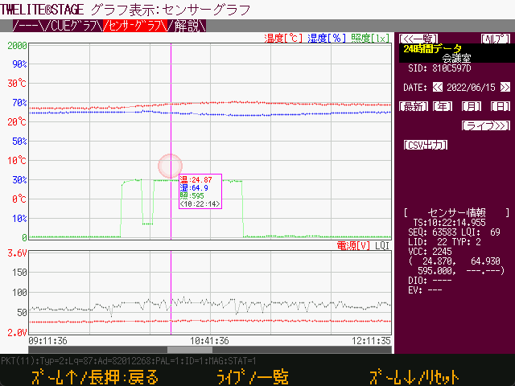
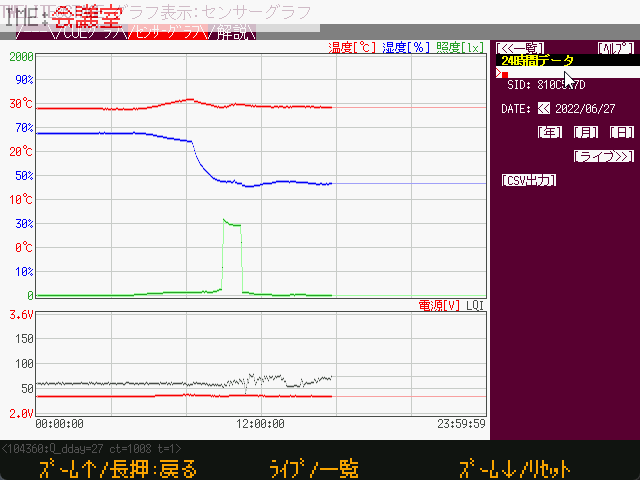

# センサーグラフ

`Windows` `macOS` `Linux`  `RasPi`

各種センサーデータをデータベースファイルに記録します。また TWELITE STAGE APP 画面上で簡易的に計測値を参照する機能もあります。





同一実行形式名の TWELITE STAGE APP を複数起動して、センサーグラフを同時に使用することはできません。

データベースファイルは `{MWSTAGEインストール}/log` フォルダに格納され、TWELITE_STAGE APP 実行形式名をもとにファイル名が決まります。同一実行形式の場合、同じデータベースファイルを参照するためです。TWELITE STAGE APPの実装では、複数のアプリが同時に同一のデータベースにデータを追加することを想定していません。また、状況によってはデータベースファイルのアクセスエラーとなり、TWELITE STAGE APP がクラッシュすることもあります。

例えば、MONOSTICK を２台接続して、同時に複数の「センサーグラフ」を動作させたい場合には、各々別の実行形式名 (`TWELITE_Stage_a.exe`, `TWELITE_Stage_b.exe`) とした TWELITE STAGE アプリを実行します。この時のデータベースファイル名は `log/TWELITE_Stage_a_WSns.sqlite`, `log/TWELITE_Stage_b_WSns.sqlite` です。


* データの保存には sqlite3 を使用しており、 `{MW_STAGE Install}/log/{実行形式名}_WSns.sqlite` というファイルに格納されます。

* 画面遷移は [一覧(グラフプレビューあり)]>[２４時間データ] >[ライブビュー]です。

    * [２４時間データ] から更に [年] [月] [日(グラフプレビューあり)] 選択画面に遷移できます。

* [ライブ]表示画面について

    * 一覧から特定のノードを選択します。
    * １秒おきのリアルタイム表示を行い、過去450秒前までのデータを表示します。

* [２４時間データ] 表示画面について

    * 特定の日のデータを表示します。
    * １秒おきの取得とし、複数データが有る場合は間引かれます。
    * 最大拡大時（１ピクセル１秒）以外は、各ピクセル範囲での取得値の平均により表示します。
    * 値が画面よりはみ出す場合は上下端に測定点を表示します。
    * 現在時間が含まれる場合は、新しいデータが来ると表示更新します。
    * ホイール、カーソル↑↓：時間軸の拡大・縮小
    * マウスの移動：マウスポインタに対応する時間軸にある取得データを簡易表示します。
        * カーソル→、←：隣の取得データに移動します。
    * クリック&ドラッグ：スクロール（拡大時のみ）
    * 拡大時はスクロールバーによる操作も可能です。
    * [CSV出力] 機能では、データベースに含まれるすべての取得値を表示します。

* データの抽出は https://sqlitebrowser.org/ のツールを使ってください。

### 操作

|  操作                                 |  内容                                                        |
| ------------------------------------ | ------------------------------------------------------------ |
| マウスドラッグ（グラフ部分）         | 拡大時に表示位置を移動                                     |
| マウスドラッグ（下部スクロールバー） | 拡大時に位置を移動                                   |
| カーソル→, ←                         | サンプル表示の移動                                           |
| カーソル↑, ↓, ホイール                | サンプル横軸の拡大・縮小                                   |
| `[ライブ]`                           | 最新到着データを表示する1秒刻みビューに移動する |
| `[24時間データ]`                     | 1日単位グラフに移動する |
| `[<<一覧]`                          | 一覧選択画面に移動する |
| `[年]`　`[月]` `[日]`                | 年月日で、特定日を選択する |
| `[最新]`                             | 今日のデータに移動 |
| `[CSV出力]`                          | 1日分のデータをCSVファイルに出力 |
| 一覧で `[表示]`                      | リストの表示方式を変更する |
| 一覧で `[ソート]`                    | リストの並び順を変更する |
| 一覧で `[↑]`                        | リストの並び順を反転する |


#### センサーノードのメモ(補助情報)の編集

`v1.3.9`以降


「24時間データ画面」上で、画面右上のセンサーノードのメモ部分を左クリックすると、メモを編集するためのプロンプトになります。





| キー         | 内容                                                         |
| ------------ | ------------------------------------------------------------ |
| 通常文字     | 通常の英数文字列を直接入力すると画面上にも表示されます。 |
| IME での入力 | IMEからの入力は画面左上部分に入力途上の文字列が表示されます。`ENTER`キーで入力中の文字列を確定します。 |
| `BS`         | 表示されている末尾の文字を削除します。                       |
| `ENTER`      | 入力した文字列をデータベースに反映します。                   |

* IME入力時の操作方法は、利用のシステムに依存する場合があります。
* IME入力時の操作によっては期待しない文字列が入力される場合があります。不要な文字列が入力エリアに表示された場合は `BS` キーで不要部分を削除します。


### 画面遷移

画面は一覧、24時間、ライブの3種類が基本になります。

```
[一覧] <--> [24時間] <--> [ライブ]
              ↓↑
          [年月日選択]
```


### センサーグラフモードの起動時に開く

[STAGE 共通設定→起動アプリ指定]にて`32`を指定する。


### DBのテーブルについて

#### sensor_data

| カラム名      | 型                     | 解説                                                         |
| ------------- | ---------------------- | ------------------------------------------------------------ |
| `_uqid`       | INTEGER                | データベースで使用する続き番号                               |
| `sid`         | INTEGER<br />`int32_t` | `int32_t` 型で格納しているシリアル番号です。"8123abcd" というシリアル番号の場合は整数値で -2,128,368,691 の値が格納されます |
| `ts`          | INTEGER                | システムがパケットを受信した時刻で、`int64_t` 型で格納されるタイムスタンプ値です。UNIX epoch (エポック、1970年からの経過秒) です。 |
| `ts_msec`     | INTEGER                | タイムスタンプのミリ秒部分です。                             |
| `year`        | INTEGER                | タイムスタンプよりローカル時間の年部分です。                 |
| `month`       | INTEGER                | タイムスタンプよりローカル時間の月部分です。                 |
| `day`         | INTEGER                | タイムスタンプよりローカル時間の日部分です。                 |
| `hour`        | INTEGER                | タイムスタンプよりローカル時間の時部分です。                 |
| `lid`         | INTEGER                | ユーザにより割り当てられた LID などの識別値です。            |
| `lqi`         | INTEGER                | 受信強度の目安値です (Link Quality Indicator) 。             |
| `pkt_seq`     | INTEGER                | パケットの続き番号です。どのような値を取りうるのかはファームウェアによって異なります。 |
| `pkt_type`    | INTEGER                | 無線パケットの種別です。<br />`2 PAL AMB, 6 ARIA` <br />`1 PAL MAG` <br />`*3 PAL MOT,5 CUE` <br />`0x101 App_Twelite, *0x103 App_IO` <br />*現時点で非対応 |
| `value`       | REAL                   | 計測値 (パケット種別によって定義が異なります)<br />`pkt_type->`<br />` 2,6: 温度`<br />` 1: 磁石の判定有無 00->磁石なし, 01->N極, 02->S極`<br />` 3,5: X軸加速度(パケット中に複数サンプル含まれる場合は平均値)[G]`<br />` 0x101,103: 入力IOのビットマップ(val_dioの下位８ビットと同値)` |
| `value1`      | REAL                   | 計測値 (パケット種別によって定義が異なります)<br />`pkt_type->`<br />` 2,6: 湿度[%]`<br />` 1: 未使用`<br />` 3,5: Y軸加速度(パケット中に複数サンプル含まれる場合は平均値)[G]`<br />` 0x101: ADC1[V] ,103: 未使用` |
| `value2`      | REAL                   | 計測値 (パケット種別によって定義が異なります)<br />`pkt_type->`<br />` 2: 照度[lx], 6: 未使用`<br />` 1: 未使用`<br />` 3,5: Z軸加速度(パケット中に複数サンプル含まれる場合は平均値)[G]`<br />` 0x101: ADC2[V], 103: 未使用` |
| `value3`      | REAL                   | 計測値 (パケット種別によって定義が異なります)<br />`pkt_type->`<br />` 2: 未使用, 6: 未使用`<br />` 1: 未使用`<br />` 3,5: 未使用`<br />` 0x101: ADC3[V], 103: 未使用` |
| `val_vcc_mv`  | INTEGER                | 電圧[mV]                                                     |
| `val_dio`     | INTEGER<br />`int32_t` | b0..b7: DI1..DI8の値 (1はLO, 0はHIGHレベル)<br />b24..b25: マグネット値 (b28が1の場合), 00->磁石なし, 01->N極, 10->S極<br />b28: 1の場合マグネットデータがb24..b25に格納される<br />b31: 定期送信ビット(マグネットのみ) |
| `val_adc1_mv` | INTEGER                | `pkt_type`->1,2,3,0x101: ADC1の計測値                        |
| `val_adc2_mv` | INTEGER                | `pkt_type`->0x101: ADC4の計測値                              |
| `val_aux`     | INTEGER                | その他データ格納目的                                         |
| `ev_src`      | INTEGER                | イベント発生元                                               |
| `ev_id`       | INTEGER                | イベントID<br />`pal_type`->5: 1...6→サイコロ 16→MOVE ... 他(TWELITE CUE の資料参照) |
| `ev_param`    | INTEGER                | イベントパラメータ                                           |

#### sensor_node

センサーノードにテキストメモ（付加情報）を格納する目的で利用する。

| カラム名   | 型           | 解説                                                        |
| ---------- | ------------ | ----------------------------------------------------------- |
| `sid`      | INTEGER      | 上述のSID                                                   |
| `sid_text` | TEXT         | SIDを１６進数文字列に変換したもの（可読性のため）           |
| `desc`     | TEXT (UTF-8) | SIDに対応するメモ（補助情報）で、一覧などで一緒に表示する。 |

#### sensor_last

最後に受信したタイムスタンプを管理する目的で使用する。

| カラム名     | 型      | 解説                             |
| ------------ | ------- | -------------------------------- |
| `sid`        | INTEGER | 上述のSID                        |
| `ts`         | INTEGER | 最後の受信時のタイムスタンプ     |
| `lid`        |         | 以下、最後に受信時のデータの抜粋 |
| `lqi`        |         |                                  |
| `pkt_type`   |         |                                  |
| `value`      |         |                                  |
| `value1`     |         |                                  |
| `value2`     |         |                                  |
| `value3`     |         |                                  |
| `val_vcc_mw` |         |                                  |
| `val_dio`    |         |                                  |
| `ev_id`      |         |                                  |
