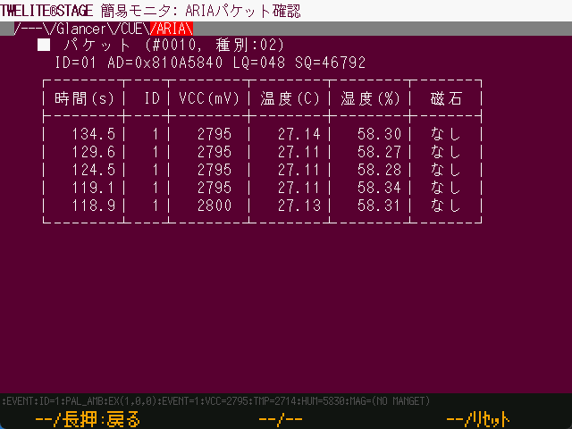

# ARIA ビューア

`Windows` `macOS` `Linux` `RasPi`

[TWELITE ARIA](https://mono-wireless.com/jp/products/twelite-aria/index.html)の通知メッセージを解釈します。


本解説中は旧バージョンのキャプチャ画像です。


## TWELITE ARIA

TWELITE ARIAのデフォルト設定(ARIAモード)は、コイン電池でも動作できるスリープを用いた間欠駆動をしながら、いくつかの要因により起床し、起床後様々な情報を送信しいます。

#### 起床要因

* タイマーの起床（設定値による定期起床）
* 磁気センサーによる起床（磁石が近づいたことを検出した場合）

#### 送信データ

* モジュール電源電圧
* 磁気センサーの検出値
* 温湿度データ

### パケット

パケットの基本情報を表示します。

| 項目    | 解説                                                                                                                        |
| ----- | ------------------------------------------------------------------------------------------------------------------------- |
| #???? | これまでの受信パケット数です。                                                                                                           |
| 種別    | [`E_PKT`](https://mwm5.twelite.info/references/parser/twefmt/twepacket/e\_pkt)の値で、パケット種別です。TWELITE ARIAからのパケットは通常PKT\_PAL=02になります。 |
| ID    | 送信元の論理IDです。通常は0..100の値になります。                                                                                              |
| AD    | 送信元のシリアル番号です。                                                                                                             |
| LQ    | LQI、電波強度に対応する値です。                                                                                                         |
| SQ    | パケットの続き番号です。                                                                                                              |

### データ表

TWELITE ARIAから受信した過去9回分のデータの履歴を表示します。上にあるほど新しいデータです。

#### 時間(s)

TWELITE STAGE APPが起動してからデータを受信するまでの時間\[秒]です。

#### ID

モジュールの論理デバイスIDです。

#### VCC(mV)

モジュールの電源電圧\[mV]です。

#### 温度(C)

モジュールが計測した温度(℃)です。

#### 湿度(%)

モジュールが計測した湿度(％)です。

#### 磁石

検出された磁石の極または未検出を表示します。


磁気センサーの検出による起床かどうかを表示する機能はありません。

