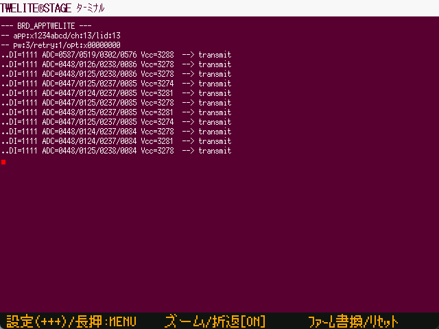

# ターミナル

`Windows` `macOS` `Linux` `RasPi`

ANSI エスケープシーケンス（の一部）に対応した簡易的なターミナルです。TWELITE と PC 間の入出力を直接扱います。

| 操作         |                                                                                                                                    |
| ---------- | ---------------------------------------------------------------------------------------------------------------------------------- |
| \[ A ]     | + + + シーケンスの入力（インタラクティブモード）                                                                                                        |
| \[ A ] 長押し | この画面を抜けて、前のメニューに戻ります。                                                                                                                   |
| \[ B ]     | 大きなフォントで表示する。最初の画面の部分領域を表示します。カーソルが画面中に表示されるように領域を選びますが、画面出力によっては見たい部分が見えない場合もあります。                                                |
| \[ B ] 長押し | 折返し制御のON/OFF。標準では折返し表示を行うようになっていますが、折り返ししないように表示することもできます。画面右端以降の文字列は表示されません。                                                      |
| \[ C ]     | ファーム書換画面に移動します。ファームウェアの開発中には頻繁にソースコードの修正、動作確認、ビルド＆書き込みを行うため、ショートカットを用意しています。                                                       |
| \[ C ] 長押し | TWELITE のリセットピンを制御し、リセットします。                                                                                                |
| ESC ESC    | ESCキーを２回素早く入力することで、この画面を抜けます。※ 殆どの画面ではESCキーを１回押すことで画面から抜ける操作となっていますが、ターミナルではESCキーの単独入力を使用する場合があるため、２回連続入力の割当になっています。 |
