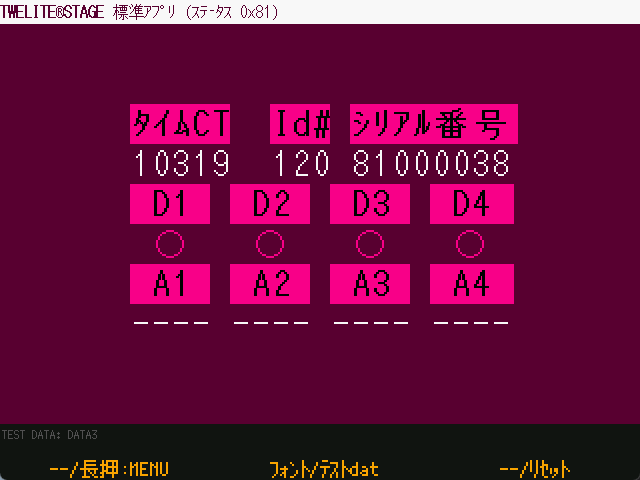

# 標準アプリ ビューア

`Windows` `macOS` `Linux` `RasPi`

[App\_Twelite(標準アプリ)](https://mono-wireless.com/jp/products/TWE-APPS/App\_Twelite/)の[0x81コマンド](https://mono-wireless.com/jp/products/TWE-APPS/App\_Twelite/step3-81.html)を解釈して表示します。

PCに接続する TWELITE に App\_Twelite（標準アプリ） または App\_Wings（親機・中継機アプリ） を書き込んでおき、通信相手のTWELITEから受信したデータがターミナルに表示されることを確認してから使用します。

通信相手の TWELITE には App\_Twelite（標準アプリ）を書き込んでおきます。標準アプリのボタンやアナログ入力の状態のメッセージ (0x81メッセージ) を受信すると、その内容を mwm5 のパーサーライブラリにより解釈して表示します。

| 操作         |                                     |
| ---------- | ----------------------------------- |
| \[ A ]     | 割当なし                                |
| \[ A ] 長押し | この画面を抜けて、前メニューに戻ります。                    |
| \[ B ]     | フォントを変更します。                         |
| \[ B ] 長押し | テスト用のダミーデータによる画面表示を行います。            |
| \[ C ]     | 割当なし                                |
| \[ C ] 長押し | TWELITE のリセットピンを制御し、リセットします。 |
| ESC        | ESCキーを入力することで、この画面を抜けます。            |
