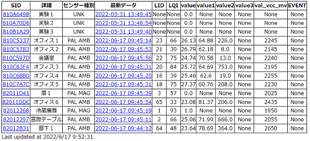
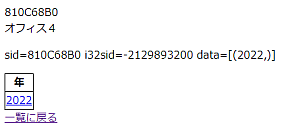
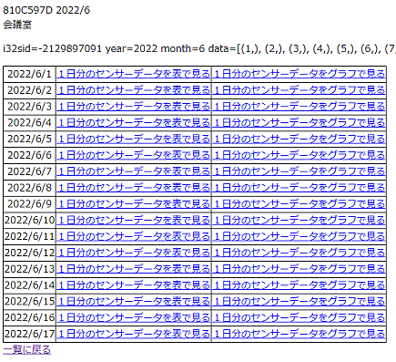
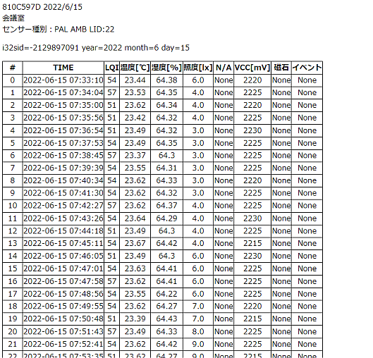
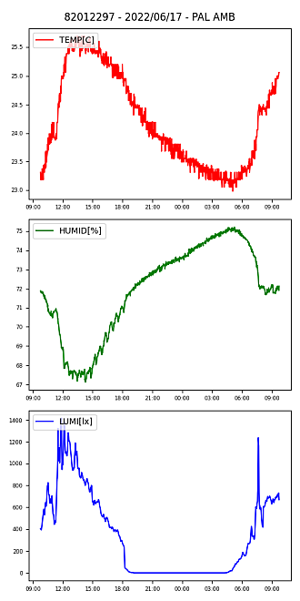

# Python, Flask, sqlite3 による簡易的なサーバ

```python
# Copyright (C) 2022 Mono Wireless Inc. All Rights Reserved.
# Released under MW-OSSLA-1J,1E (MONO WIRELESS OPEN SOURCE SOFTWARE LICENSE AGREEMENT).
```

## このサンプルコードについて
TWELTIE STAGE のセンサーグラフ機能では、sqlite3 を用い取得したセンサーデータを保存します。
このサンプルでは、TWELITE STAGEこのデータベースをウェブサーバー上で参照します。

* Python3や関連パッケージのインストールが必要です。インストールのための pip3 コマンドなどの扱いは一般の情報を参照してください。
* パッケージのバージョン等に依存して動作状況が変化する場合があります。
* パッケージの解説などは最低限に留めます。詳細は各パッケージのマニュアルなど資料を参照ください。

## 必要なPython3パッケージ
* `sqlite3` : sqlite3 データベースへのアクセスを行います。最近の Python3 には含まれる場合があります。(参考: `pip3 install pysqlite3`)
* `Flask` : 軽量ウェブサーバーです。(参考：`pip3 install Flask`)
* `matplotlib` : グラフを描画します (参考：`pip3 install matplotlib`)

## ファイル構成
TWELITE STAGE インストールディレクトリを {TWELITE STAGE} とします。データベースファイルを相対パス `../log/TWELITE_Stage_WSns.sqlite`により開くため、以下のディレクトリ構成にしておきます。
```
{TWELITE STATE}/                    : STAGE 最上位、実行形式などが格納
    /log                            : ログディレクトリ
    /log/TWELITE_Stage_WSns.sqlite  : データベースファイル

    /flask_wsns_db                  : 本サンプルのトップディレクトリ
        _readme/                    : 本ドキュメントの画像など
        static/                     : CSS など
        templates/                  : html ひな型
        app.py                      : サーバー用のスクリプト
        README.html                 : 本ドキュメント
        README.md                   : 本ドキュメント (マークダウン言語版)
```


## Flaskの起動

コマンドプロンプトやシェルで `{TWELITE STAGE}` ディレクトリに移動して、`python3 app.py` を実行します。終了はコマンド画面上で `Ctrl+C` などです。

```bash
$ cd {TWELITE STAGE}
$ python3 app.py
```

ブラウザからは http://localhost:5000 を開きます。
一部の環境やブラウザでは localhost のアクセスでエラーになる場合があります。その場合は http://127.0.0.1:5000 でも試してみてください。


このソース `app.py` の末尾では `app.run(host='localhost')` の指定になっています。LAN内で公開する場合は `app.run (host='0.0.0.0')` に書き換え、必要に応じて動作させるPCのファイアウォール設定も変更してください。


## app.py について
※ この解説で引用されるソースコードは格納される最新コードと一部違う場合があります。

### import セクション
sqlite3, Flask, matplotlib関連のパッケージを読み込んでいます。
```python
import sqlite3
from flask import Flask,send_from_directory,render_template,request,g
from matplotlib.figure import Figure
import matplotlib.dates as mdates
```


### データベース接続

リクエストごとのデータベース接続のオープンとクローズを処理します。

* オープンはリクエスト書利用のハンドラ関数内で、明示的に `db_open()` を呼び出します。
* クローズは、リクエスト終了時に呼び出される `teardown_appcontext` を拡張して実装します。

```python
def db_open():
    if 'db' not in g:
        g.db = sqlite3.connect(conf_db_filename)
    return g.db

@app.teardown_appcontext
def teardown_db(exception):
    db = g.pop('db', None)
    if db is not None:
        db.close()
```


### リクエストの処理

ここではサーバーのアドレスの処理を `/{SID}/{年}/{月}/{日}`のような書式で設計することにします。例えば `/810B1A29/2022/5/31/g` とすれば、SID=810B1A29の2022/5/31日のグラフを描画します。

以下には、対応するリクエスト書利用のハンドラ関数を列挙します。

```python
# / -> データの存在する SID を一覧
@app.route('/')
def index():
    
# /{SID} -> データの存在する年を一覧
@app.route('/<sid>')
def list_years_url(sid):

# /{SID}/{年} -> データの存在する月を一覧
@app.route('/<string:sid>/<int:year>')
def list_months_url(sid, year):

# /{SID}/{年}/{月} -> データの存在する日を一覧
@app.route('/<string:sid>/<int:year>/<int:month>')
def list_days_url(sid, year, month):
    
# /{SID}/{年}/{月}/{日}/l -> １日分のデータを表で見る
@app.route('/<string:sid>/<int:year>/<int:month>/<int:day>/l')
def show_the_day_url(sid, year, month, day):
    
# /{SID}/{年}/{月}/{日}/l -> １日分のデータをグラフで見る
@app.route('/<string:sid>/<int:year>/<int:month>/<int:day>/g')
def graph_the_day_url(sid, year, month, day):
    
# /{SID}/g -> 最新データから１日分をグラグで見る
@app.route('/<string:sid>/g')
def graph_the_latest_url(sid):
```


コードの再利用性を考えて、実際の処理の多くは上記のハンドラ関数ではなく別途定義した関数中で処理します。

```python
def _list_years(sid, i32sid):
def _list_months(sid, i32sid, year):
def _list_days(sid, i32sid, year, month):
def _show_the_day(sid, i32sid, year, month, day):
def _graph_a_day(sid, i32sid, latest_ts, year, month, day):
```


### / ルートのアクセス




`@app.route('/')`で始まる関数 `def index():` は HTTP からの `/` のリクエストを処理します。

```python
@app.route('/')
def index():
    global dict_pkt_type
    # query result
    r = []
    result = []

    # open data base
    cur = db_open().cursor()

    # find SIDs
    cur.execute('''SELECT * FROM sensor_last ORDER BY ts DESC''')
    # find Desc for each SID
    for sid, ts, lid, lqi, pkt_type, value, value1, value2, value3, val_vcc_mv, val_dio, ev_id in cur.fetchall():
        cur.execute('''SELECT * FROM sensor_node WHERE (sid = ?)''', (sid,))
        d = cur.fetchone()

        # PKT TYPE
        lblinfo = ('UNK',)
        if pkt_type in dict_pkt_type: lblinfo=dict_pkt_type[pkt_type]

        # CUE EVENT
        if pkt_type == dict_pkt_type['CUE']:
            if ev_id in dict_ev_cue: 
                ev_id = dict_ev_cue[ev_id]

        r.append((sid, d[1], d[2], ts, datetime.fromtimestamp(ts) # SID(int32), SID(TEXT), DESC(TEXT), ts(EPOCH)
                , (lblinfo[0], lid, lqi, value, value1, value2, value3, val_vcc_mv, val_dio, ev_id))) 
            
    
    # sort by ID
    result = sorted(r, key=lambda x : x[1])

    # returns
    return render_template('index.html', data = result)
```

Webサーバーにルートアクセスがあった場合のふるまいを記述します。`@app.route('/')` 部分で `/` へのアクセスを指定します。まずデータベースへの接続、sqlite3 操作用のカーソル `cur` を構築し、データベースからシリアルID(SID)一覧を検索し、さらにSIDごとの補助情報を得ます。


データベースを開きます。検索書利用のカーソルオブジェクトを構築しています。

```python
    # open data base
    cur = db_open().cursor()
```


シリアル一覧は `sensor_last` テーブルより得ています。このテーブルは SID と最後にデータを受信したときのタイムスタンプとその時のセンサー値の抜粋を記録しています。データの格納時に更新されるテーブルです。

```python
cur.execute('''SELECT * FROM sensor_last ORDER BY ts DESC''')
for sid, ts, lid, lqi, pkt_type, value, value1, value2, value3, val_vcc_mv, val_dio, ev_id in cur.fetchall():
    ...
```


続いて SID ごとに `sensor_node` テーブルを検索して、データベースに記録されたセンサーの補助情報（別途入力したSIDに対応するメモ、補助情報のテキスト情報）を取得します。

```python
    cur.execute('''SELECT * FROM sensor_node WHERE (sid = ?)''', (sid,))
    d = cur.fetchone()
    ...
```


最後にウェブページのテンプレートに渡すデータリストを更新します。

```python
    r.append((sid, d[1], d[2], ts, datetime.fromtimestamp(ts)
		    , (lblinfo[0], lid, lqi, value, value1, value2, value3, val_vcc_mv, val_dio, ev_id))) 
```


すべての SID に対してデータ取得が終わったら、リスト`result`を SID 名でソートして、`render_template()`にリスト`result`を`data`という名前で渡しています。

```python
    # sort by ID
    result = sorted(r, key=lambda x : x[1])

    # returns
    return render_template('index.html', data = result)
```


### templates/index.html

HTMLのテンプレートでは、Flask から渡されたデータを `{{item[1]}}` のような式を用いて内容を構成します。先程の `render_template()`により渡されたデータ構造に基づくため、互いの仕様を確認しておきます。

この`/`ページでは、SID リスト（および無線ノードから得られた最新の情報）を表示します。
その SID のリンクをクリックすることで、センサーデータの格納される年度を検索する画面に遷移します。
（年度検索画面から月検索、日検索、日データ表示と画面遷移します）
また「最新データ」の日付をクリックすることで、そのデータから遡って１日分のグラフを表示します。

```html
<!DOCTYPE html>
<html lang="jp">
<head>
    <meta charset="UTF-8">
    <title>センサーノード</title>
    <link rel="stylesheet" type="text/css" href="/static/css/style.css">
</head>
<body>
    <div>
        <table>
            <thead>
                <tr>
                    <th>SID</th>
                    <th>詳細</th>
                    <th>センサー種別</th>
                    <th>最新データ</th>
                    <th>LID</th>
                    <th>LQI</th>
                    <th>value</th>
                    <th>value1</th>
                    <th>value2</th>
                    <th>value3</th>
                    <th>val_vcc_mv</th>
                    <th>EVENT</th>
                </tr>
            </thead>
            <tbody>
                
                <tr>
                    <td>
                        <a href="/{{item[1]}}">{{item[1]}}</a>
                    </td>
                    <td>{{item[2]}}</td><!-- desc -->
                    <td>{{item[5][0]}}</td>
                    <td>
                        <a href="/{{item[1]}}/g">{{item[4]}}</a>
                    </td><!-- timestamp -->
                    <td>{{item[5][1]}}</td>
                    <td>{{item[5][2]}}</td>
                    <td>{{item[5][3]}}</td>
                    <td>{{item[5][4]}}</td>
                    <td>{{item[5][5]}}</td>
                    <td>{{item[5][6]}}</td>
                    <td>{{item[5][7]}}</td>
                    <td>{{item[5][9]}}</td>
                </tr>
                
            </tbody>
        </table>
    </div>
    <div class="lastupd">
        Last updated at 
        <SCRIPT LANGUAGE="javascript" TYPE="text/javascript">
            options = { year: 'numeric', month: 'numeric', day: 'numeric', hour: 'numeric', minute: 'numeric', second: 'numeric' };
            document.write(new Intl.DateTimeFormat('default', options).format(new Date()) + ".");
        </SCRIPT>
    </div>
</body>
</html>
```

CSSは `static/` 以下に格納します。
```html
    <link rel="stylesheet" type="text/css" href="/static/css/style.css">
```

Python側から渡された `data` にアクセスできます。以下では `for` 文を用いてリストで与えられる `data` を要素ごとに展開し、テーブルに追加しています。
```html

...
<td>{{item[2]}}</td>

```


続く年検索を行うリンクアドレス `/{年}` と最新グラフを表示するリンクアドレス `/{SID}/g` を出力します。

```html
<a href="/{{item[1]}}">{{item[1]}}</a>
...
<a href="/{{item[1]}}/g">{{item[4]}}</a>
```

### 年検索



年検索の処理は以下のように記述しています。`/{SID}` の入力があった場合に呼び出されます。

```python
@app.route('/<sid>')
def list_years_url(sid):
    app.logger.debug(sid)
    try:
        i32sid = toint_i32(sid)
    except:
        app.logger.debug("/{STRING}=%s" % sid)
        i32sid = None

    if i32sid is None: return send_from_directory(os.path.join(app.root_path, 'static/root/'), sid, )
    else: return _list_years(sid, i32sid)
```

この記述では `<sid>` に実際の `{SID}` 以外のリクエストが来る場合があるため、SID として認識されない入力に対しては `send_from_directory` を用いて `static/root` ディレクトリのファイルへのリクエストとして例外処理しています。


SIDが入力された場合は、以下のように SID をキーとしてデータベースを検索して、`year` カラムにあるデータの一覧（重複は除去）を列挙します。結果を `render_template`に渡しますが、その時のパラメータはテンプレート側の利便性を考え SID(`sid`), SID１０進数整数(`i32sid`), 補助メモ(`desc`), 検索結果(`data`)です。

```python
def _list_years(sid, i32sid):
    # open data base and query
    cur = db_open().cursor()
    cur.execute('''SELECT DISTINCT year FROM sensor_data WHERE sid = ? ORDER BY year ASC''', (i32sid,))
    result = cur.fetchall()
    desc = get_desc(cur, i32sid)
    return render_template('year.html', sid = sid, i32sid = i32sid, desc = desc, data = result)
```


### 月検索

{SID},{年}をキーとして、データの存在する月を検索します。処理自体は年検索と同様です。

### 日検索



{SID},{年},{月}をキーとして、そのリストを渡します。処理自体は年検索・月検索と同様です。

１日分のデータを参照するためのリンクを２種類用意します。

* 表で見る：表で見るリンクは、末尾に `/l` を付加します。 (例：`/810C597D/2022/6/3/l`)
* グラフで見る：表で見るリンクは、末尾に `/g` を付加します。 (例：`/810C597D/2022/6/3/g`)


### 表で見る




指定された{SID},{年},{月},{日}を１日分のデータを表の形で出力します。センサーデータは以下の式で検索しています。検索式が長くなった以外は、先ほどまでの年月日の検索と処理は大きく変わりません。検索した値をタプルを格納したリストとして html テンプレートに渡します。

```python
def _show_the_day(sid, i32sid, year, month, day):
    ...
    desc = get_desc(cur, i32sid) # desc は改めて検索する
	cur.execute('''SELECts,lid,lqi,pkt_type,value,value,
		value2,value3,val_vcc_mv,val_dio,ev_id FROM sensor_data
        WHERE (sid=?) and (year=?) and (month=?) and (day=?)
        ORDER BY ts ASC''', (i32sid,year,month,day,))
    r = cur.fetchall() # 検索結果を格納
```


１日分のセンサーデータはリスト`r`に格納されます。ここでは最初のエントリからセンサーの種別やセンサーに割り当てられた`lid`を判定します（１日の途中で変化があった場合には対応しません）。

```python
    # check first sample (determine packet type, etc)
    lblinfo = ('UNKNOWN', 'VAL', 'VAL1', 'VAL2', 'VAL3')
    pkt_type = None
    lid = None
    if len(r) > 0:
        try:
            # pick first sample
            r0 = r[0]
            # packet type
            pkt_type = int(r0[3])
            if pkt_type in dict_pkt_type: lblinfo=dict_pkt_type[pkt_type]
            # logical ID (normally, all the same)
            lid = r0[1]
        except:
            pass
```


各々の検索結果に対して１件１件必要に応じてデータの加工を行います。例えばタイムスタンプはローカル時間オブジェクトに変換します。また、磁石センサーのデータが含まれる場合は、処理しやすい形にデータを加工します。最後に結果格納リスト`result`に追加します。

```python
	ct = 1
    for ts,lid,lqi,pkt_type,value,value1,value2,value3,val_vcc_mv,val_dio,ev_id in r:
        try:
            lt = datetime.fromtimestamp(ts) # convert unix epoch timestamp to local time object.

            # mag info
            mag = None
            if val_dio & 0x10000000:
                mag = dict_mag[(val_dio >> 24) & 0x3]

            if pkt_type == 1: value = mag

            # DIO
            if pkt_type == dict_pkt_type['APPTWELITE']:
                bm_dio = int(value)
                if bm_dio >= 0 and bm_dio <= 15:
                    value = dict_dio[bm_dio]

            # EVENT ON CUE
            if pkt_type == dict_pkt_type['CUE']:
                if ev_id in dict_ev_cue: 
                    ev_id = dict_ev_cue[ev_id]

        except:
            pass

        result.append((ct,lt,lqi,value,value1,value2,value3,val_vcc_mv,mag,ev_id))
        ct = ct + 1
```


上記で参照した `dict_pkt_type` は、パケット種別ごとの軸ラベルやIDを引くための辞書です。

```python
dict_pkt_type = {
    1 : ('PAL MAG', 'MAG', 'N/A', 'N/A', 'N/A'),
    2 : ('PAL AMB', '温度[℃]', '湿度[%]', '照度[lx]', 'N/A'),
    3 : ('PAL MOT','X[G]', 'Y[G]', 'Z[G]', 'N/A'),
    5 : ('CUE','X[G]', 'Y[G]', 'Z[G]', 'N/A'),
    6 : ('ARIA','温度[℃]', '湿度[%]', 'N/A', 'N/A'),
    257 : ('App_TWELITE','DI0/1/2/3', 'AD1[V]', 'AD2[V]', 'AD3[V]'),
    'ARIA' : 6,
    'PAL_AMB' : 2,
    'PAL_MOT' : 3,
    'CUE' : 5,
    'MAG' : 1,
    'APPTWELITE' : 257
}
```


HTMLテンプレートに情報を渡しています。リスト(`data`)に含まれない LID (`lid`) やラベル情報(`lblinfo`)
を別途渡しています。

```python
    return render_template('show_the_day.html', 
                sid = sid, i32sid = i32sid, desc = desc, year = year, 
                month=month, day=day, data = result, lid=lid, lblinfo=lblinfo)
```


### グラフ表示



グラフの機能は `_graph_a_day()` 関数に処理を集約しています。最新のタイムスタンプからグラフを描画する処理と指定した年月日からグラフを描画する２種類に対応します。

データ検索はリスト表示と流れは同じですが、表示用データを`ORDER BY random() LIMIT 1024`の指定を行い間引いています。
```python
    cur.execute('''SELECT ts, lid, lqi, pkt_type, value, value1, value2, value3, val_vcc_mv, val_dio, ev_id FROM sensor_data
                   WHERE (sid=?) and (year=?) and (month=?) and (day=?)
                   ORDER BY random() LIMIT 1024''', (i32sid,year,month,day,))
```


上記の検索で `random()` 指定を行っているので、検索結果は時間順に並びません。リスト`sr`に時間順にソートした結果を格納します。

```python
	r = cur.fetchall()
    ...
    sr = sorted(r, key=lambda x : x[0])
```


検索により得られたデータリストをもとに、グラフの描画には X 軸に対応する時間リスト `v_t`と、Y軸に対応する計測値のリスト `v_0`, `v_1`, `v_2` を作成します。

```python
    for ts,lid,lqi,pkt_type,value,value1,value2,value3,val_vcc_mv,val_dio,ev_id in sr:
        lt = datetime.fromtimestamp(ts)
        v_0.append(value)
        v_1.append(value1)
        v_2.append(value2)
        v_t.append(lt)
```


グラフのイメージはファイルを作成せず、base64でエンコードしたデータを直接埋め込んだタグを戻しています。そのために `BytesIO()` を用いています。

```python
    fig = Figure()
    ...
    ax = fig.add_subplot(3, 1, 1)
    ax.tick_params(labelsize = 6.5) 
    ax.plot(v_t, v_0, label=lblinfo[1], color='red')
    ...
    buf = BytesIO()
    fig.savefig(buf, format="png")
    # Embed the result in the html output.
    data = base64.b64encode(buf.getbuffer()).decode("ascii")
    return f""
```


## その他

* TWLITE STAGEでデータ取得中の場合もアクセスは可能ですが、TWELITE STAGEでのデータベース書き出しのタイミング（約１０秒ごと）までは、情報は更新されません。
* 本サンプルのデータベース検索では テーブル `sensor_data` 中の `year`, `month`, `day` カラムを用いていますが、パフォーマンスが必要な場合は `ts` カラムを用いた検索を行うか、適切なインデックスを構築してください。
